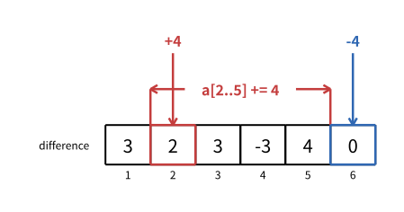

# 差分

> 最近修订：2026-08-16 15:05 +10:00（未审阅）

[前缀和](prefix-sums.md) 保存从开头到当前位置的累计结果。差分反过来保存相邻元素之间的变化量，并能通过一次前缀累加恢复原数组。

差分最典型的用途是：先接收许多次闭区间整体加值，最后一次性输出修改后的数组。每次修改只记录两个边界，全部修改结束后再统一恢复，可以把逐元素修改的总时间从 $O(nm)$ 降到 $O(n + m)$。

## 多次闭区间加值

给定一个长度为 $n$ 的 1-based 数组 `a[1..n]`，接下来有 $m$ 次修改。每次给出
`l`、`r` 和 `delta`，把闭区间 `[l,r]` 中的每个元素都增加 `delta`。全部修改
结束后，输出最终数组。

例如初始数组是：

```text
a = 3 1 4 1 5 9
```

执行：

```text
a[2..5] += 4
```

会得到：

```text
3 5 8 5 9 9
```

`delta` 可以为负数；区间减去一个值就是增加负数。

## 逐元素修改

最直接的实现扫描整个区间：

```cpp
for (int i = l; i <= r; i++) {
    a[i] += delta;
}
```

一次修改最多访问 $n$ 个元素，$m$ 次修改最坏需要 $O(nm)$ 时间。

题目只在全部修改结束后要求最终数组，中间不需要读取每个 `a[i]`。因此没有必要在每次修改时立刻写出区间内部所有新值；只要记录“从哪里开始增加”和“从哪里停止增加”，最后统一展开即可。

## 相邻变化量

额外定义 `a[0] = 0`，并令：

$$
difference[i] = a[i] - a[i - 1],\qquad 1 \le i \le n
$$

对示例数组：

```text
a[i]：           3   1   4   1   5   9
difference[i]：  3  -2   3  -3   4   4
```

每个 `difference[i]` 表示从前一个位置走到当前位置时，数值发生了多少变化：

```text
a[i - 1] + difference[i] = a[i]
```

代码只需相邻相减：

```cpp
vector<ll> difference(n + 5);
for (int i = 1; i <= n; i++) {
    difference[i] = a[i] - a[i - 1];
}
```

`a[0]` 是统一边界的哨兵。由于 `vector` 初始化为零，代码中自然有 `a[0] == 0`，不需要为 `i == 1` 单独判断。

## 前缀恢复

根据定义：

$$
\begin{aligned}
difference[1] &= a[1] - a[0],\\
difference[2] &= a[2] - a[1],\\
&\ \vdots\\
difference[i] &= a[i] - a[i - 1].
\end{aligned}
$$

把前 $i$ 项相加，中间的 $a[1],a[2],\ldots,a[i - 1]$ 会两两抵消：

$$
\sum_{j = 1}^{i} difference[j] = a[i] - a[0] = a[i]
$$

所以差分数组的前缀和就是原数组：

```cpp
ll current = 0;
for (int i = 1; i <= n; i++) {
    current += difference[i];
    a[i] = current;
}
```

也可以直接使用前一个已经恢复的元素：

```cpp
for (int i = 1; i <= n; i++) {
    a[i] = a[i - 1] + difference[i];
}
```

本篇完整代码采用第二种写法，使“相邻变化量”与“从前一个值恢复当前值”直接对应。

## 区间内部不会改变

现在给 `[l, r]` 中每个元素都增加 `delta`。

对任意 `l < i <= r`，`a[i]` 和 `a[i - 1]` 同时增加相同的值：

$$
(a[i] + delta) - (a[i - 1] + delta) = a[i] - a[i - 1]
$$

因此区间内部的 `difference[i]` 完全不变。整段区间不需要逐元素记录。

只有两个边界两侧得到的增量不同。

## 左边界开始增加

`a[l]` 增加了 `delta`，而区间外的 `a[l - 1]` 没有改变：

$$
(a[l] + delta) - a[l - 1] = difference[l] + delta
$$

所以只需：

```cpp
difference[l] += delta;
```

从 `l` 开始做前缀恢复时，这个 `delta` 会被带到 `l` 以及它后面的所有位置。

## 右边界之后停止增加

我们只想让增量持续到 `r`。位置 `r + 1` 不应增加，因此在下一处差分中放入相反变化：

```cpp
difference[r + 1] -= delta;
```

恢复到 `r + 1` 时，先前累计的 `delta` 被抵消，后续位置就回到原来的数值变化轨迹。

一次区间加最终只修改：

```cpp
difference[l] += delta;
difference[r + 1] -= delta;
```

以示例的 `[2, 5]` 增加 $4$ 为例，原差分是：

```text
3 -2 3 -3 4 4
```

只修改 `difference[2] += 4` 和 `difference[6] -= 4`，得到：

```text
3 2 3 -3 4 0
```

下图的范围标记表示原数组的修改区间，两个箭头表示差分数组中真正发生变化的位置：



对新差分求前缀和，正好恢复出：

```text
3 5 8 5 9 9
```

## 右端到达数组末尾

若 `r == n`，`r + 1` 是 `n + 1`，不属于最终输出的原数组。但仍然可以写：

```cpp
difference[r + 1] -= delta;
```

`difference` 按统一约定分配 `n + 5` 个位置，所以 `n + 1` 是安全的边界哨兵。
最终只恢复 `1..n`，不会读取它。这样所有修改都使用同样的两行代码，不需要为
`r == n` 增加分支。

这里的 `difference[n + 1]` 只是取消区间影响的哨兵，不属于长度为 `n` 的逻辑差分数组。

## 叠加多次修改

不同修改可以直接累加到同一个差分数组：

```cpp
for (int i = 1; i <= m; i++) {
    int l;
    int r;
    ll delta;
    cin >> l >> r >> delta;

    difference[l] += delta;
    difference[r + 1] -= delta;
}
```

每个 `difference[x]` 保存所有修改在这个边界产生的变化总和。加法的先后顺序不影响结果，因此全部修改记录完成后，只需要做一次前缀恢复：

```cpp
for (int i = 1; i <= n; i++) {
    a[i] = a[i - 1] + difference[i];
}
```

## 手动过程

从初始数组：

```text
3 1 4 1 5 9
```

依次执行：

```text
[2, 5] += 4
[1, 3] += -2
```

差分状态为：

| 状态 | `difference[1..6]` |
| --- | --- |
| 初始 | `3 -2 3 -3 4 4` |
| 第一处修改后 | `3 2 3 -3 4 0` |
| 第二处修改后 | `1 2 3 -1 4 0` |

第二次修改让 `difference[1] += -2`；在 `r + 1 == 4` 处执行 `difference[4] -= -2`，也就是增加 $2$。

最后从左到右恢复：

| `i` | 1 | 2 | 3 | 4 | 5 | 6 |
| ---: | ---: | ---: | ---: | ---: | ---: | ---: |
| `difference[i]` | 1 | 2 | 3 | -1 | 4 | 0 |
| `a[i]` | 1 | 3 | 6 | 5 | 9 | 9 |

这与逐元素执行两次区间修改得到的结果一致。

## 正确性

建立差分时，`difference[i] = a[i] - a[i - 1]`，所以前缀累加必然恢复原数组。

一次 `[l, r]` 增加 `delta` 时：

- `difference[l] += delta` 让恢复值从 `l` 开始全部增加 `delta`；
- `difference[r + 1] -= delta` 在 `r + 1` 取消这份累计影响；
- 区间内部相邻元素同时增加相同值，原有差分不变。

因此这两个边界修改与逐元素修改 `[l, r]` 完全等价。多次修改只是把各次边界变化相加，最后一次前缀恢复会在每个位置累计所有覆盖它的修改，所以最终数组正确。

## 时间与空间复杂度

建立初始差分需要 $O(n)$ 时间；每次区间修改只更新两个位置，需要 $O(1)$ 时间；最后恢复数组需要 $O(n)$ 时间。$m$ 次修改的总时间复杂度是：

$$
O(n + m)
$$

`a` 和 `difference` 各保存 $O(n)$ 个元素，额外空间复杂度是 $O(n)$。

相比之下，逐元素修改最坏需要 $O(nm)$ 时间。差分把每次修改暂存为边界变化，代价是必须等到最后恢复后才能获得全部最终值。

## 适用边界

这份基础差分适合“许多次区间加，最后统一输出或统一处理”的离线过程。

若每次修改后都要立刻询问某个位置，可以维护差分数组的前缀和，但需要支持动态前缀查询；后续可以使用树状数组。若还要在线询问区间和，通常需要更完整的树状数组或带懒标记的线段树方案。

不要因为题目出现“区间修改”就直接使用差分。先确认所有修改能否收集完，再一次性恢复答案。

二维差分、树上差分和高阶差分都沿用了“只记录变化边界”的思想，但它们有不同的边界数量与恢复过程，不属于本文的一维基础模型。

## 完整代码

下面的程序读入初始数组和 $m$ 次闭区间加值，输出全部修改完成后的数组。

```cpp
#include <bits/stdc++.h>
using namespace std;

typedef long long ll;

void solve() {
    int n;
    int m;
    cin >> n >> m;

    vector<ll> a(n + 5);
    for (int i = 1; i <= n; i++) {
        cin >> a[i];
    }

    vector<ll> difference(n + 5);
    for (int i = 1; i <= n; i++) {
        difference[i] = a[i] - a[i - 1];
    }

    for (int i = 1; i <= m; i++) {
        int l;
        int r;
        ll delta;
        cin >> l >> r >> delta;

        difference[l] += delta;
        difference[r + 1] -= delta;
    }

    for (int i = 1; i <= n; i++) {
        a[i] = a[i - 1] + difference[i];
    }

    for (int i = 1; i <= n; i++) {
        if (i > 1) {
            cout << ' ';
        }
        cout << a[i];
    }
    cout << '\n';
}

int main() {
    solve();
    return 0;
}
```

输入：

```text
6 2
3 1 4 1 5 9
2 5 4
1 3 -2
```

输出：

```text
1 3 6 5 9 9
```

## 常见错误

### 忘记初始数组

差分修改不是只记录所有 `delta`。若题目给出非零初始数组，必须先建立它的初始差分，再叠加区间修改。

### 右边界写成 r

区间 `[l, r]` 包含 `r`，增量应当从 `r + 1` 才停止，因此取消标记是 `difference[r + 1] -= delta`。

### 对负增量处理两次符号

公式始终是 `difference[r + 1] -= delta`。当 `delta` 为负数时，这行自然变成加上它的绝对值，不需要额外分支。

### 忘记前缀恢复

记录完边界后，`difference[i]` 仍然只是相邻变化量，不是最终的 `a[i]`。输出前必须从左到右累加。

### 使用 32 位整数

初始值、修改值或许能分别放入 32 位整数，但许多次修改叠加后的元素与差分边界都可能超出 32 位范围，应使用 64 位整数。

### 在在线询问中反复恢复

每次修改后重新扫描整个差分数组需要 $O(n)$ 时间，会失去优势。差分基础写法要求能够把恢复推迟到全部修改结束。

## 需要记住什么

1. `difference[i]` 表示哪两个相邻元素之间的变化？
2. 为什么对差分数组求前缀和可以恢复原数组？
3. `[l, r]` 整体增加 `delta` 时，区间内部的差分为什么不变？
4. 为什么左边界执行 `difference[l] += delta`？
5. 为什么取消影响的位置是 `r + 1`，并执行 `difference[r + 1] -= delta`？
6. `r == n` 时为什么仍能安全写入 `difference[n + 1]`？
7. 多次区间修改为什么可以先叠加边界，最后只恢复一次？
8. 一维差分的总时间和额外空间复杂度分别是多少？
9. 哪类询问说明不能直接使用本文的离线差分写法？
