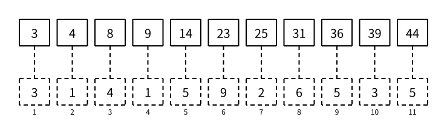

# 前缀和

> 状态：定稿

给定一个建立后不再修改的数组，如果题目反复询问闭区间 $[l,r]$ 中所有数的和，最直接的做法是每次都从 `a[l]` 累加到 `a[r]`：

```cpp
ll range_sum(int l, int r) {
    ll res = 0;
    for (int i = l; i <= r; i++) {
        res += a[i];
    }
    return res;
}
```

一次询问最多扫描 $n$ 个元素，时间复杂度为 $O(n)$。如果有 $q$ 次询问，最坏总复杂度是 $O(nq)$。不同询问反复累加相同位置，大量计算被重复了。

**前缀和**会先保存每个前缀的和。预处理只扫描数组一次，之后每个区间和都可以由两个已经算好的前缀在 $O(1)$ 时间内得到。

## 定义前缀和

本篇使用 1-based 下标。对于数组：

```text
a = [3, 1, 4, 1, 5, 9, 2, 6, 5, 3, 5]
```

定义 `prefix[i]` 为从第 $1$ 个元素到第 $i$ 个元素的和：

```text
prefix[i] = a[1] + a[2] + ... + a[i]
```

例如：

```text
prefix[1] = 3
prefix[2] = 3 + 1 = 4
prefix[3] = 3 + 1 + 4 = 8
```

完整前缀和依次是：

```text
prefix = [3, 4, 8, 9, 14, 23, 25, 31, 36, 39, 44]
```

下图中，上层每个实线格保存对应位置的前缀和，下层虚线格是原数组。竖向虚线只表示两层使用同一个下标，因此下标只在原数组下方标注一次。



## 空前缀

区间可以从第 $1$ 个元素开始。为了让后面的区间公式在 $l=1$ 时仍然直接成立，额外定义：

```text
prefix[0] = 0
```

`prefix[0]` 表示一个元素都没有的**空前缀**，和自然是 $0$。它没有对应的原数组元素，所以上图只画出 `prefix[1]` 到 `prefix[11]`，没有为 `prefix[0]` 再画一列。

因此，包含空前缀后的完整数值是：

```text
下标 i：       0  1  2  3  4   5   6   7   8   9  10  11
prefix[i]：    0  3  4  8  9  14  23  25  31  36  39  44
```

## 递推计算

相邻两个前缀只相差新加入的 `a[i]`：

```text
prefix[i - 1] = a[1] + a[2] + ... + a[i - 1]
prefix[i]     = a[1] + a[2] + ... + a[i - 1] + a[i]
```

所以：

```text
prefix[i] = prefix[i - 1] + a[i]
```

从左向右依次计算：

```cpp
prefix[0] = 0;
for (int i = 1; i <= n; i++) {
    prefix[i] = prefix[i - 1] + a[i];
}
```

计算 `prefix[i]` 时，`prefix[i - 1]` 已经在上一轮循环得到。每轮只做一次加法，共计算 $n$ 个位置，因此预处理时间复杂度是 $O(n)$。

如果后续不需要原数组，读入时可以直接计算前缀和，不必另外保存 `a`：

```cpp
prefix[0] = 0;
for (int i = 1; i <= n; i++) {
    ll val;
    scanf("%lld", &val);
    prefix[i] = prefix[i - 1] + val;
}
```

## 区间和

现在查询闭区间 $[l,r]$ 的和。`prefix[r]` 包含从 $1$ 到 $r$ 的所有元素：

```text
prefix[r] = a[1] + ... + a[l - 1] + a[l] + ... + a[r]
```

前面不属于询问区间的部分，恰好是：

```text
prefix[l - 1] = a[1] + ... + a[l - 1]
```

两式相减，`a[1]` 到 `a[l - 1]` 全部抵消，只剩下目标区间：

```text
sum(l, r) = prefix[r] - prefix[l - 1]
```

例如，对前面的数组查询 $[2,5]$：

```text
prefix[5] - prefix[1] = 14 - 3 = 11
```

对照原数组：

```text
a[2] + a[3] + a[4] + a[5] = 1 + 4 + 1 + 5 = 11
```

代码只需要两次数组访问和一次减法：

```cpp
ll range_sum(int l, int r) {
    return prefix[r] - prefix[l - 1];
}
```

因此每次区间和询问的时间复杂度是 $O(1)$。

### 左端点为 1

当 $l=1$ 时：

```text
sum(1, r) = prefix[r] - prefix[0] = prefix[r] - 0
```

空前缀让这个边界与其他区间使用完全相同的代码，不需要另写 `if (l == 1)`。这是主动增加一个有明确语义的边界位置，使核心公式对所有合法区间都成立。

## 整数溢出

即使每个 `a[i]` 都能放进 `int`，多个元素的和也可能超出 `int` 范围。例如：

```text
n <= 100000
|a[i]| <= 1000000000
```

前缀和的绝对值可能达到 $10^{14}$。因此本篇让输入值、`prefix` 和区间和结果全部使用 `long long`：

```cpp
typedef long long ll;
ll prefix[MAXN];
```

不要只检查单个元素的范围。选择累加类型时，要估算最多累加多少项以及每项的最大绝对值。

## 完整代码

下面的程序约定：

- 第一行输入数组长度 `n` 和询问数量 `q`；
- 第二行输入 $n$ 个整数；
- 接下来 $q$ 次询问每次输入 `l` 和 `r`，题目保证 $1 \le l \le r \le n$；
- 对每次询问输出闭区间 $[l,r]$ 的和。

```cpp
#include <bits/stdc++.h>
using namespace std;

typedef long long ll;

const int MAXN = 1e5 + 5;

int n;
int q;
ll prefix[MAXN];

ll range_sum(int l, int r) {
    return prefix[r] - prefix[l - 1];
}

void solve() {
    scanf("%d%d", &n, &q);

    prefix[0] = 0;
    for (int i = 1; i <= n; i++) {
        ll val;
        scanf("%lld", &val);
        prefix[i] = prefix[i - 1] + val;
    }

    while (q--) {
        int l;
        int r;
        scanf("%d%d", &l, &r);
        printf("%lld\n", range_sum(l, r));
    }
}

int main() {
    solve();
    return 0;
}
```

对于输入：

```text
6 4
3 1 4 1 5 9
1 1
1 6
2 5
6 6
```

输出：

```text
3
23
11
9
```

预处理前缀和需要 $O(n)$ 时间，$q$ 次询问共需要 $O(q)$ 时间，总时间复杂度是 $O(n+q)$。`prefix` 保存 $n+1$ 个有意义的位置，空间复杂度是 $O(n)$。

## 数组修改

普通前缀和适合建立后不再修改的数组。如果 `a[pos]` 增加了一个值，所有包含它的前缀都会改变：

```text
prefix[pos], prefix[pos + 1], ..., prefix[n]
```

直接更新这些位置需要 $O(n)$ 时间，前缀和 $O(1)$ 询问的优势因此不再免费。

根据题目操作选择更直接的工具：

| 需求 | 常用工具 |
| --- | --- |
| 静态数组的区间和 | 前缀和 |
| 单点增加，区间和 | [树状数组](../data-structures/fenwick-tree.md) |
| 区间增加，区间和 | [带懒标记的线段树](../data-structures/segment-tree.md#懒标记) |

选择数据结构前，先确认题目是否真的存在修改。没有修改时，前缀和通常比树状数组或线段树更短、更快也更不容易写错。

## 常见错误与调试

最常见的公式错误是写成：

```text
prefix[r] - prefix[l]
```

这会把 `a[l]` 也一起减掉。要排查边界，先用很短的数组手算：

```text
a = [3, 1, 4, 1, 5, 9]
prefix = [0, 3, 4, 8, 9, 14, 23]
```

检查每一轮预处理是否满足：

```text
prefix[i] - prefix[i - 1] = a[i]
```

再检查三类边界区间：

```text
[1, 1]：prefix[1] - prefix[0] = 3
[1, 6]：prefix[6] - prefix[0] = 23
[6, 6]：prefix[6] - prefix[5] = 9
```

另外需要确认：

- `prefix[0]` 是 $0$；
- 预处理循环从 $1$ 到 $n$；
- 区间和使用 `long long`；
- 数组如果发生修改，不能继续使用旧前缀和。

## 基础练习

1. 对数组 `[2, 7, 1, 8, 2, 8]` 手算 `prefix[0]` 到 `prefix[6]`。
2. 使用手算的前缀和分别求区间 $[1,1]$、$[1,6]$、$[3,5]$ 和 $[6,6]$ 的和。
3. 将完整代码改为先保存 `a[1]` 到 `a[n]`，再用第二个循环计算 `prefix`。
4. 为完整代码准备包含负数、单个元素和整个数组的输入，用直接循环计算区间和，对照两种方法的输出。

## 需要记住什么

1. `prefix[i]` 表示原数组的哪一段？
2. `prefix[0]` 为什么定义为 $0$？它如何消除 $l=1$ 的特判？
3. 为什么 `prefix[i] = prefix[i - 1] + a[i]`？
4. 区间 $[l,r]$ 的和为什么是 `prefix[r] - prefix[l - 1]`，而不是 `prefix[r] - prefix[l]`？
5. 前缀和的预处理、单次询问和总空间复杂度分别是什么？
6. 为什么单个数值能放进 `int` 时，前缀和仍可能需要 `long long`？
7. 为什么普通前缀和不适合频繁修改原数组？

二维与更高维前缀和、前缀异或、前缀积和其他可逆前缀信息都是相同思想在不同运算中的延伸，不要求在本篇理解或记忆。

## 下一篇

下一篇 [差分](difference-array.md) 会反过来保存相邻元素的变化量，并通过前缀和恢复原数组。
