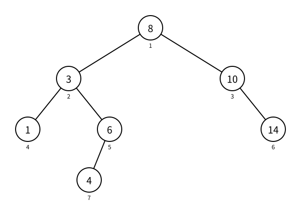

# 二叉树：前序、中序与后序遍历

> 状态：草稿
> 直接前置：[0311 二叉树：结构与存储](binary-tree-structure-and-storage.md)、[0434 树的深度优先搜索](../graph-theory/tree-depth-first-search.md)

树的 DFS 会在进入一个节点后递归处理它的每棵子树。二叉树进一步规定了左子树和右子树，因此每个节点都有三个稳定的处理位置：递归左子树之前、左右子树之间、递归右子树之后。把“处理当前节点”分别放在这三个位置，就得到前序、中序和后序遍历。

## 同一棵二叉树

下面始终遍历同一棵二叉树。圆内的大号数字是节点值 `value`，圆外的小号数字是节点编号。



孩子数组中的 `0` 表示对应子节点不存在：

```text
节点 1：value = 8， left = 2，right = 3
节点 2：value = 3， left = 4，right = 5
节点 3：value = 10，left = 0，right = 6
节点 4：value = 1， left = 0，right = 0
节点 5：value = 6， left = 7，right = 0
节点 6：value = 14，left = 0，right = 0
节点 7：value = 4， left = 0，right = 0
```

遍历顺序描述的是节点出现的顺序。示例输出节点值，是因为实际算法通常要读取或处理节点保存的数据；节点编号仍用于递归定位左右孩子。

## 递归骨架

二叉树的递归遍历先处理空节点边界，再递归访问左、右子树：

```cpp
void traverse(int u) {
    if (u == 0) {
        return;
    }

    traverse(left_child[u]);
    traverse(right_child[u]);
}
```

两次递归调用的先后次序不能交换：二叉树的左、右位置属于结构本身。现在只差决定在哪个位置处理当前节点 `u`。

## 前序遍历

前序遍历（preorder traversal）的顺序是：

```text
当前节点 -> 左子树 -> 右子树
```

所以在递归左子树之前处理当前节点：

```cpp
void preorder(int u) {
    if (u == 0) {
        return;
    }

    printf("%d ", value[u]);
    preorder(left_child[u]);
    preorder(right_child[u]);
}
```

示例树的前序遍历输出：

```text
8 3 1 6 4 10 14
```

每棵子树的根节点都会先于它的所有后代出现。因此，前序遍历适合在进入一棵子树时先创建、复制或记录根的信息。

## 中序遍历

中序遍历（inorder traversal）的顺序是：

```text
左子树 -> 当前节点 -> 右子树
```

所以在两次递归调用之间处理当前节点：

```cpp
void inorder(int u) {
    if (u == 0) {
        return;
    }

    inorder(left_child[u]);
    printf("%d ", value[u]);
    inorder(right_child[u]);
}
```

示例树的中序遍历输出：

```text
1 3 4 6 8 10 14
```

这棵示例树恰好还是二叉搜索树，所以中序遍历的值递增。递增不是任意二叉树都具有的性质，而是二叉搜索树的左小右大规则带来的结果。

中序遍历依赖明确的左、右子树。普通有根树可能有任意多个没有左右顺序的子节点，因此没有唯一对应的中序遍历。

## 后序遍历

后序遍历（postorder traversal）的顺序是：

```text
左子树 -> 右子树 -> 当前节点
```

所以等两棵子树都递归返回后，再处理当前节点：

```cpp
void postorder(int u) {
    if (u == 0) {
        return;
    }

    postorder(left_child[u]);
    postorder(right_child[u]);
    printf("%d ", value[u]);
}
```

示例树的后序遍历输出：

```text
1 4 6 3 14 10 8
```

每个节点都会在自己的所有后代之后出现。因此，需要先得到两棵子树的结果，再合并到父节点的计算，或者需要先删除子节点再删除父节点时，通常使用后序位置。

## 三种顺序的共同结构

三段代码只有 `printf` 的位置不同：

```cpp
void traverse(int u) {
    if (u == 0) {
        return;
    }

    // 前序位置：当前节点 -> 左 -> 右
    traverse(left_child[u]);
    // 中序位置：左 -> 当前节点 -> 右
    traverse(right_child[u]);
    // 后序位置：左 -> 右 -> 当前节点
}
```

“序”说的就是当前节点相对于左右子树的处理次序，不是三套互不相关的模板。读递归代码时，只要找到处理当前节点的语句位于两次递归调用的哪一侧，就能判断遍历类型。

## 完整代码

下面的程序读取孩子数组表示的二叉树，依次输出三种遍历。第一行给出节点数 `n` 和根节点编号 `root`，随后第 `u` 行给出节点 `u` 的值、左孩子编号和右孩子编号。

```cpp
#include <bits/stdc++.h>
using namespace std;

const int MAXN = 200005;

int value[MAXN];
int left_child[MAXN];
int right_child[MAXN];

void preorder(int u) {
    if (u == 0) {
        return;
    }

    printf("%d ", value[u]);
    preorder(left_child[u]);
    preorder(right_child[u]);
}

void inorder(int u) {
    if (u == 0) {
        return;
    }

    inorder(left_child[u]);
    printf("%d ", value[u]);
    inorder(right_child[u]);
}

void postorder(int u) {
    if (u == 0) {
        return;
    }

    postorder(left_child[u]);
    postorder(right_child[u]);
    printf("%d ", value[u]);
}

int main() {
    int n, root;
    scanf("%d%d", &n, &root);

    for (int u = 1; u <= n; u++) {
        scanf(
            "%d%d%d",
            &value[u],
            &left_child[u],
            &right_child[u]
        );
    }

    preorder(root);
    printf("\n");

    inorder(root);
    printf("\n");

    postorder(root);
    printf("\n");

    return 0;
}
```

对应示例树的输入是：

```text
7 1
8 2 3
3 4 5
10 0 6
1 0 0
6 7 0
14 0 0
4 0 0
```

输出为：

```text
8 3 1 6 4 10 14
1 3 4 6 8 10 14
1 4 6 3 14 10 8
```

## 复杂度

每一种遍历都会恰好处理每个节点一次，所以时间复杂度是 $O(n)$。孩子数组占用 $O(n)$ 空间；递归调用的额外空间是 $O(h)$，其中 $h$ 是树高，最坏可达到 $O(n)$。

## 需要记住什么

- 前序、中序和后序分别把当前节点放在左右子树的什么位置？
- 三种递归代码真正不同的是哪一行的位置？
- 为什么中序遍历只对区分左、右子树的结构有明确含义？
- 任意二叉树的中序值都会递增吗？示例为什么恰好递增？
- 哪种顺序保证父节点先于后代出现？哪种保证父节点晚于后代出现？
- 三种遍历的时间复杂度和递归空间复杂度分别是多少？
