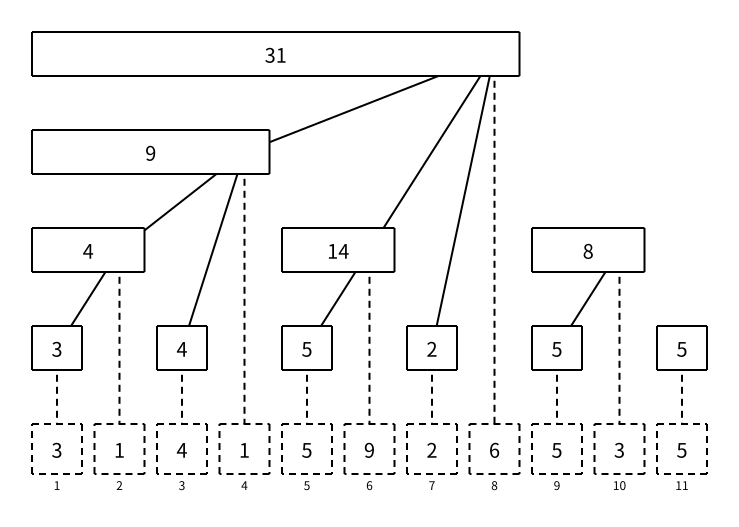

# 树状数组：基础

> 最近修订：2026-08-13 02:57 +10:00（未审阅）

树状数组（Fenwick Tree，Binary Indexed Tree，BIT）用一个数组维护前缀信息。它最经典的用途是：

- 单点增加一个值。
- 查询前缀和。
- 用两个前缀和之差查询区间和。

这三种操作都能做到 $O(\log n)$，代码通常比线段树短，常数也较小。

如果题目只需要“单点修改 + 前缀和或区间和”，树状数组通常是第一选择；如果需要维护更复杂的区间信息、区间修改或多种标记，再考虑线段树。

## 命名约定

树状数组的存储数组常见名字有 `bit`、`tree`、`tr`、`c` 和 `fenwick`。

- `bit` 是 Binary Indexed Tree 的缩写，是很常见的惯用名，并不是指数组元素的数据类型是二进制位。
- `tree` 表示这份数组在存一棵隐式树，是简洁而且不绑定维护功能的名字。
- `sum` 能说明当前节点维护的是一段区间和，却没有说明它属于哪种数据结构；换成最大值等信息时也必须改名。
- `tr` 和 `c` 在短竞赛代码里常见，但教学材料里不够直观。

本文和线段树统一把内部存储数组写成 `tree`：数组名表达它在数据结构中的职责，`prefix_sum`、`range_sum` 表达查询的聚合信息。

树状数组有自己的规模、存储和一组共同维护这些状态的操作，所以完整模板使用 `struct FenwickTree` 封装。内部 `vector` 按实际规模分配 `n + 5` 个元素，位置 `1..n` 保存数据，第 `0` 格有意留空，末尾 4 格是与其他动态数据结构一致的边界余量。这样既保持 `lowbit` 的自然公式，也不会让 `n`、`tree`、`add` 等名称污染全局命名空间。

## 从前缀和的问题出发

[前缀和](../algorithm-basics/prefix-sums.md) 会预先保存每个位置结尾的完整前缀：

```text
prefix[x] = a[1] + a[2] + ... + a[x]
```

可以在 $O(1)$ 内求区间和：

```text
sum(l, r) = prefix[r] - prefix[l - 1]
```

但修改 `a[pos]` 后，`prefix[pos]` 到 `prefix[n]` 都会改变，一次修改需要 $O(n)$。

树状数组不保存每一个完整前缀，而是把前缀拆成若干个长度为 2 的幂的小段。修改时只更新包含这个位置的若干小段，查询时再把若干小段拼成完整前缀。

## lowbit

树状数组的核心函数是：

```cpp
int lowbit(int x) {
    return x & -x;
}
```

`lowbit(x)` 取出 `x` 的二进制表示中最低位的 `1` 所代表的值。

```text
x = 12 = (1100)2，lowbit(x) = 4
x = 10 = (1010)2，lowbit(x) = 2
x =  8 = (1000)2，lowbit(x) = 8
x =  7 = (0111)2，lowbit(x) = 1
```

初学时不必先展开补码证明。先记住 `x & -x` 会保留最低位的 `1`，并把其他位清零。树状数组通常使用从 1 开始的下标，因为 `lowbit(0) == 0`，从 0 开始会使更新过程无法前进。

## 每个位置维护什么

用 `tree[x]` 表示一个小段的区间和。它负责的区间是：

```text
[x - lowbit(x) + 1, x]
```

前 8 个位置对应如下：

| `x` | `lowbit(x)` | `tree[x]` 负责的区间 |
| ---: | ----------: | -------------------- |
| 1 | 1 | `[1, 1]` |
| 2 | 2 | `[1, 2]` |
| 3 | 1 | `[3, 3]` |
| 4 | 4 | `[1, 4]` |
| 5 | 1 | `[5, 5]` |
| 6 | 2 | `[5, 6]` |
| 7 | 1 | `[7, 7]` |
| 8 | 8 | `[1, 8]` |

例如：

```text
tree[6] = a[5] + a[6]
tree[8] = a[1] + a[2] + ... + a[8]
```

这些区间长度都是 2 的幂，并且总以 `x` 作为右端点。

下图中，每个实线长方形是一个 `tree[x]`，宽度正好等于它覆盖的区间长度。连线从节点覆盖区间最后一个格子的中心出发，底部虚线格是原数组；两者使用同一套下标。



## 查询前缀和

查询 `a[1] + ... + a[x]` 时，先取 `tree[x]`，再令：

```text
x = x - lowbit(x)
```

这个操作会删掉当前前缀末尾已经统计过的小段。不断重复，直到 `x == 0`。

例如查询前缀 `[1, 7]`：

```text
x = 7：取 tree[7]，负责 [7, 7]
x = 6：取 tree[6]，负责 [5, 6]
x = 4：取 tree[4]，负责 [1, 4]
x = 0：结束
```

于是 `[1, 7]` 被拆成三个互不重叠的区间：

```text
[1, 4] + [5, 6] + [7, 7]
```

下面的代码是 `FenwickTree` 的成员函数：

```cpp
ll prefix_sum(int x) {
    ll res = 0;
    while (x > 0) {
        res += tree[x];
        x -= lowbit(x);
    }
    return res;
}
```

每次减去 `lowbit(x)`，都会清掉 `x` 二进制中最低位的一个 `1`，所以循环次数不超过 $O(\log n)$。

## 单点增加

把 `a[pos]` 增加 `val` 时，需要更新所有包含 `pos` 的树状数组区间。

从 `x = pos` 开始，不断执行：

```text
x = x + lowbit(x)
```

例如修改位置 5，数组大小至少为 8：

```text
x = 5：更新 tree[5]，负责 [5, 5]
x = 6：更新 tree[6]，负责 [5, 6]
x = 8：更新 tree[8]，负责 [1, 8]
```

对应的成员函数是：

```cpp
void add(int x, ll val) {
    while (x <= n) {
        tree[x] += val;
        x += lowbit(x);
    }
}
```

`x += lowbit(x)` 会跳到下一个包含当前位置的更大区间。每次跳转后负责区间的长度至少扩大，因此最多跳 $O(\log n)$ 次。

## 区间和

区间 `[l, r]` 的和等于两个前缀和之差：

```cpp
ll range_sum(int l, int r) {
    return prefix_sum(r) - prefix_sum(l - 1);
}
```

注意 `l - 1` 可能是 0。`prefix_sum(0)` 不进入循环，自然返回 0，不需要单独特判。

## 单点赋值

基础树状数组天然支持的是“增加一个差值”，不是“直接赋成某个值”。

如果要把 `a[pos]` 改成 `val`，先算出变化量：

```cpp
ll delta = val - a[pos];
a[pos] = val;
add(pos, delta);
```

如果没有另外保存原数组，也可以用树状数组查询当前位置原来的值：

```cpp
ll old_val = range_sum(pos, pos);
add(pos, val - old_val);
```

## 完整基础代码

下面的接口约定：

- 操作 `1 pos val`：把 `a[pos]` 增加 `val`。
- 操作 `2 l r`：输出区间 `[l, r]` 的和。

```cpp
#include <bits/stdc++.h>
using namespace std;

typedef long long ll;

struct FenwickTree {
    int n;
    vector<ll> tree;

    FenwickTree(int n) : n(n), tree(n + 5) {}

    int lowbit(int x) const {
        return x & -x;
    }

    void add(int x, ll val) {
        while (x <= n) {
            tree[x] += val;
            x += lowbit(x);
        }
    }

    ll prefix_sum(int x) const {
        ll res = 0;
        while (x > 0) {
            res += tree[x];
            x -= lowbit(x);
        }
        return res;
    }

    ll range_sum(int l, int r) const {
        return prefix_sum(r) - prefix_sum(l - 1);
    }
};

int main() {
    int n;
    int q;
    scanf("%d%d", &n, &q);

    FenwickTree fenwick(n);
    for (int i = 1; i <= n; i++) {
        ll val;
        scanf("%lld", &val);
        fenwick.add(i, val);
    }

    while (q--) {
        int op;
        scanf("%d", &op);
        if (op == 1) {
            int pos;
            ll val;
            scanf("%d%lld", &pos, &val);
            fenwick.add(pos, val);
        } else {
            int l;
            int r;
            scanf("%d%d", &l, &r);
            printf("%lld\n", fenwick.range_sum(l, r));
        }
    }
    return 0;
}
```

逐个调用 `add(i, a[i])` 建树的复杂度是 $O(n \log n)$。大多数题目已经足够；确实需要时也可以用专门方法在 $O(n)$ 内建树，但它不是理解基础操作的前置知识。

## 复杂度

- 单点增加、前缀和和区间和的时间复杂度都是 $O(\log n)$。
- 逐个调用 `add` 建树的时间复杂度是 $O(n\log n)$。
- `FenwickTree` 的内部 `tree` 共使用 $O(n)$ 空间，并按当前 `n` 分配。

## 树状数组和线段树怎样选择

| 需求 | 更直接的选择 |
| ---- | ------------ |
| 静态区间和 | 前缀和 |
| 单点增加，前缀和或区间和 | 树状数组 |
| 区间增加，单点查询 | 差分 + 树状数组 |
| 单点修改，区间最大值 | [线段树](segment-tree.md) |
| 区间修改，区间查询 | [带懒标记的线段树](segment-tree.md#懒标记) |
| 维护复杂节点信息 | [线段树](segment-tree.md) |

普通树状数组依靠“两个前缀答案相减”得到任意区间答案。区间和可以这样做，但区间最大值不能通过两个前缀最大值相减得到，所以不能直接照搬这份模板。

## 不变量

写树状数组时要盯住这些不变量：

- 所有有效下标都从 1 开始。
- `tree[x]` 维护区间 `[x - lowbit(x) + 1, x]` 的和。
- 查询用 `x -= lowbit(x)`，不断删除已经统计的末尾区间。
- 修改用 `x += lowbit(x)`，不断走向包含当前位置的更大区间。
- `add` 的参数是变化量，不一定是修改后的新值。

## 常见错误

- 使用下标 0 调用 `add`，导致 `lowbit(0) == 0`，循环无法前进。
- 查询时写成 `x += lowbit(x)`，或修改时写成 `x -= lowbit(x)`。
- 区间和忘记减 `prefix_sum(l - 1)`。
- 单点赋值时直接 `add(pos, val)`，没有先计算新旧值之差。
- `tree` 和查询结果使用 `int`，区间和发生溢出。
- 多组数据时没有清空 `tree`。

使用封装模板时，每组数据重新构造 `FenwickTree fenwick(n)`，内部 `vector` 会从全零状态开始；若复用同一个对象，则仍然要显式重新初始化。

## 调试方法

用一个很小的数组手算：

```text
a = [1, 2, 3, 4, 5, 6, 7, 8]
```

建树后应满足：

```text
tree[1] = 1
tree[2] = 1 + 2 = 3
tree[4] = 1 + 2 + 3 + 4 = 10
tree[6] = 5 + 6 = 11
tree[8] = 1 + 2 + ... + 8 = 36
```

再检查：

```text
prefix_sum(7) = tree[7] + tree[6] + tree[4] = 28
range_sum(3, 6) = prefix_sum(6) - prefix_sum(2) = 18
```

如果结果错误，先打印查询和修改经过的下标。查询 7 应经过 `7 -> 6 -> 4 -> 0`；修改 5 应经过 `5 -> 6 -> 8`。

## 练习题

将本文的完整代码提交到 [洛谷 P3374【模板】树状数组 1](https://www.luogu.com.cn/problem/P3374)。这道题只需要本文的单点增加与区间和。

## 扩展阅读

用树状数组维护差分数组，可以得到“区间增加、单点查询”；再维护两棵树状数组，可以得到“区间增加、区间和”。这两种推导在“树状数组的区间修改变体”中单独讲解，不属于本篇需要掌握的基础版本。

树状数组经过专门修改也能维护部分区间最值问题，但它不再是本文这份求和模板的直接推广。

## 需要记住什么

1. `lowbit(x)` 取出什么，树状数组为什么使用从 `1` 开始的下标？
2. `tree[x]` 负责的区间左右端点分别是什么？
3. 查询前缀和时，为什么执行 `x -= lowbit(x)`？
4. 单点增加时，为什么执行 `x += lowbit(x)`？
5. 怎样用两个前缀和得到 `[l, r]` 的区间和？
6. `add(pos, val)` 中的 `val` 是新值还是变化量？如果要做单点赋值，应该怎样转换？

$O(n)$ 建树、区间修改变体和区间最值只需知道它们存在，学习基础版本时不要求理解或记忆。
