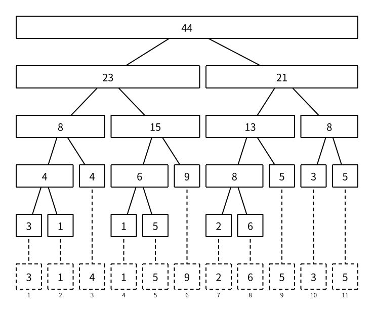

# 线段树：基础

> 最近修订：2026-08-13 02:55 +10:00（未审阅）

线段树维护的是一段序列上的区间信息。它的核心思想是：把一个区间递归拆成左右两半，每个节点维护自己负责区间的答案。

如果每次区间查询都从 `a[l]` 遍历到 `a[r]`，一次查询最慢需要 $O(n)$。线段树会预先保存许多段区间的答案，再用少量已经算好的区间拼出查询结果。

线段树不是某个固定代码，而是一套结构：

- 区间怎样拆。
- 每个节点维护什么信息。
- 两个子节点的信息怎样合并。
- 区间修改时怎样延迟下传。

## 适用问题

最经典的线段树支持：

- 单点修改，区间查询。
- 区间修改，区间查询。

常见维护信息：

- 区间和。
- 区间异或和。
- 区间最大值、最小值。
- 区间 gcd。
- 字符串哈希。
- 区间最大子段和。
- 区间某种状态转移矩阵。

线段树适合维护“区间答案可以由左右子区间答案合并出来”的信息。

例如区间和：

```text
sum[l, r] = sum[l, mid] + sum[mid + 1, r]
```

例如区间最大值：

```text
max[l, r] = max(max[l, mid], max[mid + 1, r])
```

例如区间异或和：

```text
xor[l, r] = xor[l, mid] ^ xor[mid + 1, r]
```

例如字符串多项式哈希。若每个节点维护区间长度 `len` 和正向哈希 `h`，一种常见合并方式是：

```text
h[l, r] = h[l, mid] * base^len[mid + 1, r] + h[mid + 1, r]
```

这说明线段树不只维护普通加法。只要区间信息能按固定顺序合并，就可以考虑线段树。

如果一个区间答案不能稳定地由左右子区间答案合并出来，线段树就不一定合适。

从代数角度看，线段树维护的信息通常需要满足结合律：

```text
(a op b) op c = a op (b op c)
```

如果查询时需要处理“空区间”，还需要一个恒等元，例如区间和的 `0`、区间异或和的 `0`、区间最大值的负无穷、区间 gcd 的 `0`、字符串哈希的空串哈希。也就是说，线段树通常维护的是一个幺半群，而不是必须维护群；它不要求每个元素都有逆元。

这点和树状数组的常见用法不同：树状数组常通过“前缀答案相减”得到区间答案，因此如果要支持任意区间查询，通常需要逆元。区间和可以做，因为加法有逆元；区间最大值就不能用普通树状数组这样做，因为 `max` 没有逆元。

## 区间拆分

根节点维护整个区间 `[1, n]`。

对节点 `[l, r]`：

```text
mid = (l + r) / 2
左儿子：[l, mid]
右儿子：[mid + 1, r]
```

直到 `l == r`，这个节点就是叶子，表示一个位置。

每向下一层，区间长度大约减半。长度为 `n` 的区间，连续减半到 1，大约需要 $\log_2 n$ 次，所以线段树高度是 $O(\log n)$。

一次单点修改只沿着根到某个叶子的一条链走下去，再沿原路 `pull` 回来，因此复杂度是 $O(\log n)$。

一次区间查询最多在每一层拆出少量相关节点。直观理解是：查询区间的左右边界各自沿树向下分裂，中间被完整覆盖的区间直接返回，所以总访问节点数是 $O(\log n)$ 级别。

### 手算一棵小树

下图中，每个实线长方形就是一个线段树节点，节点宽度等于它覆盖的原数组区间长度。底部虚线格是原数组，虚线投影表明叶节点与原数组位置的对应关系。



设数组下标范围是 `[1, 8]`。线段树只看区间时，结构如下：

```text
                         [1, 8]
                 /                  \
             [1, 4]                [5, 8]
           /        \            /        \
       [1, 2]      [3, 4]      [5, 6]      [7, 8]
       /   \        /   \       /   \       /   \
    [1,1] [2,2]  [3,3] [4,4] [5,5] [6,6] [7,7] [8,8]
```

查询 `[2, 7]` 时：

1. `[1, 8]` 没有被完整覆盖，继续访问左右儿子。
2. `[1, 4]` 只有一部分在查询区间内，拆成 `[2, 2]` 和 `[3, 4]`。
3. `[5, 8]` 也只有一部分在查询区间内，拆成 `[5, 6]` 和 `[7, 7]`。
4. `[3, 4]`、`[5, 6]` 这类已经被查询区间完整覆盖的节点直接返回，不再访问叶子。

最终查询区间被拆成：

```text
[2, 2] + [3, 4] + [5, 6] + [7, 7]
```

这里的加号表示“合并节点信息”。维护区间和时是真的加法；维护最大值时应改成 `max`。线段树查询快的关键正是：遇到完整覆盖的节点就直接使用已经维护好的答案。

### 函数参数分别表示什么

递归线段树里经常同时出现两组区间：

```cpp
query(u, l, r, ql, qr)
```

- `u, l, r`：当前访问的节点，以及这个节点负责的区间 `[l, r]`。
- `ql, qr`：本次查询目标 `[ql, qr]`，递归过程中通常保持不变。

初学时最容易把两组边界混在一起。可以始终问两个问题：

1. 当前节点 `[l, r]` 是否已经被目标 `[ql, qr]` 完整覆盖？
2. 目标区间是否碰到左儿子或右儿子？

对应代码就是：

```cpp
if (ql <= l && r <= qr) {
    return tree[u];
}

if (ql <= mid) {
    // 目标区间碰到左儿子 [l, mid]
}
if (qr > mid) {
    // 目标区间碰到右儿子 [mid + 1, r]
}
```

## 数组存树

竞赛中常用一段连续存储模拟按完全二叉树方式编号的树：

```text
节点 u 的左儿子：u * 2
节点 u 的右儿子：u * 2 + 1
```

直接写乘法和加法即可。编译器会自行完成等价的底层优化，手写位运算不会带来实用的性能优势。

可复用模板把线段树自身的规模、节点信息与操作放进同一个 `struct`，内部按实际 `n` 分配 `vector`：

```cpp
struct SegmentTree {
    int n;
    vector<ll> tree;
    vector<ll> lazy;

    SegmentTree(int n) : n(n), tree(4 * n + 5), lazy(4 * n + 5) {}
};
```

线段树根节点编号为 `1`，第 `0` 个元素有意留空。`tree` 与 `lazy` 都是对象内部状态，不会与其他线段树实例或题目变量重名；构造多个对象时，每个对象拥有自己的存储。

这里有两个不同的问题：

- 递归线段树实际创建多少个有效节点。
- 用 `u * 2`、`u * 2 + 1` 编号时，数组下标最大可能到哪里。

如果每个叶子对应原序列的一个位置，那么有效叶子数是 `n`。一棵每个内部节点都有两个儿子的二叉树满足：

```text
内部节点数 = 叶子数 - 1
总节点数 = 2 * 叶子数 - 1
```

所以递归线段树的有效节点数是：

```text
2 * n - 1
```

但数组存树使用的是完全二叉树编号。若 `n` 不是 2 的幂，这种编号中间会出现空洞；最大下标可能明显大于有效节点数。

设树高为 $h = \lceil \log_2 n \rceil$。使用完全二叉树编号时，深度不超过 `h` 的节点编号小于：

```text
2^(h + 1)
```

又因为：

```text
2^h < 2n
```

所以：

```text
最大节点编号 < 2^(h + 1) < 4n
```

这就是常见存储分配 `4 * n` 级别空间的原因。它不是精确节点数，而是对完全二叉树编号方式足够安全的上界。模板写 `4 * n + 5`，额外几个元素只作为边界余量，不具有特殊数学含义。

原序列仍然可以使用 `vector<ll> a(n + 5)` 保存 `a[1]` 到 `a[n]`。这里的第 `0` 格与线段树节点 `0` 都不参与有效数据，末尾额外位置是统一边界余量：浪费常数个元素换来与题面、递归区间和树节点编号一致的 1-based 语义。

### 统一命名约定

本文使用一套不绑定具体聚合和修改类型的名字：

| 名字 | 含义 |
| ---- | ---- |
| `tree[u]` | 节点 `u` 当前维护的聚合信息 |
| `lazy[u]` | 节点 `u` 尚未下传的修改 |
| `pull(u)` | 从两个儿子重新计算当前节点 |
| `push(u, l, r)` | 把当前节点的待处理修改下传给儿子 |
| `apply(...)` | 把一次修改作用到一个完整节点 |
| `update(...)` | 修改目标区间或位置 |
| `query(...)` | 查询目标区间 |

基础区间和代码里，`tree[u]` 存的是节点区间和；改成区间最大值时，数组名和接口名不必变化，只需要改变合并规则和单位元。

如果每个节点同时维护多种信息，可以把 `tree` 的元素类型改成结构体：

```cpp
struct Node {
    ll sum;
    ll mx;
};

vector<Node> tree(4 * n + 5);
```

对于本篇唯一的区间加操作，`lazy[u]` 保存整个节点区间尚未下传的增量：

```cpp
vector<ll> lazy(4 * n + 5);
```

加法的单位元是 `0`，所以 `lazy[u] == 0` 正好表示没有需要下传的增量。区间赋值等操作不能这样借用 `0`，需要另设布尔标记；多种标记的表示与组合放在扩展篇讨论。

## pull

`pull` 用左右儿子重新计算当前节点。从当前节点的视角看，它在主动拉取两个儿子的信息。它只负责合并，不下传懒标记，也不访问原数组。

维护区间和：

```cpp
void pull(int u) {
    tree[u] = tree[u * 2] + tree[u * 2 + 1];
}
```

维护区间最大值：

```cpp
void pull(int u) {
    tree[u] = max(tree[u * 2], tree[u * 2 + 1]);
}
```

线段树模板里最重要的问题之一就是：你到底在每个节点维护什么，两个儿子怎样合并。

## build

建树把原数组信息放到叶子，再一路 `pull`。原数组由构造函数以只读引用交给建树过程：

```cpp
void build(int u, int l, int r, const vector<ll>& a) {
    if (l == r) {
        tree[u] = a[l];
        return;
    }
    int mid = (l + r) / 2;
    build(u * 2, l, mid, a);
    build(u * 2 + 1, mid + 1, r, a);
    pull(u);
}
```

调用：

```cpp
build(1, 1, n, a);
```

## 单点修改

以下代码默认已经有 `typedef long long ll;`。

把位置 `pos` 改成 `val`：

```cpp
void update(int u, int l, int r, int pos, ll val) {
    if (l == r) {
        tree[u] = val;
        return;
    }
    int mid = (l + r) / 2;
    if (pos <= mid) {
        update(u * 2, l, mid, pos, val);
    } else {
        update(u * 2 + 1, mid + 1, r, pos, val);
    }
    pull(u);
}
```

如果是单点加 `val`，叶子处写：

```cpp
tree[u] += val;
```

## 区间查询

查询 `[ql, qr]` 的区间和：

```cpp
ll query(int u, int l, int r, int ql, int qr) {
    if (ql <= l && r <= qr) {
        return tree[u];
    }
    int mid = (l + r) / 2;
    ll res = 0;
    if (ql <= mid) {
        res += query(u * 2, l, mid, ql, qr);
    }
    if (qr > mid) {
        res += query(u * 2 + 1, mid + 1, r, ql, qr);
    }
    return res;
}
```

这里的 `res = 0` 是区间和的单位元。如果维护最大值，单位元不能随便写 0，而应写成足够小的数。本文代码约定：局部累计变量优先叫 `res`，`ans` 留给 `solve` 里真正要输出的最终答案。

## 完整单点修改、区间和代码

第一次写线段树，建议先掌握这个不带懒标记的版本。下面的接口约定：

- 操作 `1 pos val`：把 `a[pos]` 增加 `val`。
- 操作 `2 l r`：输出区间 `[l, r]` 的和。

```cpp
#include <bits/stdc++.h>
using namespace std;

typedef long long ll;

struct SegmentTree {
    int n;
    vector<ll> tree;

    SegmentTree(int n, const vector<ll>& a) : n(n), tree(4 * n + 5) {
        build(1, 1, n, a);
    }

    void pull(int u) {
        tree[u] = tree[u * 2] + tree[u * 2 + 1];
    }

    void build(int u, int l, int r, const vector<ll>& a) {
        if (l == r) {
            tree[u] = a[l];
            return;
        }
        int mid = (l + r) / 2;
        build(u * 2, l, mid, a);
        build(u * 2 + 1, mid + 1, r, a);
        pull(u);
    }

    void update(int u, int l, int r, int pos, ll val) {
        if (l == r) {
            tree[u] += val;
            return;
        }
        int mid = (l + r) / 2;
        if (pos <= mid) {
            update(u * 2, l, mid, pos, val);
        } else {
            update(u * 2 + 1, mid + 1, r, pos, val);
        }
        pull(u);
    }

    ll query(int u, int l, int r, int ql, int qr) {
        if (ql <= l && r <= qr) {
            return tree[u];
        }
        int mid = (l + r) / 2;
        ll res = 0;
        if (ql <= mid) {
            res += query(u * 2, l, mid, ql, qr);
        }
        if (qr > mid) {
            res += query(u * 2 + 1, mid + 1, r, ql, qr);
        }
        return res;
    }

    void update(int pos, ll val) {
        update(1, 1, n, pos, val);
    }

    ll query(int l, int r) {
        return query(1, 1, n, l, r);
    }
};

int main() {
    int n;
    int q;
    scanf("%d%d", &n, &q);

    vector<ll> a(n + 5);
    for (int i = 1; i <= n; i++) {
        scanf("%lld", &a[i]);
    }

    SegmentTree segment(n, a);

    while (q--) {
        int op;
        scanf("%d", &op);
        if (op == 1) {
            int pos;
            ll val;
            scanf("%d%lld", &pos, &val);
            segment.update(pos, val);
        } else {
            int l;
            int r;
            scanf("%d%d", &l, &r);
            printf("%lld\n", segment.query(l, r));
        }
    }
    return 0;
}
```

这个版本只需要记住三件事：

1. `build`：先建立两个儿子，再 `pull`。
2. `update`：只进入包含 `pos` 的一个儿子，回来时 `pull`。
3. `query`：目标碰到哪个儿子就查询哪个儿子，完整覆盖时直接返回。

把这三部分写稳之后，再学习懒标记。否则同时处理“节点区间、查询区间、修改区间、待下传标记”，很难判断错误究竟来自哪一层。

## 懒标记

区间修改不能每次都改到所有叶子，否则一次修改可能是 $O(n)$。

懒标记的思想是：当一个节点负责的区间被整体修改时，先只修改这个节点的信息，并记录“这个修改还没有下传给儿子”。等以后真的访问儿子时，再把标记传下去。

区间加、区间和的典型信息：

```cpp
vector<ll> tree(4 * n + 5);
vector<ll> lazy(4 * n + 5);
```

基础模板中的 `tree[u]` 是节点区间和，`lazy[u]` 是整个节点区间尚未下传的增量。`tree` 和 `lazy` 描述它们在线段树中的职责，不把名字绑定到某个具体题目。

本篇只有区间加，因此 `lazy[u] == 0` 正好表示没有未下传的修改：给区间增加 $0$ 与什么都不做完全等价。基础模板不为一种无歧义的操作额外保存布尔值。

区间乘法也存在，常见于取模意义下的“区间乘、区间加、区间和”。它需要维护乘法标记和加法标记的组合顺序，复杂度和细节都比基础懒标记更高，不放在第一份基础模板里。

如果把修改操作换成区间赋值，就不能再用数值 `0` 表示“无标记”，因为“把整个区间赋值为 0”是真实操作。此时可以显式保存操作是否存在：

```cpp
vector<pair<bool, ll>> lazy(4 * n + 5);
```

`lazy[u].first` 表示是否存在待下传赋值，`lazy[u].second` 表示赋值内容。这属于另一种修改语义，不混入本篇区间加模板。

多个懒标记的覆盖关系和下传顺序见 [线段树：懒标记的组合顺序](segment-tree-lazy-tags.md)。

对节点 `[l, r]` 整体加 `val`：

```cpp
void apply(int u, int l, int r, ll val) {
    tree[u] += val * (r - l + 1);
    lazy[u] += val;
}
```

下传懒标记：

```cpp
void push(int u, int l, int r) {
    if (lazy[u] == 0) {
        return;
    }
    int mid = (l + r) / 2;
    apply(u * 2, l, mid, lazy[u]);
    apply(u * 2 + 1, mid + 1, r, lazy[u]);
    lazy[u] = 0;
}
```

区间加：

```cpp
void update(int u, int l, int r, int ql, int qr, ll val) {
    if (ql <= l && r <= qr) {
        apply(u, l, r, val);
        return;
    }
    push(u, l, r);
    int mid = (l + r) / 2;
    if (ql <= mid) {
        update(u * 2, l, mid, ql, qr, val);
    }
    if (qr > mid) {
        update(u * 2 + 1, mid + 1, r, ql, qr, val);
    }
    pull(u);
}
```

带懒标记的区间查询：

```cpp
ll query(int u, int l, int r, int ql, int qr) {
    if (ql <= l && r <= qr) {
        return tree[u];
    }
    push(u, l, r);
    int mid = (l + r) / 2;
    ll res = 0;
    if (ql <= mid) {
        res += query(u * 2, l, mid, ql, qr);
    }
    if (qr > mid) {
        res += query(u * 2 + 1, mid + 1, r, ql, qr);
    }
    return res;
}
```

## 完整区间加、区间和代码

下面的接口约定：

- 操作 `1 l r val`：把 `[l, r]` 中的每个数都增加 `val`。
- 操作 `2 l r`：输出区间 `[l, r]` 的和。

```cpp
#include <bits/stdc++.h>
using namespace std;

typedef long long ll;

struct SegmentTree {
    int n;
    vector<ll> tree;
    vector<ll> lazy;

    SegmentTree(int n, const vector<ll>& a) : n(n), tree(4 * n + 5), lazy(4 * n + 5) {
        build(1, 1, n, a);
    }

    void pull(int u) {
        tree[u] = tree[u * 2] + tree[u * 2 + 1];
    }

    void apply(int u, int l, int r, ll val) {
        tree[u] += val * (r - l + 1);
        lazy[u] += val;
    }

    void push(int u, int l, int r) {
        if (lazy[u] == 0) {
            return;
        }
        int mid = (l + r) / 2;
        apply(u * 2, l, mid, lazy[u]);
        apply(u * 2 + 1, mid + 1, r, lazy[u]);
        lazy[u] = 0;
    }

    void build(int u, int l, int r, const vector<ll>& a) {
        if (l == r) {
            tree[u] = a[l];
            return;
        }
        int mid = (l + r) / 2;
        build(u * 2, l, mid, a);
        build(u * 2 + 1, mid + 1, r, a);
        pull(u);
    }

    void update(int u, int l, int r, int ql, int qr, ll val) {
        if (ql <= l && r <= qr) {
            apply(u, l, r, val);
            return;
        }
        push(u, l, r);
        int mid = (l + r) / 2;
        if (ql <= mid) {
            update(u * 2, l, mid, ql, qr, val);
        }
        if (qr > mid) {
            update(u * 2 + 1, mid + 1, r, ql, qr, val);
        }
        pull(u);
    }

    ll query(int u, int l, int r, int ql, int qr) {
        if (ql <= l && r <= qr) {
            return tree[u];
        }
        push(u, l, r);
        int mid = (l + r) / 2;
        ll res = 0;
        if (ql <= mid) {
            res += query(u * 2, l, mid, ql, qr);
        }
        if (qr > mid) {
            res += query(u * 2 + 1, mid + 1, r, ql, qr);
        }
        return res;
    }

    void update(int l, int r, ll val) {
        update(1, 1, n, l, r, val);
    }

    ll query(int l, int r) {
        return query(1, 1, n, l, r);
    }
};

int main() {
    int n;
    int q;
    scanf("%d%d", &n, &q);

    vector<ll> a(n + 5);
    for (int i = 1; i <= n; i++) {
        scanf("%lld", &a[i]);
    }

    SegmentTree segment(n, a);

    while (q--) {
        int op;
        scanf("%d", &op);
        if (op == 1) {
            int l;
            int r;
            ll val;
            scanf("%d%d%lld", &l, &r, &val);
            segment.update(l, r, val);
        } else {
            int l;
            int r;
            scanf("%d%d", &l, &r);
            printf("%lld\n", segment.query(l, r));
        }
    }
    return 0;
}
```

## 复杂度

- `build` 访问线段树的每个有效节点一次，时间复杂度是 $O(n)$。
- 单点增加只经过一条从根到叶子的链，时间复杂度是 $O(\log n)$。
- 一次区间查询或带懒标记的区间增加，时间复杂度是 $O(\log n)$。
- 有效节点数是 $O(n)$，`SegmentTree` 内部按当前规模分配 `4 * n + 5` 个元素，空间复杂度是 $O(n)$。

## 不变量

写线段树时要盯住这些不变量：

- `tree[u]` 永远表示节点 `u` 当前区间 `[l, r]` 的区间和。
- 如果没有懒标记，父节点信息应该等于两个儿子信息合并。
- 如果有懒标记，`tree[u]` 已经反映这个节点区间的真实答案，但儿子可能还没更新。
- 每次访问儿子前，如果存在可能影响儿子的懒标记，就先 `push`。
- 每次修改儿子后，都要 `pull` 更新当前节点。

## 常见错误

- 内部 `vector` 没有分配到 `4 * n` 级别。
- `mid` 之后左右区间写错，导致死递归。
- 查询右半边条件写成 `qr >= mid`，正确通常是 `qr > mid`。
- 区间修改后忘记 `pull`。
- 访问儿子前忘记 `push`。
- 懒标记只改了 `lazy[u]`，没有同步改 `tree[u]`。
- 维护最大值时，把查询初值错误地写成 0。
- `val * (r - l + 1)` 没用 `ll`，导致溢出。

## 什么时候不该用线段树

- 只有静态区间和查询：前缀和更简单。
- 只有单点修改和前缀/区间和：树状数组更短。
- 需要维护的是全局有序集合：可能是平衡树、堆、set。
- 需要复杂历史版本：可能是主席树。
- 需要区间取 min/max 后继续修改：可能需要线段树 beats，普通懒标记不够。

## 扩展阅读

本文只要求掌握区间和的基础版本。如果题目同时出现加法、乘法或赋值等多种修改，再阅读 [线段树：懒标记的组合顺序](segment-tree-lazy-tags.md)。

其他常见变体包括：

- 区间加，区间最大值。
- 区间赋值，区间和。
- 区间加和区间赋值同时存在。
- 区间异或和。
- 字符串哈希，支持单点修改和区间哈希查询。
- 动态开点线段树。
- 权值线段树。
- 主席树。
- 线段树合并。
- 线段树分裂。
- 线段树优化建图。
- 线段树二分。
- 线段树 beats。

这些不应该一次塞进基础模板。基础线段树先保证常见形态清晰，变体单独成文。

## 调试方法

小数据手算一组：

```text
a = [1, 2, 3, 4, 5]
update(2, 4, 10)
query(1, 5) = 45
query(2, 3) = 25
```

如果结果错误，按顺序查：

1. 建树叶子是否正确。
2. `pull` 合并是否正确。
3. 区间完全覆盖条件是否正确。
4. 左右递归条件是否正确。
5. `apply` 是否同时更新 `tree` 和 `lazy`。
6. `push` 是否清空当前懒标记。
7. 是否所有可能进入儿子的地方都先下传。

## 练习题

将完整的区间加、区间和代码提交到 [洛谷 P3372【模板】线段树 1](https://www.luogu.com.cn/problem/P3372)。这道题的两种操作与本文完整代码的接口直接对应。

## 需要记住什么

1. 线段树的一个节点负责什么，左右儿子的区间怎样由 `[l, r]` 得到？
2. `build`、`pull`、`update` 和 `query` 各自负责哪一步？
3. 区间查询中，什么时候可以直接返回 `tree[u]`，什么时候要继续进入儿子？
4. 为什么递归线段树通常分配 `4 * n + 5` 个存储位置？
5. 懒标记存在时，`tree[u]` 和它的两个儿子分别已经包含了哪些修改？
6. `apply`、`push` 和 `pull` 的调用顺序为什么不能随意交换？

幺半群、字符串哈希、复杂懒标记与各种高级变体只需知道它们说明了线段树的扩展能力，学习基础版本时不要求理解或记忆。

## 下一篇

[树状数组：基础](fenwick-tree.md) 会用更短的代码处理“单点增加、前缀和与区间和”，并解释 `lowbit` 怎样决定每次跳转的位置。
