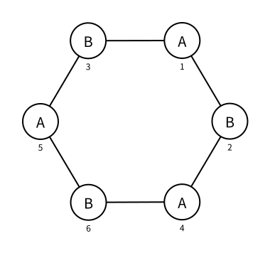

# 二分图：判定

> 最近修订：2026-08-16 15:20 +10:00（未审阅）

[图的广度优先搜索（BFS）](graph-breadth-first-search.md) 已经能够从一个起点访问所在连通分量。本篇考虑另一类常见要求：把无向图中的所有点分进两个集合，使每条边的两个端点一定属于不同集合。

例如，需要把互相冲突的人分到两个小组、把相邻区域涂成两种颜色，或者判断一组“二者必须不同类”的限制能否同时满足。直接枚举每个点属于哪个集合有 $2^n$ 种方案；图上的一条边却会立即决定相邻点必须怎样选择。我们将从这条局部限制推导线性判定方法。

## 二分图

如果一张无向图的点可以分成两个互不相交的集合 $A$ 和 $B$，并且每条边都恰好连接一个 $A$ 中的点与一个 $B$ 中的点，那么这张图称为二分图（bipartite graph）。



图中：

```text
A = {1, 4, 5}
B = {2, 3, 6}
```

点在纸面上的左右或上下位置不决定集合；圆内的 `A`、`B` 才是分类结果。同一个集合内部不能存在边，但并不要求两个集合之间的任意一对点都有边。

没有边的点可以任意放入一个集合。含有多个连通分量的图也可以是二分图，只要每个连通分量都能分别完成分类。

## 从枚举到染色

把集合 $A$ 记作颜色 `1`，集合 $B$ 记作颜色 `-1`，尚未分类记作 `0`：

```cpp
color.assign(n + 5, 0);
```

这里的“染色”只是给点保存一个类别编号，不要求真的使用彩色图形。

若已经知道点 `u` 的颜色，那么每个邻居 `v` 都必须属于另一个集合。因此尚未染色的邻居只有一种合法选择：

```cpp
color[v] = -color[u];
```

`1` 的相反数是 `-1`，`-1` 的相反数是 `1`。一条边把原本独立的两次二选一变成了“一旦确定一端，另一端就被迫确定”。沿着边不断传播以后，一个连通分量只剩下“整体交换两种颜色”这一种对称选择，无需枚举其中每个点。

## 用 BFS 传播颜色

先从一个尚未染色的点 `start` 开始，任选颜色 `1`：

```cpp
queue<int> q;
color[start] = 1;
q.push(start);
```

这个选择不会损失答案。若某种合法分类把 `start` 放在 `B`，将这个连通分量中的 `A`、`B` 整体交换以后，仍然是合法分类，并且 `start` 会位于 `A`。

取出当前点 `u`，检查它的全部邻居：

```cpp
while (!q.empty()) {
    int u = q.front();
    q.pop();

    for (int v : g[u]) {
        // 检查边 u - v
    }
}
```

若 `v` 尚未染色，就按照边的限制赋予相反颜色，并把它加入队列，让这个新颜色继续向外传播：

```cpp
if (color[v] == 0) {
    color[v] = -color[u];
    q.push(v);
}
```

BFS 的距离每经过一条边增加 `1`，因此它实际上按距离奇偶性染色：与起点距离为偶数的点和起点同色，距离为奇数的点与起点异色。不过代码只依赖已经确定的 `color[u]`，不需要另外维护距离。

## 发现冲突

若邻居 `v` 已经有颜色，就不能直接跳过这条边。它可能从另一条路径得到分类，当前边还需要验证两端是否异色：

```cpp
else if (color[v] == color[u]) {
    return false;
}
```

例如三角形 `1 - 2 - 3 - 1`：

1. 令 `color[1] = 1`；
2. 边 `1 - 2` 迫使 `color[2] = -1`；
3. 边 `2 - 3` 迫使 `color[3] = 1`；
4. 边 `3 - 1` 却连接了两个颜色都是 `1` 的点。

无论怎样整体交换颜色，这个冲突都不会消失，所以三角形不是二分图。

自环 `u - u` 也会立即产生 `color[u] == color[u]`，因此含自环的图一定不是二分图。重边只会重复检查同一项限制，不改变结论。

## 不能只搜索一个连通分量

从一个起点进行 BFS 只能访问它所在的连通分量。其他分量可能含有三角形等冲突，因此必须依次寻找尚未染色的点，把它作为新分量的起点：

```cpp
for (int start = 1; start <= n; start++) {
    if (color[start] != 0) {
        continue;
    }

    // 从 start 开始染色当前连通分量
}
```

孤立点也会启动一次 BFS，但队列中只有它自己；任意颜色都合法。

## 完整判定函数

邻接表、点数与染色结果都是题目级共享状态，因此完整判定函数不再反复传递它们。

把所有连通分量和冲突检查合在一起：

```cpp
bool is_bipartite() {
    color.assign(n + 5, 0);

    for (int start = 1; start <= n; start++) {
        if (color[start] != 0) {
            continue;
        }

        queue<int> q;
        color[start] = 1;
        q.push(start);

        while (!q.empty()) {
            int u = q.front();
            q.pop();

            for (int v : g[u]) {
                if (color[v] == 0) {
                    color[v] = -color[u];
                    q.push(v);
                } else if (color[v] == color[u]) {
                    return false;
                }
            }
        }
    }

    return true;
}
```

一旦发现同色边，已经足以证明不存在合法分类，可以立即返回 `false`。若所有邻接表都检查完仍没有冲突，每条边的两端都异色，当前 `color` 就直接给出了一组合法分类。

## 为什么它恰好在排除奇环

一个环若有偶数条边，沿环交替使用两种颜色，回到起点时会恢复起点原来的颜色，不产生冲突。

一个环若有奇数条边，颜色交替奇数次以后，回到起点时却要求起点同时具有相反颜色。因此奇环一定不能被二染色。

反过来，若染色过程中出现同色边 `u - v`，从当前分量的 BFS 起点分别走到 `u`、`v` 的树上路径具有相同的距离奇偶性。去掉两条路径共有的前缀，再加上边 `u - v`，会形成一个奇环。

所以得到等价结论：

> 一张无向图是二分图，当且仅当它不含奇环。

实际判定时不需要先找出环。二染色会在扫描构成奇环的某条边时直接发现冲突。

## 完整程序

下面读入一张无向图，并输出它是否为二分图：

```cpp
#include <bits/stdc++.h>
using namespace std;

int n, m;
vector<vector<int>> g;
vector<int> color;

bool is_bipartite() {
    color.assign(n + 5, 0);

    for (int start = 1; start <= n; start++) {
        if (color[start] != 0) {
            continue;
        }

        queue<int> q;
        color[start] = 1;
        q.push(start);

        while (!q.empty()) {
            int u = q.front();
            q.pop();

            for (int v : g[u]) {
                if (color[v] == 0) {
                    color[v] = -color[u];
                    q.push(v);
                } else if (color[v] == color[u]) {
                    return false;
                }
            }
        }
    }

    return true;
}

void solve() {
    scanf("%d%d", &n, &m);

    g.assign(n + 5, {});
    for (int i = 1; i <= m; i++) {
        int u, v;
        scanf("%d%d", &u, &v);
        g[u].push_back(v);
        g[v].push_back(u);
    }

    printf("%s\n", is_bipartite() ? "Yes" : "No");
}

int main() {
    solve();
    return 0;
}
```

这份程序只处理无向图。若题目给出有向边，却要求每条边的两个端点属于不同集合，那么方向对这项限制没有影响，可以仍把每条边按无向边加入两份邻接表；若题目对方向另有定义，应以题目定义为准。

## 示例

输入：

```text
6 6
1 2
1 3
2 4
3 5
5 6
4 6
```

输出：

```text
Yes
```

若在输入末尾增加边 `2 3`，点 `1`、`2`、`3` 会构成三角形，答案变成 `No`。

## 正确性

对每个连通分量任选一个起点染成 `1`。每当算法第一次到达未染色点 `v`，都通过当前边把它染成 `-color[u]`，所以这条边的两端异色。

对于连接两个已染色点的边，算法显式检查颜色。若两端同色，这条限制不可能满足，返回 `false` 正确；若全部边都没有产生冲突，最终每条边的两个端点都异色，`color` 给出二分图定义要求的两个集合，因此返回 `true` 正确。

外层循环会为每个尚未访问的连通分量启动 BFS，所以不会遗漏不与点 `1` 连通的冲突。

## 复杂度

每个点至多入队一次。无向边在邻接表中保存两次，两份记录各检查一次，因此时间复杂度为 $O(n+m)$。邻接表、颜色数组和队列的空间复杂度为 $O(n+m)$。

## 常见错误

### 只给未染色邻居赋值

已经染色的邻居仍必须检查。若直接 `continue`，三角形的最后一条边不会被发现。

### 只从点 `1` 开始搜索

图可能不连通；点 `1` 所在分量合法，另一个分量仍可能含奇环。必须用外层循环启动每个分量。

### 把无向边只存一次

本篇的 BFS 使用邻接表访问所有邻居。每条无向边必须同时加入 `g[u]` 和 `g[v]`。

### 使用两个布尔状态

若 `false`、`true` 分别表示两种颜色，就没有第三种状态表示“尚未染色”。可以另设 `visited`，但一个取值为 `0`、`1`、`-1` 的 `int` 数组更直接。

### 把二分图理解成完全二分图

二分图只要求边不出现在同一个集合内部，并不要求 $A$ 与 $B$ 之间所有可能的边都存在。后者是更特殊的完全二分图。

## 基础练习

1. 手算路径、偶环、奇环和含自环的图分别会怎样染色。
2. 给出一张不连通图，其中点 `1` 所在分量是二分图，另一个分量不是二分图。
3. 修改模板，在答案为 `Yes` 时分别输出两个集合中的点。
4. 若每条限制表示“两个人必须在不同组”，读入限制并输出一种分组方案。
5. 在网格图中按行列坐标奇偶性给格子染色，并解释为什么普通四联通网格不含奇环。
6. 随机生成小图，枚举全部 $2^n$ 种分类，与 BFS 判定结果对拍。

## 需要记住什么

1. 二分图的两个集合需要满足什么条件？
2. 为什么固定一个连通分量起点的颜色不会损失答案？
3. `color` 为什么需要三种状态？
4. 一个点染色以后，邻居的颜色为什么被唯一确定？
5. 遇到未染色邻居和已染色邻居时分别怎样处理？
6. 为什么必须遍历所有连通分量？
7. 为什么自环一定使答案为 `false`？重边为什么不影响结论？
8. 二分图与奇环之间有什么等价关系？
9. 判定算法为什么是 $O(n+m)$？
10. 怎样从 `color` 数组恢复两个集合？

## 扩展阅读

- [二分图：最大匹配（正文待写）](../catalog.md#04-图论) 会在二分图两侧的点之间选择尽量多条端点互不重复的边。
