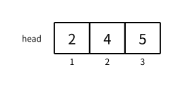
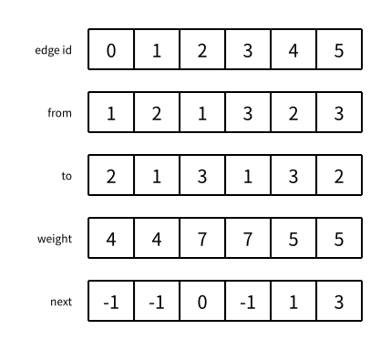

# 图的存储：链式前向星

> 状态：草稿
> 直接前置：[0118 数组：一维数组](../cpp/0118-one-dimensional-arrays.md)、[0402 图的存储：基础概念](graph-representation.md)

[图的存储：基础概念](graph-representation.md) 已经说明，邻接表只要求每个点能够直接找到自己的全部出边，并不限定底层实现。普通图算法用 `vector` 实现最简单；欧拉图和网络流还会高频访问与当前边配对的反向记录。如果两条记录分别放在不同点的 `vector` 中，就要为每条边额外保存反向位置，并在两个互不连续的动态数组之间跳转。

链式前向星把所有边记录放入同一个连续的全局数组，用整数下标标识边；同一起点的边再通过 `head` 和 `next` 串成静态链表。只要把配对边连续插入，就能用下标最低位直接在两者之间切换。这种布局牺牲了“同一点的全部出边连续”，换来“每条边与它的配对反向记录连续”。

## 用下标连接邻接项

先只解决“如何枚举点 `u` 的所有出边”。无权边记录保存终点，以及同一起点的下一条边编号：

```cpp
struct Edge {
    int to;
    int next;
};
```

带权边记录再增加 `weight`：

```cpp
struct Edge {
    int to;
    int weight;
    int next;
};
```

所有记录放在同一个数组 `edges` 中。`head[u]` 保存点 `u` 的第一条出边编号；没有出边时使用 `-1`：

```cpp
Edge edges[MAXM];
int head[MAXN];
int edge_count;
```

枚举从点 `u` 出发的边，就是沿 `next` 下标移动：

```cpp
for (int edge_id = head[u]; edge_id != -1;
     edge_id = edges[edge_id].next) {
    int to = edges[edge_id].to;
    int weight = edges[edge_id].weight;
}
```

`head[u]` 和连续的全局边数组共同实现了点 `u` 的邻接表；`next` 则用数组下标代替指针，把同一起点的邻接项连接起来。链式前向星因此属于邻接表的数组实现，也常称为静态邻接表。

## 头插一条边

加入有向边 `from -> to` 时，新记录放在全局边数组末尾。它的 `next` 指向原来的 `head[from]`，随后让 `head[from]` 指向新记录：

```cpp
void add_edge(int from, int to, int weight) {
    edges[edge_count] = {to, weight, head[from]};
    head[from] = edge_count;
    edge_count++;
}
```

无权图只需删除 `weight` 参数和字段：

```cpp
void add_edge(int from, int to) {
    edges[edge_count] = {to, head[from]};
    head[from] = edge_count;
    edge_count++;
}
```

这是单向链表的头插法，每次加入只需 $O(1)$ 时间。代价是同一起点的边会按照输入的相反顺序枚举；大多数图算法不依赖这个顺序。

使用前必须把所有 `head` 初始化为 `-1`，并让第一条边的编号从 `0` 开始：

```cpp
fill(head, head + n + 1, -1);
edge_count = 0;
```

全局数组大小 `MAXM` 按实际保存的边记录数计算。一张有 $m$ 条无向边的图通常需要至少 `2 * m` 个位置。

## 连续存放配对边

加入一条带权无向边 $(u,v,w)$ 时，严格连续调用两次：

```cpp
add_edge(u, v, w);
add_edge(v, u, w);
```

因为 `edge_count` 从 `0` 开始，第一对边编号为 `0,1`，第二对为 `2,3`，依此类推。每一对中，偶数编号与紧随其后的奇数编号互为反向记录。

整数 `edge_id ^ 1` 会翻转二进制最低位：

```text
0 ^ 1 = 1    1 ^ 1 = 0
2 ^ 1 = 3    3 ^ 1 = 2
4 ^ 1 = 5    5 ^ 1 = 4
```

所以任意一条记录的配对边编号都是：

```cpp
int reverse_edge_id = edge_id ^ 1;
```

这个公式依赖三个不变量：

- 边编号从 `0` 开始；
- 每一对记录连续加入；
- 两次加入之间绝不插入无关记录。

只要破坏其中任何一条，`edge_id ^ 1` 就不再表示反向边。

## 数组中的实际结果

依次加入三条带权无向边：

```text
(1, 2, 4)
(1, 3, 7)
(2, 3, 5)
```

最终的 `head` 是：



全局边数组的逻辑内容如下。教学图保留 `from` 是为了说明每条记录来自哪个点；实际结构体不必保存它，因为沿 `head[from]` 的链已经知道起点。



点 $1$ 的出边链从 `head[1] = 2` 开始：

```text
edge 2 -> edge 0 -> -1
```

它们分别表示 $1\to3$ 和 $1\to2$。边 `2` 的配对记录是 `2 ^ 1 = 3`，也就是 $3\to1$。`next` 负责找到同一起点的下一条边，`^ 1` 负责找到当前边的配对记录，两者是相互独立的关系。

## 前向星与链式前向星

边集只把完整边记录依次放进数组，没有按起点建立索引。

前向星（forward star）把边按起点分组，使同一点的出边占据全局数组中的一个连续区间，再为每个点记录区间边界。常见实现按起点排序边集，需要 $O(m\log m)$ 构建时间；也可以计数分组到 $O(n+m)$。边已连续，所以它不需要 `next`。

链式前向星不要求同一起点的边连续。所有记录仍在一个全局数组中，但 `head/next` 用下标把同一起点的记录串起来，因此可以按输入顺序 $O(1)$ 头插。

所以，原始边集不是前向星；链式前向星也不是“排序后的边集”。前向星和链式前向星都为每个点建立了定位出边的索引，因此都是邻接表的实现，只是索引方式和内存布局不同。

## 跳过已经无用的边

链式前向星用整数下标表示当前邻接项，因此可以把 `head[u]` 或单独维护的当前边下标不断推进到 `next`，懒惰地跳过已经使用、容量耗尽或不再需要检查的边。

欧拉回路可以在取走边后推进表头，避免反复扫描已经使用的前缀；网络流的当前弧优化也会记住已经检查到哪条边。具体算法会在各自的文章中定义“什么时候一条边已经无用”，这里先记住 `next` 允许直接向后推进即可。

## 网络流中的配对边

网络流同样连续加入一对记录，但它们的初始容量通常不同：

```cpp
add_edge(u, v, capacity);
add_edge(v, u, 0);
```

第二条不是原图本来就有的反向有向边，而是残量网络为了撤销或调整流量建立的反向边。两条记录仍可以用 `edge_id ^ 1` 高频互相访问。真正学习网络流时，会把字段 `weight` 改成语义明确的 `capacity`。

## 完整代码

下面是可复制的带权无向图链式前向星。进入竞赛模板后使用常见缩写：边数组为 `e`，边计数为 `cnt`，输入端点和边权为 `u`、`v`、`w`。

```cpp
#include <bits/stdc++.h>
using namespace std;

const int MAXN = 200005;
const int MAXM = 400005;

struct Edge {
    int v;
    int w;
    int next;
};

Edge e[MAXM];
int head[MAXN];
int cnt;

void add_edge(int u, int v, int w) {
    e[cnt] = {v, w, head[u]};
    head[u] = cnt;
    cnt++;
}

int main() {
    int n, m;
    scanf("%d%d", &n, &m);

    fill(head, head + n + 1, -1);
    cnt = 0;

    for (int i = 1; i <= m; i++) {
        int u, v, w;
        scanf("%d%d%d", &u, &v, &w);
        add_edge(u, v, w);
        add_edge(v, u, w);
    }

    for (int u = 1; u <= n; u++) {
        printf("%d:", u);
        for (int i = head[u]; i != -1; i = e[i].next) {
            printf(" (%d, %d, edge %d)", e[i].v, e[i].w, i);
        }
        printf("\n");
    }

    return 0;
}
```

`MAXM` 必须覆盖展开后的边记录数。这里假设输入无向边数量不超过 `200000`，所以至少预留约 `400000` 条记录；额外的几个位置只用于避免边界估算写得过紧。

## 复杂度

建图时每条边记录只头插一次，时间为 $O(m)$。枚举整张图时每条记录只沿链访问一次，时间为 $O(n+m)$。`head` 占用 $O(n)$ 空间，全局边数组占用 $O(m)$ 空间。

与 `vector` 邻接表相比，渐进复杂度相同。链式前向星在这里真正重要的优势是：边记录集中在一个全局数组中，配对记录能够保证连续，并且无需为每条边额外保存反向位置。网络流频繁在 `e[i]` 和 `e[i ^ 1]` 之间切换时，连续的配对记录也具有良好的内存局部性。

因此，本书的选型是：

- Kruskal、Bellman–Ford 等整体扫描或排序全部边的算法使用边集；
- 欧拉回路和网络流等高频访问配对反向记录的算法使用链式前向星；
- 其他绝大多数普通图算法使用代码更短、同一点出边连续的 `vector` 邻接表。

哈密顿路径和哈密顿回路限制的是点只出现一次，不需要标记一对反向记录属于同一条已使用的原始边，因此不属于第二种情况。

## 需要记住什么

- `head[u]`、`e[i].next` 和 `i` 分别表示什么？
- 无权边记录和带权边记录分别保存哪些字段？
- `add_edge` 如何用头插法在 $O(1)$ 时间加入一条边？
- 为什么同一起点的边会按输入的相反顺序枚举？
- 为什么边编号必须从 `0` 开始并成对连续插入？
- `i ^ 1` 为什么能在一对边之间切换？哪些操作会破坏这个约定？
- `next` 与 `i ^ 1` 分别维护哪一种关系？
- 直接存边、前向星和链式前向星有什么区别？
- 为什么链式前向星仍然属于邻接表，而不是第四种基础存图方法？
- 为什么普通图算法使用 `vector`，欧拉图和网络流改用链式前向星？
- `head[u]` 或当前边下标怎样帮助算法跳过已经无用的邻接项？
- 为什么哈密顿问题通常不需要成对反向记录？
