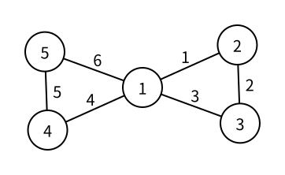

# 欧拉问题：路径、回路与图

> 状态：定稿

普通路径关心经过哪些点；欧拉问题换了一个目标：图中的每条原始边都必须恰好使用一次。

## 欧拉路径

经过图中每条边恰好一次的行走顺序称为欧拉路径（Eulerian path）。它不能重复使用边，但允许重复经过点。

这个名称中的“路径”沿用竞赛中的固定叫法。按照 [路径与环](paths-and-cycles.md) 的严格定义，普通路径不能重复点；欧拉路径实际上更接近“边不重复的迹”。解题时应直接记住它真正限制的是边，而不是尝试从“路径”二字推测限制。

一张图有 $m$ 条边时，欧拉路径的点序列恰好包含 $m+1$ 项：每走过一条边，序列中就增加一个到达点。

## 欧拉回路

起点与终点相同的欧拉路径称为欧拉回路（Eulerian circuit）。存在欧拉回路的图称为欧拉图（Eulerian graph）。

下图中边旁的数字表示经过顺序：



对应点序列是：

```text
1 -> 2 -> 3 -> 1 -> 4 -> 5 -> 1
```

每条边恰好使用一次，但点 $1$ 出现了三次。这个结构是欧拉回路，却不是 [路径与环](paths-and-cycles.md#环) 中不重复中间点的环。

存在欧拉路径、但不存在欧拉回路的图也称为半欧拉图。这个名称只需能够识别；判断和构造仍然围绕“是否能恰好使用全部边”进行。

## 无向图的度数条件

沿一条无向欧拉回路进入某个点后，必须再沿另一条尚未使用的边离开。进入和离开总是成对出现，所以每个非孤立点的度数都必须是偶数。

反过来，一张无向图存在欧拉回路，当且仅当同时满足：

- 所有度数不为 $0$ 的点属于同一个连通分量；
- 每个点的度数都是偶数。

若只要求欧拉路径，则奇数度数的点只能有 $0$ 个或 $2$ 个：

- 没有奇度点时，欧拉路径会回到起点，因此也是欧拉回路；
- 恰有两个奇度点时，欧拉路径必须从其中一个开始，在另一个结束；
- 奇度点数量为其他值时，不存在欧拉路径。

孤立点没有边需要经过，因此不会破坏其他边组成的欧拉路径。连通条件只检查度数不为 $0$ 的点。

## 有向图的度数条件

有向图还要区分进入和离开的方向。

有向图存在欧拉回路时，每个点的入度必须等于出度，而且忽略边的方向后，所有度数不为 $0$ 的点必须连通。

有向图存在起点和终点不同的欧拉路径时：

- 起点的出度比入度大 $1$；
- 终点的入度比出度大 $1$；
- 其他点的入度等于出度；
- 忽略边的方向后，所有度数不为 $0$ 的点连通。

若所有点的入度都等于出度，则路径会闭合为欧拉回路。度数条件负责确定可能的起点和终点，连通条件负责保证不会遗漏另一个边连通分量。

## 不能只贪心输出

从起点不断任选一条未使用边，最终一定会在某处无路可走。但直接把沿途点依次当成最终答案，可能过早闭合一小段回路，而其他边仍然没有加入。

Hierholzer 算法的关键是推迟写入答案：

1. 只要当前点还有未使用的出边，就取走一条边并继续前进；
2. 当前点再也没有边可走时，才把它加入答案；
3. 这样得到的点序列方向相反，最后整体翻转。

若一条小回路先闭合，递归或显式栈仍会回到它与其他边相接的点，再把剩余回路拼接进正确位置。

## 配对无向边

链式前向星把无向边 $(u,v)$ 连续存成两条记录：

```cpp
add_edge(u, v);
add_edge(v, u);
```

编号 `i` 和 `i ^ 1` 表示同一条原始无向边的两个方向。选中其中一个方向后，必须同时标记两条记录：

```cpp
used[i] = true;
used[i ^ 1] = true;
```

否则算法稍后可能从另一个端点沿反向记录再使用一次同一条原始边。

每次检查点 `u` 时，还可以把 `head[u]` 推进到下一项，永久跳过已经取走的表头：

```cpp
int i = head[u];
head[u] = e[i].next;
```

这正是欧拉问题使用链式前向星的原因：同一点的出边可以沿 `next` 枚举，同一条原始边的两个方向又能通过 `i ^ 1` 立即互相定位。

## 显式栈构造

下面用 `path_stack` 保存当前尚未最终确定的点序列：

```cpp
vector<int> path_stack;
vector<int> answer;
path_stack.push_back(start);

while (!path_stack.empty()) {
    int u = path_stack.back();

    while (head[u] != -1 && used[head[u]]) {
        head[u] = e[head[u]].next;
    }

    if (head[u] == -1) {
        answer.push_back(u);
        path_stack.pop_back();
        continue;
    }

    int i = head[u];
    head[u] = e[i].next;
    used[i] = true;
    used[i ^ 1] = true;
    path_stack.push_back(e[i].v);
}

reverse(answer.begin(), answer.end());
```

只有无边可走的点才会从 `path_stack` 弹出并进入 `answer`。因此 `answer` 最初是逆序，翻转后才是从起点出发的欧拉路径。

同样的过程也可以递归书写，但递归深度最坏达到 $O(m)$。显式栈不依赖运行环境的调用栈大小，更适合作为可复制版本。

## 完整代码

下面的程序寻找无向图中的一条欧拉路径。若奇度点数量不合法，或构造后没有使用全部 $m$ 条原始边，就输出 `No Euler path`。

```cpp
#include <bits/stdc++.h>
using namespace std;

const int MAXN = 2e5 + 5;
const int MAXM = 4e5 + 5;

struct Edge {
    int v;
    int next;
};

Edge e[MAXM];
int head[MAXN];
int degree[MAXN];
bool used[MAXM];
int cnt;

void add_edge(int u, int v) {
    e[cnt] = {v, head[u]};
    head[u] = cnt;
    cnt++;
}

int main() {
    int n, m;
    scanf("%d%d", &n, &m);

    fill(head, head + n + 1, -1);

    for (int i = 1; i <= m; i++) {
        int u, v;
        scanf("%d%d", &u, &v);
        add_edge(u, v);
        add_edge(v, u);
        degree[u]++;
        degree[v]++;
    }

    vector<int> odd;
    for (int u = 1; u <= n; u++) {
        if (degree[u] % 2 == 1) {
            odd.push_back(u);
        }
    }

    if (!odd.empty() && odd.size() != 2) {
        printf("No Euler path\n");
        return 0;
    }

    int start = 1;
    if (odd.size() == 2) {
        start = odd[0];
    } else {
        for (int u = 1; u <= n; u++) {
            if (degree[u] > 0) {
                start = u;
                break;
            }
        }
    }

    vector<int> path_stack = {start};
    vector<int> answer;

    while (!path_stack.empty()) {
        int u = path_stack.back();

        while (head[u] != -1 && used[head[u]]) {
            head[u] = e[head[u]].next;
        }

        if (head[u] == -1) {
            answer.push_back(u);
            path_stack.pop_back();
            continue;
        }

        int i = head[u];
        head[u] = e[i].next;
        used[i] = true;
        used[i ^ 1] = true;
        path_stack.push_back(e[i].v);
    }

    if (answer.size() != static_cast<size_t>(m + 1)) {
        printf("No Euler path\n");
        return 0;
    }

    reverse(answer.begin(), answer.end());
    for (int i = 0; i <= m; i++) {
        printf("%d", answer[i]);
        if (i == m) {
            printf("\n");
        } else {
            printf(" ");
        }
    }

    return 0;
}
```

这里没有额外运行一次连通性 DFS。若非孤立边分散在多个连通分量中，从 `start` 出发只能使用其中一部分边，最终 `answer.size()` 就不会等于 $m+1$；最后的长度检查同时完成了验证。

例如，输入图示中的六条边：

```text
5 6
1 2
2 3
3 1
1 4
4 5
5 1
```

程序输出一条欧拉回路：

```text
1 5 4 1 3 2 1
```

同一张图可能存在多条欧拉回路。链式前向星采用头插法，因此程序优先取到同一起点最后输入的边；输出与图示顺序不同，但仍然恰好使用了每条边一次。

## 正确性直觉

每次选择一条记录时，`used[i]` 与 `used[i ^ 1]` 同时标记，所以每条原始无向边至多使用一次。只有从当前点再也找不到未使用边时，它才进入逆序答案；之后发现并完成的局部回路会自然插入这个点之前。最终翻转后，相邻点仍由刚才取走的边连接。

若答案包含 $m+1$ 个点，它就恰好走过 $m$ 条边。图中总共也只有 $m$ 条原始边，因此每条边恰好使用一次，答案就是欧拉路径。

## 复杂度

每条有向边记录至多被取走或跳过一次，构造时间为 $O(n+m)$，链式前向星、标记数组、显式栈和答案共使用 $O(n+m)$ 空间。

## 基础练习

1. 按照图示中的边编号，手动模拟 `path_stack` 和逆序 `answer` 的变化，再解释为什么最后必须翻转答案。
2. 在一条链的两个端点各接一条新边，判断奇度点是谁，并写出任意一条从一个奇度点到另一个奇度点的欧拉路径。
3. 构造两个互不连通的三角形。它们的点度数全部为偶数，但程序为什么仍会输出 `No Euler path`？
4. 给输入加入重边和自环，检查一条自环为什么会让同一个点的度数增加 $2$，并验证配对边标记仍然有效。

## 需要记住什么

- 欧拉路径限制边还是点？点能否重复出现？
- 欧拉回路与欧拉图分别是什么？
- 无向图存在欧拉回路时，非孤立点的连通性和度数要满足什么条件？
- 恰有两个奇度点时，欧拉路径从哪里开始、在哪里结束？
- 有向欧拉路径的起点和终点分别满足怎样的入度、出度差？
- 为什么一条无向边的 `i` 和 `i ^ 1` 必须同时标记？
- Hierholzer 算法为什么在无边可走时才把点加入答案？
- 为什么最终还要检查答案长度是否为 $m+1$？

## 扩展阅读

- [OI Wiki：欧拉图](https://oi-wiki.org/graph/euler/) 给出了判定性质、证明和 Hierholzer 算法的另一种表述。
- [Competitive Programmer's Handbook](https://usaco.guide/CPH.pdf) 的 Eulerian paths 一节用英文竞赛术语解释了有向、无向情形。

## 相关概念

[哈密顿问题：路径、回路与图](hamiltonian-paths-and-circuits.md) 关心的是“每个点恰好一次”，
与欧拉问题的“每条边恰好一次”必须区分。
