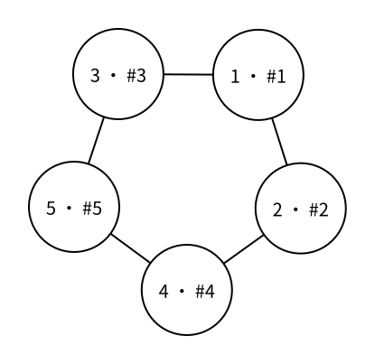

# 图的遍历：广度优先搜索（BFS）

> 状态：定稿

在 [图的存储：邻接表（vector 实现）](vector-adjacency-list.md) 上，广度优先搜索（breadth-first search，BFS）从起点开始，先处理距离起点一条边的点，再处理距离两条边的点，依次向外扩展。图可能有环，同一个点还可能从多条边被发现；图也可能不连通，从一个起点无法到达所有点。因此 BFS 需要访问标记，并且一次搜索只会处理从起点可达的部分。

## 图中的按层扩展

从起点 $1$ 开始，先访问与它相邻的点 $2,3$，再访问需要经过两条边才能到达的点 $4,5$。图中每个圆内的 `u · #k` 表示点编号为 $u$，并且它是 BFS 第 $k$ 个访问到的点。



按照图中边的输入顺序，BFS 的访问顺序是：

```text
1 2 3 4 5
```

如果在同一张图上使用递归 DFS，则会先沿点 $2$ 的分支深入，访问顺序可以是：

```text
1 2 4 5 3
```

两种搜索都会访问从点 $1$ 可达的所有点，区别在于 BFS 保证按“从起点至少需要经过多少条边”逐层扩展。

## 距离也是访问标记

令 `distance[u]` 表示从起点到点 $u$ 最少需要经过的边数。搜索开始前，把所有距离初始化为 `-1`，表示尚未发现：

```cpp
int distance[MAXN];

for (int u = 1; u <= n; u++) {
    distance[u] = -1;
}
```

起点到自己的距离是 $0$，并首先入队：

```cpp
queue<int> q;
distance[start] = 0;
q.push(start);
```

从点 `u` 查看相邻点 `v` 时，如果 `distance[v] != -1`，说明 `v` 以前已经发现，直接跳过。否则第一次发现 `v` 的路径比到 `u` 的路径多一条边：

```cpp
for (int v : g[u]) {
    if (distance[v] != -1) {
        continue;
    }

    distance[v] = distance[u] + 1;
    q.push(v);
}
```

因此，`distance` 同时承担距离数组和访问标记的职责，不需要再建立内容重复的 `visited` 数组。

## 入队时标记

一个点必须在入队时立刻设置距离，不能等到出队时才标记。

在上图中，点 $4$ 和点 $3$ 都能到达点 $5$。点 $4$ 第一次发现点 $5$ 并把它放入队列时，立即设置 `distance[5]`。以后点 $3$ 再看见点 $5$，就知道它已经入队，不会重复加入。

如果等到出队才标记，那么在点 $5$ 真正出队之前，多条边都可能认为它“尚未访问”，把同一个点重复放入队列。更稠密的图会产生大量无用项，也会让父节点等首次发现信息变得不明确。

## 最短边数

BFS 使用先进先出的队列，所以距离为 $d$ 的点一定在距离为 $d+1$ 的点之前处理。第一次从点 `u` 发现点 `v` 时，`distance[u] + 1` 已经是从起点到 `v` 的最少边数；若存在更短的路径，`v` 应当在更早的一层就被发现。

这条性质只直接适用于每条边代价相同的图，通常称为无权图。如果边权不同，经过边数最少的路径不一定是边权和最小的路径，需要使用其他最短路算法。

如果还要恢复具体路径，可以在第一次发现 `v` 时保存：

```cpp
parent[v] = u;
```

从终点沿 `parent` 不断回到起点，再把顺序反转，就得到一条最短路径。

## 不可达的点

一次 `bfs(start)` 只会访问从 `start` 可达的点。搜索结束后仍满足 `distance[u] == -1` 的点，就是从起点不可达的点。

如果任务只是遍历整张无向图或统计连通块，可以像图的 DFS 一样，在最外层检查所有点，并从每个尚未访问的点重新开始 BFS。此时每次搜索的距离都相对于该连通块新选择的起点，不能理解为同一个全局起点的距离。

## 有向图

同一份 BFS 代码也能处理有向图，但 `g[u]` 只保存从 `u` 出发的边。队列只能沿箭头方向发现新点，`distance[u]` 表示从起点沿有向边到达 `u` 的最少边数。

## 完整代码

下面的程序读取一张无向图和起点 `start`，输出起点到每个点的最少边数；不可达点输出 `-1`。

```cpp
#include <bits/stdc++.h>
using namespace std;

const int MAXN = 2e5 + 5;
vector<int> g[MAXN];
int distance_from_start[MAXN];

int main() {
    int n, m, start;
    scanf("%d%d%d", &n, &m, &start);

    for (int i = 1; i <= m; i++) {
        int u, v;
        scanf("%d%d", &u, &v);
        g[u].push_back(v);
        g[v].push_back(u);
    }

    for (int u = 1; u <= n; u++) {
        distance_from_start[u] = -1;
    }

    queue<int> q;
    distance_from_start[start] = 0;
    q.push(start);

    while (!q.empty()) {
        int u = q.front();
        q.pop();

        for (int v : g[u]) {
            if (distance_from_start[v] != -1) {
                continue;
            }

            distance_from_start[v] = distance_from_start[u] + 1;
            q.push(v);
        }
    }

    for (int u = 1; u <= n; u++) {
        printf("%d%c", distance_from_start[u], " \n"[u == n]);
    }

    return 0;
}
```

在上图之外再加入边 $6-7$ 和孤立点 $8$，对应输入为：

```text
8 6 1
1 2
1 3
2 4
4 5
3 5
6 7
```

输出为：

```text
0 1 1 2 2 -1 -1 -1
```

同一层中各点的先后顺序取决于 `g[u]` 中邻接项的顺序。交换输入边的顺序可能改变同层访问顺序和最终保存的某一条最短路径，但不会改变每个点的最短距离。

## 复杂度

每个可达点只入队、出队一次，每个可达点的邻接表只扫描一次。遍历整个邻接表的上界是 $O(n+m)$，队列与距离数组使用 $O(n)$ 额外空间，图本身的邻接表使用 $O(n+m)$ 空间。

## 基础练习

1. 在第一次发现点 `v` 时记录 `parent[v] = u`，恢复从 `start` 到一个指定终点的最短路径。
2. 把完整程序改成遍历整张无向图，并统计连通块数量；不要把每个连通块内部的距离误认为同一个起点的距离。
3. 把输入改成有向图，确认每条边只加入一次，并输出从 `start` 沿箭头可达的所有点。

## 需要记住什么

- 一般图 BFS 为什么不能只跳过父节点？
- 为什么 `distance == -1` 可以同时表示尚未访问？
- 为什么必须在入队时，而不是出队时标记一个点？
- 队列为什么保证第一次发现得到的是最少边数？
- BFS 结束后如何判断一个点从起点不可达？
- 这项最短路性质为什么不能直接用于边权不同的图？
- 邻接表 BFS 的时间复杂度为什么是 $O(n+m)$？

## 下一篇

下一篇 [图的遍历：连通块](connected-components.md) 会用一次完整遍历为每个点记录所属连通块，使后续连通性查询无需重新搜索。
