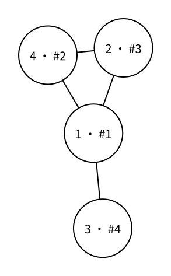

# 图的遍历：深度优先搜索（DFS）

> 最近修订：2026-08-16 16:45 +10:00（未审阅）

[图的存储：邻接表（vector 实现）](vector-adjacency-list.md) 告诉我们一个点能够沿哪些边继续前进。深度优先搜索（depth-first search，DFS）从起点出发，每次先沿一条尚未探索的分支不断深入，再在走不下去时返回。一般图可能有环，也可能不连通，因此还要记录哪些点已经访问过，并在每个尚未访问的连通分量重新开始搜索。

## 父节点不再足够

考虑三条边组成的环 $1-4-2-1$。如果从点 $1$ 进入点 $4$，再进入点 $2$，此时点 $2$ 跳过父节点 $4$ 后，仍能沿另一条边回到点 $1$。



图中每个圆内的 `u · #k` 表示点编号为 $u$，并且它是 DFS 第 $k$ 个访问到的点。

点 $1$ 不是点 $2$ 的父节点，却已经访问过。只保存 `parent` 无法识别这种情况，递归会沿环不断重复。

真正需要判断的问题不再是“这个相邻点是不是我的父节点”，而是“这个点以前有没有访问过”。

## 访问标记

使用 `vis[u]` 记录点 $u$ 是否已经访问：

```cpp
vector<bool> vis;
```

第一次进入点 `u` 时立刻标记，再处理它的所有相邻点：

```cpp
void dfs(int u) {
    vis[u] = true;
    printf("%d ", u);

    for (int v : g[u]) {
        if (vis[v]) {
            continue;
        }
        dfs(v);
    }
}
```

标记必须发生在递归访问其他点之前。一旦 `vis[u]` 变成 `true`，任何路径再次遇到 `u` 都会立即跳过，环就不会造成重复递归。

调用一次 `dfs(start)` 会访问从 `start` 能够到达的所有点。在无向图中，这些点组成 `start` 所在的连通分量。

## 不连通的图

现在在上图之外再加入两条边 $5-7$、$7-6$，并加入没有连接任何边的孤立点 $8$。整张图就有三个连通分量：点 $1,2,3,4$ 在第一个连通分量，点 $5,6,7$ 在第二个连通分量，点 $8$ 自己构成第三个连通分量。

只调用 `dfs(1)` 会得到：

```text
1 4 2 3
```

它无法越过不存在的边到达点 $5$。为了遍历整张图，按编号检查每个点；遇到尚未访问的点，就以它为新起点执行一次 DFS：

```cpp
for (int u = 1; u <= n; u++) {
    if (!vis[u]) {
        dfs(u);
    }
}
```

示例图会依次从点 $1$、点 $5$ 和点 $8$ 开始三次 DFS，完整访问顺序是：

```text
1 4 2 3 5 7 6 8
```

每次从未访问点开始 DFS，就发现一个新的连通分量。因此，在循环中统计调用次数，也能得到无向图的连通分量数量。

## DFS 树与 DFS 森林

每个点第一次从点 `u` 递归进入点 `v` 时，可以把边 $(u,v)$ 看作搜索过程选中的父子边。这些边不会形成环，并把一次 DFS 访问到的点连成一棵树，称为 DFS 树。

不连通图需要执行多次 DFS，每个连通分量产生一棵 DFS 树；它们合在一起称为 DFS 森林。原图中没有被选作父子边的其他边仍然存在，只是不属于 DFS 树。

## 有向图

同一份 DFS 代码也可以遍历有向图，但 `g[u]` 只保存从 `u` 出发的边。调用 `dfs(start)` 只会访问从 `start` 沿箭头方向能够到达的点。

在有向图中，即使忽略方向后所有点连在一起，从某个起点也未必能沿箭头到达所有点。最外层循环仍能让每个点最终被访问，但循环产生的树不能直接解释为无向图的连通分量；有向图有另外的可达性和强连通概念。

## 完整代码

下面的程序读取一张无向图，输出整张图的 DFS 顺序，并统计连通分量数量。

```cpp
#include <bits/stdc++.h>
using namespace std;

int n;
int m;
vector<vector<int>> g;
vector<bool> vis;

void dfs(int u) {
    vis[u] = true;
    printf("%d ", u);

    for (int v : g[u]) {
        if (vis[v]) {
            continue;
        }
        dfs(v);
    }
}

void solve() {
    scanf("%d%d", &n, &m);

    g.assign(n + 5, {});
    vis.assign(n + 5, false);

    for (int i = 1; i <= m; i++) {
        int u, v;
        scanf("%d%d", &u, &v);
        g[u].push_back(v);
        g[v].push_back(u);
    }

    int component_count = 0;
    for (int u = 1; u <= n; u++) {
        if (!vis[u]) {
            component_count++;
            dfs(u);
        }
    }

    printf("\n%d\n", component_count);
}

int main() {
    solve();
    return 0;
}
```

`n`、`m`、`g` 和 `vis` 描述整道题共享的输入与搜索状态，因此放在全局；
`dfs` 只接收当前点 `u`。这样以后在 DFS 中继续维护父节点、进入时间或其他题目
信息时，不需要把同一批容器逐层加入参数列表。

对应上图的输入是：

```text
8 6
1 4
4 2
2 1
1 3
5 7
7 6
```

程序输出：

```text
1 4 2 3 5 7 6 8
3
```

DFS 总是按照 `g[u]` 中邻接项的先后顺序选择下一条边。交换输入边的顺序可能改变访问顺序和 DFS 树，却不会改变哪些点彼此连通，也不会改变连通分量数量。

## 复杂度

每个点只会在第一次进入时处理一次。邻接表中的每一项也只会在所属点被处理时查看一次，所以时间复杂度是 $O(n+m)$。邻接表、访问数组和最深可能达到 $O(n)$ 的递归调用总共占用 $O(n+m)$ 空间。

> 当图中存在很长的简单路径时，递归深度最坏可以达到 $n$，可能超过评测环境的调用栈限制。本篇先用递归准确展示 DFS 结构；遇到这种规模边界时，需要改用显式栈实现同样的搜索过程。

## 基础练习

1. 删除统计连通分量的外层循环，只从指定起点 `start` 开始 DFS，输出所有从它可达的点。
2. 在无向图中记录 `parent[v] = u`，输出 DFS 树的所有父子边。
3. 在完整程序中加入自环和重边，确认每个点仍然只访问一次。

## 需要记住什么

- 一般图中为什么只跳过父节点不能阻止沿环重复访问？
- `vis[u]` 应该在什么时候设为 `true`？
- 一次 `dfs(start)` 在无向图中会访问哪些点？
- 为什么遍历整张不连通的图还需要外层循环？
- DFS 树和 DFS 森林分别是什么？
- 有向图中一次 DFS 的范围为什么由箭头方向决定？
- 邻接表 DFS 的时间复杂度为什么是 $O(n+m)$？

[DFS、回溯与剪枝](../algorithm-basics/dfs-backtracking-pruning.md) 会把逐步选择产生的状态看成一棵隐式搜索树，并在递归返回时撤销当前选择。
