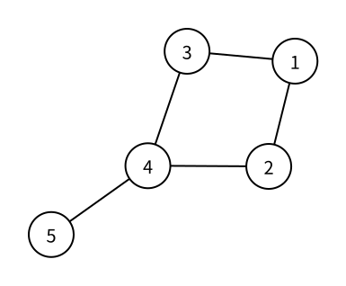

# 图的存储：基础概念

> 状态：定稿

数学定义中的图由点和边组成。程序不仅要记住有哪些点，还要保存哪些点之间存在边，以及每条边是否有方向和边权。竞赛题最常见的输入会逐行给出 `from`、`to` 和可选的 `weight`，这在形式上就是一份边集；读入后是否继续保留边集，要由算法最常见的访问方式决定。

点权很容易单独保存在一个数组中：

```cpp
int vertex_weight[MAXN];
```

`vertex_weight[u]` 就是点 $u$ 的点权。真正决定一种“存图方法”的，通常是边之间的关系如何保存。本篇先建立三种基础方法：边集、邻接矩阵和邻接表。

下面始终使用同一张无权无向图比较三种方法：



## 边集

最直接的想法是把每条边完整地记录下来。无权有向边需要保存起点和终点：

```cpp
struct Edge {
    int from;
    int to;
};

Edge edges[MAXM];
int edge_count;
```

带权边再增加 `weight`：

```cpp
struct Edge {
    int from;
    int to;
    int weight;
};
```

有向边区分起点和终点，因此 `from -> to` 与 `to -> from` 是两条不同的边。无向边没有方向；如果算法只需把每条原始边整体处理一次，一条无向边只保存一条记录即可。如果算法需要从两个端点分别沿边移动，也可以把它展开成 `from -> to` 和 `to -> from` 两条记录。

边集只占用 $O(m)$ 空间，也很适合依次扫描或排序全部边。不过，想寻找从某个点出发的所有边时，最朴素的边集必须检查全部 $m$ 条记录。

上图的五条无向边可以只各记录一次：

```text
(1, 2), (1, 3), (2, 4), (3, 4), (4, 5)
```

## 邻接矩阵

如果想直接询问“从点 `from` 到点 `to` 是否有边”，可以为每一对点准备一个格子。无权图用布尔值记录是否直接相连：

```cpp
bool connected[MAXN][MAXN];

connected[from][to] = true;
```

有向边只修改 `connected[from][to]`。无向边 $(from,to)$ 需要同时修改对称的两个格子：

```cpp
connected[from][to] = true;
connected[to][from] = true;
```

带权图可以令每个格子保存边权：

```cpp
const int INF = 0x3f3f3f3f;
int weight[MAXN][MAXN];

for (int from = 1; from <= n; from++) {
    for (int to = 1; to <= n; to++) {
        weight[from][to] = INF;
    }
}

weight[from][to] = edge_weight;
```

这里用 `INF` 表示没有边，因为边权 $0$ 可能是合法值。无向带权边仍要填写两个对称格子。存在重边时，一个格子不能同时保留多条边；如果题目只关心最小边权，可以写成：

```cpp
weight[from][to] = min(weight[from][to], edge_weight);
```

布尔矩阵命名为 `connected`，带权矩阵命名为 `weight`，都比含义不明确的二维 `graph` 更容易阅读。

上图对应的布尔邻接矩阵为：

```text
    1 2 3 4 5
1   0 1 1 0 0
2   1 0 0 1 0
3   1 0 0 1 0
4   0 1 1 0 1
5   0 0 0 1 0
```

矩阵关于主对角线对称，因为每条无向边都填写了两个方向。这里的对角线只表示是否存在自环，所以全为 `0`；某些具体算法会根据自己的状态含义另行初始化对角线。

邻接矩阵判断一条边是否存在只需 $O(1)$ 时间，但无论实际有多少条边，都要占用 $O(n^2)$ 空间。枚举一个点的全部出边时，也要检查对应一整行的 $n$ 个格子。

## 邻接表

许多图算法最常见的操作是：已经位于点 `from`，现在要枚举所有能直接到达的 `to`。邻接表为每个点分别保存它的全部出边：

```text
1: 2, 3
2: 1, 4
3: 1, 4
4: 2, 3, 5
5: 4
```

无权邻接项只需保存 `to`；带权邻接项保存 `(to, weight)`。起点已经由“这是 `from` 的表”表达，因此每一项不必重复保存 `from`。

有向边 `from -> to` 只加入 `from` 的表。无向边 $(from,to)$ 则加入两个方向：

```text
from 的表加入 to
to 的表加入 from
```

邻接表只保存实际存在的邻接项，占用 $O(n+m)$ 空间；枚举点 $u$ 的全部出边，时间与点 $u$ 的出度成正比。

“邻接表”描述的是这种组织方式，不限定表的底层实现：

- `vector` 邻接表让同一点的出边连续保存在同一个动态数组中；
- 前向星先按起点分组边集，再用每个点的区间边界定位连续出边；
- 链式前向星把边放在一个全局数组中，再用 `head/next` 串起同一点的出边。

三者都是邻接表的实现，不是新的第四、第五、第六种基础存图方法。本书普通图算法默认使用最简洁的 `vector`；需要让配对反向边连续存放时，才改用链式前向星。普通前向星会用于解释它们之间的关系，但不作为主线模板。

> adjacency list 的统一中文名是“邻接表”。只有底层确实使用链表时，才有必要强调“邻接链表”；不能用它统称所有邻接表实现。

## 方法比较

设图有 $n$ 个点、$m$ 条边。下表比较三种方法最典型的操作：

| 存储方法 | 空间 | 判断 `from -> to` 是否存在 | 枚举全部边 | 枚举一个点的全部出边 |
| --- | --- | --- | --- | --- |
| 边集 | $O(m)$ | $O(m)$ | $O(m)$ | $O(m)$ |
| 邻接矩阵 | $O(n^2)$ | $O(1)$ | $O(n^2)$ | $O(n)$ |
| 邻接表 | $O(n+m)$ | 最坏与 `from` 的出度同阶 | $O(n+m)$ | 与 `from` 的出度同阶 |

这些复杂度说明了各自的典型用途：

- 需要整体扫描或排序每条边时，边集最直接；
- 点数较少，或频繁查询任意两点是否直接相连时，可以使用邻接矩阵；
- 需要从当前点枚举出边的 DFS、BFS 和大多数图算法，通常使用邻接表。

## 需要记住什么

- 图的三种基础存储方法分别是什么？
- 点权为什么只需单独使用一个数组保存？
- 无权图和带权图的边记录分别需要哪些字段？
- 有向边和无向边在邻接矩阵中分别要修改几个格子？
- 为什么带权邻接矩阵不能随意用 $0$ 表示没有边？
- 邻接表中的一项为什么不必重复保存起点？
- `vector` 邻接表、前向星和链式前向星为什么仍然属于同一种基础存储方法？
- 三种存储方法各自最适合哪类访问？

## 下一篇

下一篇将把邻接表落实为普通图算法最常用的 [图的存储：邻接表（vector 实现）](vector-adjacency-list.md)。
