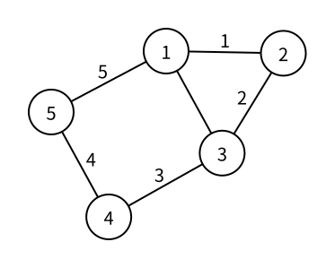

# 哈密顿问题：路径、回路与图

> 状态：定稿

[欧拉路径](eulerian-paths-and-circuits.md) 要求每条边恰好使用一次；哈密顿问题把“一次”施加在点上：每个点都必须恰好经过一次。

## 哈密顿路径

经过图中每个点恰好一次的路径称为哈密顿路径（Hamiltonian path）。一张有 $n$ 个点的图中，哈密顿路径的点序列恰好有 $n$ 项，并经过 $n-1$ 条边。

哈密顿路径仍然是 [图：路径与环](paths-and-cycles.md#路径) 中的普通路径：点不重复，边自然也不会重复。它与欧拉路径的最大区别是，没有要求使用图中的每条边；没有被选进路径的边可以留在图中。

## 哈密顿回路

经过所有点后再沿一条边回到起点，形成的回路称为哈密顿回路（Hamiltonian circuit）。除作为终点再次写出的起点外，每个点恰好出现一次。

下图边旁的数字表示一条哈密顿回路的经过顺序：



对应点序列是：

```text
1 -> 2 -> 3 -> 4 -> 5 -> 1
```

图中还有一条边 $(1,3)$ 没有使用，这不影响它成为哈密顿回路。哈密顿问题要求覆盖全部点，不要求覆盖全部边。

一张有 $n$ 个点的图中，哈密顿回路依次经过 $n$ 条边：前 $n-1$ 条连接所有不同的点，最后一条从终点返回起点。

## 哈密顿图

存在哈密顿回路的图称为哈密顿图（Hamiltonian graph）。存在哈密顿路径、但不存在哈密顿回路的图也称为半哈密顿图。

基础阶段真正需要使用的是“哈密顿路径”和“哈密顿回路”的定义；“半哈密顿图”只需能够识别，不必单独记忆性质。

## 与欧拉问题的区别

| 问题 | 必须恰好一次的对象 | 点能否重复 | 边能否遗漏 | 需要标记 |
| --- | --- | --- | --- | --- |
| 欧拉路径 / 回路 | 每条边 | 可以 | 不可以 | 原始边是否使用 |
| 哈密顿路径 / 回路 | 每个点 | 不可以 | 可以 | 点是否使用 |

欧拉问题存在直接的度数判定，并能用 Hierholzer 算法在线性时间内构造。一般的哈密顿问题没有一套在这里需要学习的同类通用算法；具体题目会根据很小的点数、特殊图结构或额外限制，分别采用回溯、状压 DP 等方法。

这个区别也解释了存图选择。欧拉回路需要把一条无向边的两个方向配对标记，本书使用链式前向星；哈密顿问题只标记点，若以后需要搜索相邻点，普通的 `vector` 邻接表即可，不必仅仅因为原图无向而维护配对反向边。

## 基础练习

1. 在图示中另找一条哈密顿回路，并指出哪些边没有被这条回路使用。
2. 画一条包含 $5$ 个点的链，说明它为什么存在哈密顿路径，却不存在哈密顿回路。
3. 分别构造一张有欧拉回路但没有哈密顿回路的图，以及一张有哈密顿回路但没有欧拉回路的图。

## 需要记住什么

- 哈密顿路径和哈密顿回路分别要求什么？
- 一张有 $n$ 个点的图中，哈密顿路径和哈密顿回路分别经过多少条边？
- 哈密顿回路为什么允许遗漏图中的边？
- 什么样的图称为哈密顿图？
- 欧拉问题和哈密顿问题分别要求边还是点恰好使用一次？
- 哈密顿问题为什么不因原图无向就必须使用成对反向边？

## 扩展阅读

- 点数很小时，可以阅读 [哈密顿问题：小规模回溯](hamiltonian-backtracking.md)。它不属于当前主学习路线。
- [OI Wiki：哈密顿图](https://oi-wiki.org/graph/hamilton/) 收录了哈密顿图的若干性质和充分条件；这些条件不要求在基础阶段理解或记忆。
- [Competitive Programmer's Handbook](https://usaco.guide/CPH.pdf) 使用英文竞赛术语定义 Hamiltonian path。

## 下一篇

下一篇回到树的结构性质，介绍 [树的直径与中心（正文待写）](../CATALOG.md#04-图论)。
