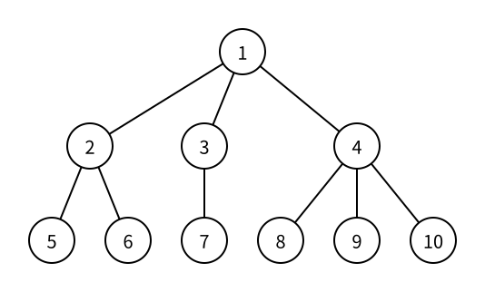

# 倍增 LCA

> 状态：定稿

在 [有根树](rooted-trees.md) 中，每个节点都有唯一的父节点链一直通向根。给定两个节点 `u` 和 `v`，树上路径、距离、差分和很多子树问题都需要找到它们向上走时第一次汇合的节点。

节点 `u` 和 `v` 的**最近公共祖先**（Lowest Common Ancestor，LCA），是同时作为两者祖先的节点中深度最大的一个。

在 LCA 问题中，约定每个节点也是自己的祖先。因此，如果 `u` 本来就是 `v` 的祖先，那么两者的 LCA 就是 `u`。

## 最近公共祖先

下图中的树以节点 $1$ 为根：



例如：

- 节点 $5$ 的祖先链是 $5 \to 2 \to 1$；
- 节点 $6$ 的祖先链是 $6 \to 2 \to 1$；
- 两条链的公共节点有 $2$ 和 $1$，其中 $2$ 的深度更大，所以 $\mathrm{LCA}(5,6)=2$。

同样：

```text
LCA(5, 7) = 1
LCA(8, 10) = 4
LCA(4, 9) = 4
```

最后一个例子使用了“节点是自己的祖先”这个约定。节点 $4$ 同时是自己和节点 $9$ 的祖先，并且是最深的公共祖先。

## 逐层向上

已经知道每个节点的父节点和深度后，最直接的 LCA 做法是：

1. 让更深的节点每次走到父节点，直到两者深度相同。
2. 如果它们已经是同一节点，直接返回。
3. 否则让两者同时每次向上走一层，直到它们相同。

这个方法一定能找到 LCA，但树退化成一条链时，一次查询可能向上走 $O(n)$ 步。$q$ 次查询最坏需要 $O(nq)$ 时间。

问题在于我们只会“向上走 $1$ 步”。如果预先知道每个节点向上 $1,2,4,8,\ldots$ 步会到哪里，就能用少量二进制大步拼出任意距离。

## 倍增祖先表

定义：

```text
up[u][k] = 节点 u 向上走 2^k 步到达的祖先
```

当 $k=0$ 时，$2^0=1$，所以：

```text
up[u][0] = u 的父节点
```

向上 $2^k$ 步可以拆成两段长度都为 $2^{k-1}$ 的路程。先从 `u` 走到 `up[u][k - 1]`，再从该节点走同样的步数：

```text
up[u][k] = up[up[u][k - 1]][k - 1]
```

例如：

```text
up[u][0] ：向上 1 步
up[u][1] ：向上 2 步
up[u][2] ：向上 4 步
up[u][3] ：向上 8 步
```

每当指数 `k` 增加 $1$，跳跃距离都翻倍，因此称为**倍增**。

## 根节点的祖先

根节点没有真实的父节点。为了让倍增递推始终访问合法节点，本篇约定根的父节点是它自己：

```text
up[root][0] = root
```

继续递推得到：

```text
up[root][k] = root
```

对任意节点跳过根所在深度后，结果会稳定停在根，而不会进入不存在的节点 $0$。

## 预处理深度与祖先

只要保证先处理父节点，再处理子节点，就能用已知的父节点信息计算子节点的整张倍增表。

本篇使用 [树的遍历：广度优先搜索（BFS）](tree-breadth-first-search.md) 按深度从小到大遍历。先初始化根：

```cpp
depth[root] = 0;
up[root][0] = root;
for (int k = 1; k <= LOG; k++) {
    up[root][k] = root;
}
```

然后从队列中取出当前节点 `u`。它的父节点已经保存在 `up[u][0]`，本地命名为 `p`：

```cpp
int p = up[u][0];
```

枚举 `u` 的相邻节点 `v` 时，跳过父节点，其他相邻节点就是尚未处理的子节点：

```cpp
for (int v : g[u]) {
    if (v == p) {
        continue;
    }

    depth[v] = depth[u] + 1;
    up[v][0] = u;
    for (int k = 1; k <= LOG; k++) {
        up[v][k] = up[up[v][k - 1]][k - 1];
    }
    que.push(v);
}
```

处理 `v` 时，它的父节点 `u` 已经出队，因此 `up[u][0]` 到 `up[u][LOG]` 已经完整计算。递推式中读取的祖先表都是已知信息。

这份预处理也可以用递归 DFS 完成。完整代码选择 BFS，是因为数十万个节点的树可能退化成长链，队列遍历不依赖评测环境的递归调用栈大小。

## 向上跳指定步数

任意非负整数 `step` 都可以拆成若干个不同的 $2^k$ 之和。例如：

```text
13 = 8 + 4 + 1 = 2^3 + 2^2 + 2^0
```

所以向上走 $13$ 步，可以依次使用 `up[u][3]`、`up[u][2]` 和 `up[u][0]`。检查 `step` 二进制表示的每一位：

```cpp
int jump(int u, int step) {
    for (int k = 0; k <= LOG; k++) {
        if ((step >> k) & 1) {
            u = up[u][k];
        }
    }
    return u;
}
```

`step` 最多是树高，而 `LOG` 只有 $O(\log n)$。因此 `jump` 的时间复杂度是 $O(\log n)$。

## 对齐深度

查询 LCA 时，先确保 `u` 不比 `v` 浅。如果顺序相反，交换两者：

```cpp
if (depth[u] < depth[v]) {
    swap(u, v);
}
```

两者的深度差是 `depth[u] - depth[v]`，用 `jump` 将较深的 `u` 向上抬到同一深度：

```cpp
u = jump(u, depth[u] - depth[v]);
```

如果此时 `u == v`，原来较浅的节点就是另一个节点的祖先，也是 LCA：

```cpp
if (u == v) {
    return u;
}
```

这一步不能省略。后续的“两个节点一起跳”以它们仍然不同为前提。

## 同时接近 LCA

对齐后，`u` 和 `v` 深度相同，且它们不是同一节点。目标是让两者仍然停在 LCA 下方，但尽可能靠近 LCA。

从最大指数向 $0$ 枚举 `k`：

```cpp
for (int k = LOG; k >= 0; k--) {
    if (up[u][k] != up[v][k]) {
        u = up[u][k];
        v = up[v][k];
    }
}
```

因为两者当前深度相同，同时向上 $2^k$ 步后深度仍然相同：

- 如果 `up[u][k] == up[v][k]`，那个节点已经是公共祖先。直接跳过去可能落在 LCA 上，甚至跳到 LCA 之上，因此不跳。
- 如果 `up[u][k] != up[v][k]`，两个祖先仍位于 LCA 下方的不同分支，可以安全地同时跳过去。

必须从大到小枚举。先尝试最大安全步长，才能用不超过 LCA 的少量跳跃尽可能接近它。

当 `k = 0` 也检查完后，`u` 和 `v` 仍不同，但它们的父节点必须相同；否则还可以各向上跳 $1$ 步。这个共同父节点就是 LCA：

```cpp
return up[u][0];
```

## LOG 的取值

本篇让 `LOG` 表示祖先表中允许的最大指数，因此第二维声明为 `LOG + 1`，下标范围是 $0$ 到 `LOG`：

```cpp
int up[MAXN][LOG + 1];
```

只要 $2^{LOG}$ 不小于题目允许的最大节点数，就一定能覆盖树中的最大深度差。例如：

| 题目的 `n` 上限 | 可用的 `LOG` | 因为 |
| ---: | ---: | ---: |
| $10^5$ | 17 | $2^{17}=131072$ |
| $2 \times 10^5$ | 18 | $2^{18}=262144$ |
| $5 \times 10^5$ | 19 | $2^{19}=524288$ |
| $10^6$ | 20 | $2^{20}=1048576$ |

完整代码约定 $n \le 5 \times 10^5$，所以使用：

```cpp
const int MAXN = 5e5 + 5;
const int LOG = 19;
```

`MAXN` 是留有额外位置的数组容量，`LOG` 根据题目真正的 $5 \times 10^5$ 节点上限计算。换题时要同时根据新上限调整两者，不要只复制祖先表的列数。

## 完整代码

下面的程序约定：

- 第一行输入节点数 `n`、查询数 `q` 和根节点 `root`；
- 接下来 $n-1$ 行输入树的无向边；
- 再输入 $q$ 对节点 `u` 和 `v`，对每对节点输出 LCA。

```cpp
#include <bits/stdc++.h>
using namespace std;

const int MAXN = 5e5 + 5;
const int LOG = 19;

int n;
int q;
int root;
int depth[MAXN];
int up[MAXN][LOG + 1];
vector<int> g[MAXN];

void build(int root) {
    depth[root] = 0;
    up[root][0] = root;
    for (int k = 1; k <= LOG; k++) {
        up[root][k] = root;
    }

    queue<int> que;
    que.push(root);

    while (!que.empty()) {
        int u = que.front();
        que.pop();

        int p = up[u][0];
        for (int v : g[u]) {
            if (v == p) {
                continue;
            }

            depth[v] = depth[u] + 1;
            up[v][0] = u;
            for (int k = 1; k <= LOG; k++) {
                up[v][k] = up[up[v][k - 1]][k - 1];
            }
            que.push(v);
        }
    }
}

int jump(int u, int step) {
    for (int k = 0; k <= LOG; k++) {
        if ((step >> k) & 1) {
            u = up[u][k];
        }
    }
    return u;
}

int lca(int u, int v) {
    if (depth[u] < depth[v]) {
        swap(u, v);
    }

    u = jump(u, depth[u] - depth[v]);
    if (u == v) {
        return u;
    }

    for (int k = LOG; k >= 0; k--) {
        if (up[u][k] != up[v][k]) {
            u = up[u][k];
            v = up[v][k];
        }
    }
    return up[u][0];
}

int main() {
    scanf("%d%d%d", &n, &q, &root);
    for (int i = 1; i < n; i++) {
        int u;
        int v;
        scanf("%d%d", &u, &v);
        g[u].push_back(v);
        g[v].push_back(u);
    }

    build(root);

    while (q--) {
        int u;
        int v;
        scanf("%d%d", &u, &v);
        printf("%d\n", lca(u, v));
    }
    return 0;
}
```

对于输入：

```text
10 4 1
1 2
1 3
1 4
2 5
2 6
3 7
4 8
4 9
4 10
5 6
5 7
4 9
8 10
```

输出：

```text
2
1
4
4
```

## 复杂度

预处理时，BFS 查看 $O(n)$ 个节点与邻接项，并为每个节点计算 $O(\log n)$ 个倍增祖先，所以时间复杂度是 $O(n\log n)$。

一次 `jump` 扫描 $O(\log n)$ 个二进制位，LCA 查询又从大到小扫描一次祖先表，因此单次查询是 $O(\log n)$，$q$ 次查询是 $O(q\log n)$。

`up` 保存 $O(n\log n)$ 个祖先，邻接表、深度和 BFS 队列使用 $O(n)$ 空间，总空间复杂度是 $O(n\log n)$。

## 常见错误与调试

检查 LCA 模板时，按算法步骤分层排查：

1. 检查根的 `up[root][k]` 是否全部是 `root`。
2. 对每个非根节点，检查 `depth[v] == depth[up[v][0]] + 1`。
3. 抽查转移是否满足 `up[u][k] == up[up[u][k - 1]][k - 1]`。
4. 单独测试 `jump(u, 0)`、`jump(u, 1)` 和 `jump(u, depth[u])`。
5. 对齐深度后，检查是否立即处理 `u == v`。
6. 同时跳跃时是否从 `LOG` 降到 $0$，并且只在两个 $2^k$ 祖先不同时跳跃。

用下列边界查询覆盖不同分支：

- `lca(root, root)`；
- `lca(root, u)`；
- `lca(u, u)`；
- 一个节点与它的直接子节点；
- 同一父节点的两个子节点；
- 分属根的两棵不同子树的节点。

常见代码错误包括：`LOG` 过小、根的祖先没有初始化、遍历时没有跳过父节点、对齐后漏掉 `u == v`，以及将最后的降序枚举误写成升序。

## 基础练习

1. 在本文示例树上手算 `LCA(5, 6)`、`LCA(5, 7)`、`LCA(4, 9)` 和 `LCA(8, 10)`。
2. 为一条以节点 $1$ 为根的 $8$ 个节点长链列出每个节点的 `depth`、`up[u][0]`、`up[u][1]`、`up[u][2]` 和 `up[u][3]`。
3. 使用 `jump` 回答“节点 `u` 向上 `step` 步是哪个节点”，题目保证 `step <= depth[u]`。
4. 在完整代码的样例树上穷举所有节点对，用“逐层向上”的直接方法对拍倍增 LCA 的结果。

## 扩展阅读

得到 LCA 后，无权树上两点距离可以由两者深度与 LCA 深度计算；边带权时则预处理每个节点到根的距离。树上差分、虚树和路径查询也会将 LCA 作为已知基础。

另一类 LCA 做法会将问题转换为 DFS 序列上的区间最值查询，或使用 Tarjan 离线处理所有询问。这些都不属于本篇的倍增基础版本。

## 需要记住什么

1. LCA 的“公共祖先”和“最近”分别如何判定？为什么一个节点可以成为它与后代的 LCA？
2. `up[u][k]` 表示什么？为什么转移式要查询两次 $2^{k-1}$ 祖先？
3. 为什么任意向上步数都可以用 $O(\log n)$ 个倍增跳跃完成？
4. LCA 查询为什么要先对齐两个节点的深度？对齐后为什么要立即检查 `u == v`？
5. 同时跳跃时，为什么只在 `up[u][k] != up[v][k]` 时移动，并且指数必须从大到小枚举？
6. 本文的 `LOG` 表示什么？给定 `n` 上限时如何保证它足够大？
7. 倍增 LCA 的预处理时间、单次查询时间和空间复杂度分别是什么？

树上距离、树上差分、虚树、RMQ LCA 和 Tarjan 离线 LCA 只需要知道它们会使用或替代本篇的结果，学习倍增基础版本时不要求理解或记忆。
