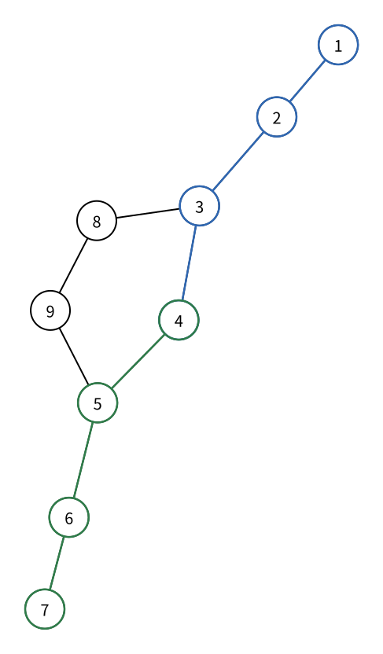

# 多源 BFS

> 最近修订：2026-08-16 15:08 +10:00（未审阅）

一张无权道路图中有若干医院。对每座城市，我们希望知道它到最近医院至少要经过多少条道路；若还要安排服务区域，也可以记录一个最近医院的编号。

[图的广度优先搜索（BFS）](graph-breadth-first-search.md) 已经能从一个起点求出到所有点的最少边数。假设有 $k$ 个医院，最直接的方法是分别从每个医院执行一次 BFS，再对每个点取最小距离。

单次 BFS 需要 $O(n+m)$ 时间，重复 $k$ 次会达到：

$$
O(k(n+m)).
$$

这些搜索会反复经过同一批点和边。我们真正关心的不是每个起点各自的完整距离，而是：

$$
dist[u]=\min_{s\in S} d(s,u),
$$

其中 $S$ 是给定的起点集合，$d(s,u)$ 是点 $s$ 到点 $u$ 的最少边数。多源 BFS（multi-source BFS）让所有起点以距离 $0$ 同时开始扩展，只执行一次 BFS 就得到这个最小值。

## 同时开始扩展

单源 BFS 的初始化只有一个起点：

```cpp
dist[start] = 0;
q.push(start);
```

现在每个给定起点到起点集合的距离都等于 $0$，所以先把全部起点设置成第零层并加入同一个队列：

```cpp
for (int i = 1; i <= k; i++) {
    int source = sources[i];
    dist[source] = 0;
    q.push(source);
}
```

队列开头因而先包含全部距离为 $0$ 的点。它们扩展出的新点距离为 $1$；所有距离为 $1$ 的点处理完以后，才轮到距离为 $2$ 的点。普通 BFS 的分层性质没有改变，只是第零层从一个点扩大成了整个起点集合。

这里的“源”表示题目指定的 BFS 起点，与有向图中“入度为零的源点”不是同一个概念。一个多源 BFS 起点可以具有任意度数，也不要求原图是 DAG。

## 距离与访问状态

建立距离数组并全部初始化成 `-1`：

```cpp
dist.assign(n + 5, -1);
```

含义与单源 BFS 一样：

- `dist[u] == -1` 表示点 `u` 尚未被任何起点的波前发现；
- `dist[u] >= 0` 表示已经求得点 `u` 到起点集合的最短距离。

初始化全部起点时立即设置距离。若输入中意外重复给出同一个起点，不能把它重复入队：

```cpp
for (int i = 1; i <= k; i++) {
    int source = sources[i];
    if (dist[source] != -1) {
        continue;
    }
    dist[source] = 0;
    q.push(source);
}
```

这个判断只负责去除重复起点。所有起点都在 BFS 正式扩展以前完成初始化，因此一个尚未处理的起点不会被另一个起点提前占据。

## 第一次发现邻点

从队首取出点 `u` 后，仍然只访问尚未发现的相邻点：

```cpp
for (int v : g[u]) {
    if (dist[v] != -1) {
        continue;
    }
    dist[v] = dist[u] + 1;
    q.push(v);
}
```

由于队列按距离层次处理，第一次发现 `v` 的波前已经给出了所有起点到 `v` 的最小距离。以后另一个起点的波前再次到达 `v` 时，路径不会更短，可以直接跳过。

和单源 BFS 一样，必须在入队时设置 `dist[v]`，不能等到出队时才标记；否则不同波前可能把同一个点重复加入队列。

## 记录最近起点

若题目不仅询问距离，还要输出一个达到最短距离的起点，可以增加数组：

```cpp
nearest.assign(n + 5, -1);
```

每个起点最初属于自己：

```cpp
dist[source] = 0;
nearest[source] = source;
q.push(source);
```

点 `u` 第一次发现点 `v` 时，`v` 由同一个起点的波前到达，所以复制来源：

```cpp
dist[v] = dist[u] + 1;
nearest[v] = nearest[u];
q.push(v);
```

若两个起点到点 `v` 的最短距离相同，先发现 `v` 的波前会被保留。此时 `nearest[v]` 可能随起点输入顺序和邻接表顺序变化，但它始终是一个合法的最近起点；最短距离 `dist[v]` 不会改变。

若题目要求所有并列最近起点、并列数量或特定的编号选择规则，就不能只使用“第一次发现后跳过”的基础状态，需要根据具体要求继续处理等距到达。本篇只记录任意一个最近起点。

## 双源示例

下面的无向图把点 `1` 和点 `7` 作为两个起点。蓝色路径和绿色路径都用三条边到达点 `4`，所以点 `4` 与两个起点等距。



所有点到起点集合 `{1, 7}` 的最短距离为：

| 点 | 1 | 2 | 3 | 4 | 5 | 6 | 7 | 8 | 9 |
| ---: | ---: | ---: | ---: | ---: | ---: | ---: | ---: | ---: | ---: |
| `dist` | 0 | 1 | 2 | 3 | 2 | 1 | 0 | 3 | 3 |

按 `1, 7` 的顺序初始化起点，并按图中边的顺序保存邻接表，队列变化为：

| 步骤 | 取出的点 | 本步首次发现 | 处理后的队列 |
| ---: | ---: | --- | --- |
| 初始 | 无 | 起点 1、7 | `[1, 7]` |
| 1 | 1 | `2 (dist=1)` | `[7, 2]` |
| 2 | 7 | `6 (dist=1)` | `[2, 6]` |
| 3 | 2 | `3 (dist=2)` | `[6, 3]` |
| 4 | 6 | `5 (dist=2)` | `[3, 5]` |
| 5 | 3 | `4 (dist=3)`、`8 (dist=3)` | `[5, 4, 8]` |
| 6 | 5 | `9 (dist=3)` | `[4, 8, 9]` |
| 7 | 4 | 无 | `[8, 9]` |
| 8 | 8 | 无 | `[9]` |
| 9 | 9 | 无 | `[]` |

点 `3` 先发现点 `4`，因此本次运行令 `nearest[4] = 1`。随后点 `5` 也能用三条边从起点 `7` 到达点 `4`，但此时 `dist[4]` 已经确定，不再重复入队。若把起点顺序改成 `7, 1`，点 `4` 可以改为归属起点 `7`，距离仍然是 `3`。

## 虚拟起点

可以用一个只存在于证明中的点 `0` 理解多源 BFS：

1. 建立虚拟点 `0`；
2. 从 `0` 向每个真实起点连接一条边；
3. 从 `0` 执行一次普通 BFS。

虚拟图中，从 `0` 到真实点 `u` 的最短距离是：

$$
1+\min_{s\in S} d(s,u).
$$

所有真实起点恰好组成虚拟 BFS 的第一层。多源 BFS 直接把这整层初始化为距离 `0`，相当于省略虚拟点和第一条边，并把后续所有距离减去 `1`。

因此无需分别关心波前来自哪个起点，也不必让不同 BFS 互相比较；把全部起点放进同一个第零层以后，普通 BFS 的第一次发现性质已经自动完成取最小值。

## 与拓扑排序的区别

[拓扑排序](topological-sort.md) 也会在开始时向一个队列加入多个点，但两种算法只共享队列外形，状态含义不同：

| 算法 | 初始入队点 | 新点何时入队 | 核心状态 | 目标 |
| --- | --- | --- | --- | --- |
| Kahn 拓扑排序 | 原图中所有入度为零的点 | 剩余入度降到零 | 当前入度 | 满足有向约束的顺序与判环 |
| 多源 BFS | 题目给出的全部起点 | 第一次从已发现点到达 | 到起点集合的距离 | 最少边数 |

拓扑排序的初始点由图的入度决定；多源 BFS 的起点由问题直接指定。拓扑排序会删除出边并修改入度，多源 BFS 不删除边，只用 `dist != -1` 避免重复发现。

## 完整代码

程序读取一张无权无向图和 $k$ 个起点，输出每个点到最近起点的最少边数，以及任意一个最近起点编号。无法从任何起点到达时，两项都输出 `-1`。

输入格式为：

```text
n m k
m 条无向边 u v
k 个起点
```

点数、边数、起点、邻接表和最终结果都是题目级共享状态，因此声明为全局变量；`multi_source_bfs()` 只保留当前搜索使用的队列。读入规模后，所有自定义数组按 `n + 5` 或 `k + 5` 分配，真实点与真实起点分别使用 `1..n` 和 `1..k`。

```cpp
#include <bits/stdc++.h>
using namespace std;

int n, m, k;
vector<vector<int>> g;
vector<int> sources;
vector<int> dist;
vector<int> nearest;

void multi_source_bfs() {
    dist.assign(n + 5, -1);
    nearest.assign(n + 5, -1);
    queue<int> q;

    for (int i = 1; i <= k; i++) {
        int source = sources[i];
        if (dist[source] != -1) {
            continue;
        }
        dist[source] = 0;
        nearest[source] = source;
        q.push(source);
    }

    while (!q.empty()) {
        int u = q.front();
        q.pop();

        for (int v : g[u]) {
            if (dist[v] != -1) {
                continue;
            }
            dist[v] = dist[u] + 1;
            nearest[v] = nearest[u];
            q.push(v);
        }
    }
}

void solve() {
    scanf("%d%d%d", &n, &m, &k);

    g.assign(n + 5, {});
    for (int i = 1; i <= m; i++) {
        int u, v;
        scanf("%d%d", &u, &v);
        g[u].push_back(v);
        g[v].push_back(u);
    }

    sources.assign(k + 5, 0);
    for (int i = 1; i <= k; i++) {
        scanf("%d", &sources[i]);
    }

    multi_source_bfs();
    for (int u = 1; u <= n; u++) {
        printf("%d%c", dist[u], " \n"[u == n]);
    }
    for (int u = 1; u <= n; u++) {
        printf("%d%c", nearest[u], " \n"[u == n]);
    }
}

int main() {
    solve();
    return 0;
}
```

输入：

```text
9 9 2
1 2
2 3
3 4
4 5
5 6
6 7
3 8
5 9
8 9
1 7
```

输出：

```text
0 1 2 3 2 1 0 3 3
1 1 1 1 7 7 7 1 7
```

第一行距离不依赖并列时选择哪个起点。第二行中点 `4` 归属起点 `1`，因为本次输入顺序让点 `1` 的波前先发现它。

## 不可达点与有向图

若一个连通分量中没有任何起点，该块中的点不会入队，搜索结束后继续满足 `dist[u] == -1` 和 `nearest[u] == -1`。

同一算法也能处理无权有向图，只需把有向边 $u\to v$ 加入 `g[u]` 一次。此时距离表示从某个给定起点沿箭头方向到达点 `u` 的最少边数，而不是忽略方向后的距离。

## 正确性

所有真实起点初始化为距离 `0`，所以它们的答案正确。队列始终先处理距离较小的层；从距离为 $d$ 的点 `u` 第一次发现相邻点 `v` 时，得到一条长度为 $d+1$ 的路径。

若存在更短路径，它会从某个起点开始，并在更小的距离层到达 `v`。该层本应更早处理并发现 `v`，与现在才第一次发现矛盾。因此 `dist[v] = dist[u] + 1` 就是所有起点到 `v` 的最小距离。

`nearest[u]` 初始是一个真实起点；每次发现新点只复制前一个点的来源，所以 `nearest[v]` 始终是起点集合中的点。复制所沿的路径长度恰好等于 `dist[v]`，因此它确实是一个达到最短距离的起点。

无法从任何起点到达的点不存在可供 BFS 沿边发现的路径，所以保持 `-1`；反过来，只要存在一条路径，BFS 就会从某个起点沿路径逐点发现它。因此可达与不可达状态也正确。

## 复杂度

设起点输入数量为 $k$。初始化扫描全部起点需要 $O(k)$ 时间；每个可达点最多入队、出队一次，每个邻接项最多扫描一次，所以总时间复杂度是：

$$
O(n+m+k).
$$

通常起点来自 $n$ 个点且 $k\le n$，于是简写为 $O(n+m)$。这比逐个起点执行 BFS 的 $O(k(n+m))$ 少掉了重复遍历。

邻接表使用 $O(n+m)$ 空间，距离、最近起点和队列使用 $O(n)$ 额外空间，总空间复杂度是 $O(n+m)$。

## 适用边界

普通 BFS 的分层依赖每条边代价相同，因此本文直接求的是无权图中的最少边数。若边权只可能为 `0` 或 `1`，[0-1 BFS](zero-one-bfs.md)会使用 `deque`；若边权是任意非负数，需要使用 Dijkstra。它们也可以把多个给定起点都初始化成距离 `0`，但更新规则不再是本文的普通队列 BFS。

在二维网格中，每个格子可以看成一个点，上下左右移动看成无权边。把所有指定格子同时入队，就能求每个格子到最近指定格子的最少步数；算法本质与本文完全相同，只是邻点由坐标方向临时生成。

## 常见错误

### 逐个起点重复 BFS

只需要最近距离时，所有起点应共享一次搜索。分别执行 $k$ 次 BFS 会把最坏时间放大到 $O(k(n+m))$。

### 依次跑 BFS 并保留 visited

若第一次 BFS 已把点标记为访问，后续起点无法改善距离；若每次清空标记，又回到了重复搜索。正确做法是先把所有起点设为同一个第零层，再开始一次 BFS。

### 只把一个起点加入队列

`sources` 中每个不同起点都要设置 `dist = 0` 并入队。遗漏任何一个起点都可能让附近点得到过大的距离或错误地不可达。

### 等到出队才标记

不同波前可能通过多条边同时到达一个点。必须在第一次入队时立刻设置距离，保证每个点最多入队一次。

### 强求最近起点编号唯一

一个点可能与多个起点等距。基础算法只保证 `nearest[u]` 是其中一个；若题目指定最小编号或要求全部并列起点，需要增加相应的等距处理规则。

### 把多源起点当成零入度点

多源 BFS 的起点由题目指定，与入度无关。不要扫描图的入度来决定它们，也不要像拓扑排序一样删除边。

### 忽略没有起点的连通分量

这些点不会被任何波前发现，应保持 `-1`。不能因为算法有多个起点，就假设整张图必然可达。

## 基础练习

1. 在示例图上交换起点 `1` 和 `7` 的输入顺序，观察距离与 `nearest[4]` 分别是否改变。
2. 给图增加一个没有起点的新连通分量，确认其中所有点的两个输出都为 `-1`。
3. 给定若干消防站，求每个点到最近消防站的距离，只输出 `dist`。
4. 在由 `0` 和 `1` 组成的网格中，把所有值为 `1` 的格子作为起点，求每个格子到最近 `1` 的曼哈顿步数。
5. 把输入改成有向图，验证算法只沿箭头方向扩展。
6. 随机生成小图，用 Floyd–Warshall 求出所有点对最短距离，再对每个点取起点集合中的最小值，与多源 BFS 对拍。

## 需要记住什么

1. 从 $k$ 个起点分别执行 BFS 的时间复杂度是多少？重复工作在哪里？
2. 多源 BFS 初始化时，哪些点的距离设为 `0`，哪些点必须入队？
3. 为什么把全部起点同时入队后，普通 BFS 仍然按距离分层？
4. `dist[u]` 表示到某个固定起点的距离，还是到整个起点集合的最小距离？
5. 为什么第一次发现点 `v` 时就已经得到所有起点到它的最短距离？
6. `nearest[v]` 怎样从前一个点传递？等距时它是否唯一？
7. 虚拟起点怎样把多源 BFS 还原成一次单源 BFS？为什么真实距离要减去 `1`？
8. 多源 BFS 与 Kahn 拓扑排序虽然都可能初始化多个队列元素，核心状态有什么区别？
9. 没有任何起点可达的点最后保存什么？
10. 多源 BFS 的时间和空间复杂度分别是什么？它对边权有什么要求？
