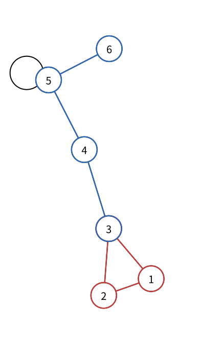

# 图：路径与环

> 状态：草稿
> 直接前置：[0401 图：点与边](vertices-and-edges.md)

在 [图：点与边](vertices-and-edges.md) 中，我们只记录了哪些点之间有边。沿着首尾相接的边从一个点走到另一个点时，经过的点和边会形成图中最常用的两个结构：路径与环。

## 路径

设一串点为：

$$
v_0,v_1,v_2,\ldots,v_k
$$

如果每一对相邻点 $v_{i-1}$ 和 $v_i$ 之间都有边，并且这些点互不重复，那么这串点和连接它们的边组成一条路径（path）。$v_0$ 和 $v_k$ 是路径的两个端点。

在有向图中，经过每条有向边时还必须沿着箭头方向前进。

不带权图中，路径的长度通常是经过的边数，即上面的 $k$。带权图中，“路径长度”通常指路径上所有边权之和；题目也可能另行定义代价。

上图中的蓝色部分 `C -> D -> E -> F` 是一条路径。

## 环

如果沿着若干条边前进后回到起点，并且除了起点和终点重合之外，不重复经过其他点，那么这些点和边组成一个环（cycle）。环中的边也不会重复。

可以把环写成：

$$
v_0,v_1,\ldots,v_{k-1},v_0
$$

其中 $v_0,v_1,\ldots,v_{k-1}$ 两两不同。下图中的红色部分 `A -> B -> C -> A` 是一个环。

自环是一个只有一个点和一条边的特殊环。上图的点 `E` 上就有一个自环；从边的角度看，它同时也是两个端点相同的特殊边。

## 术语约定

本书采用 [OI Wiki 的中文图论术语](https://oi-wiki.org/graph/concept/)，正文中的“路径”和“环”默认使用上面的严格定义。英文题面可能采用不同约定，例如额外写出 `simple path` 或说明 `not necessarily simple`。正式比赛中，题面给出的定义始终优先。

> 回路（circuit）也是首尾相接且边不重复的结构，但允许重复经过其他点。基础竞赛中很少单独使用这个词；它主要出现在欧拉回路和哈密顿回路中。欧拉回路可能重复经过点，哈密顿回路则同时是一个经过所有点的环。对应章节会重新给出完整定义。

基础阶段只需要熟练使用路径、环和自环，不需要为了完整分类额外记忆其他术语。

## 需要记住什么

- 一串点要满足什么条件才能构成路径？
- 路径的长度在不带权图和带权图中通常分别指什么？
- 环允许哪些点重复出现？
- 有向图中的路径为什么还要检查边的方向？
- 自环由多少个点和多少条边组成？
