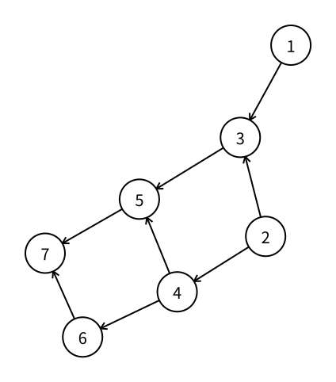

# 有向无环图：拓扑排序

> 最近修订：2026-08-14 00:34 +10:00（未审阅）

有些任务必须满足先后关系：先修课程完成后才能学习后续课程，源文件准备好以后才能编译依赖它的目标，某一步工作完成后才能开始下一步。

把每项任务看成一个点，并用有向边：

$$
u\to v
$$

表示“任务 $u$ 必须在任务 $v$ 以前完成”。现在需要把所有点排成一个线性顺序，并满足每一条有向边给出的先后限制。

若直接枚举所有 $n!$ 种排列，再逐条检查边，点数稍大就无法完成。拓扑排序（topological sort）利用有向图中的入度，在 $O(n+m)$ 时间内构造一个可行顺序，或者判断约束中存在环而无解。

本篇使用 Kahn 算法。它最直接地表达一个关键事实：每一步都可以选择任意一个当前入度为零的点，而初始时必须把所有入度为零的点都纳入考虑，不是只寻找唯一的“全局起点”。

## 拓扑序

一张有向图的拓扑序（topological ordering）是包含所有点恰好一次的排列，并且对每条边 $u\to v$，点 $u$ 都出现在点 $v$ 以前。

例如有三项约束：

```text
1 -> 3
2 -> 3
2 -> 4
```

那么 `1 2 3 4` 是一个拓扑序，`2 4 1 3` 也是；`3 1 2 4` 不是，因为它把点 `3` 放在了前置任务 `1` 和 `2` 以前。

拓扑序一般不唯一。只要不同选择都满足全部边，它们就是同样正确的答案。

## 有向无环图

若有向图中存在一个环：

```text
1 -> 2 -> 3 -> 1
```

约束会同时要求：

```text
1 在 2 前，2 在 3 前，3 又在 1 前
```

任何线性排列都不可能满足这种循环依赖。

不含有向环的有向图称为有向无环图（Directed Acyclic Graph，DAG）。一张有向图存在拓扑序，当且仅当它是 DAG：

- 有环时，沿环的先后关系最终会要求起点出现在自己以前，因此不可能有拓扑序；
- 无环时，总能找到至少一个入度为零的点，删除它以后继续处理剩余 DAG，最终可以得到拓扑序。

后一个结论正是算法的入口。

## 朴素扫描

一个点的 [入度](vertex-degrees.md#有向图的入度与出度) 是以它为终点的边数。若当前仍未处理的点中，点 $u$ 的入度为零，就没有任何尚未完成的任务要求排在 $u$ 以前，因此现在可以安全地选择 $u$。

最直接的算法可以反复执行：

1. 扫描全部点，寻找一个尚未处理且当前入度为零的点；
2. 把它加入答案，并从概念上删除这个点及其全部出边；
3. 重复直到处理全部点，或再也找不到可选点。

删除一条 $u\to v$ 的边以后，点 $v$ 的当前入度减少 $1$。程序不需要真的从邻接表中删除边，只需修改一个入度数组。

这套方法正确，但寻找每个点时都可能重新扫描 $n$ 个位置，总时间最坏达到 $O(n^2+m)$。问题在于：一个点的入度从正数变为零时，程序已经知道它刚刚变得可选，却在下一轮丢掉了这条信息。

## 当前入度

为了在处理点 `u` 时直接找到它的全部出边，程序使用 [图的存储：邻接表（vector 实现）](vector-adjacency-list.md) 中的 `g[u]`。

建立数组：

```cpp
vector<int> indegree(n + 5, 0);
```

`indegree[v]` 始终表示点 $v$ 来自尚未处理点的入边数量。

读入有向边 $u\to v$ 时：

```cpp
g[u].push_back(v);
indegree[v]++;
```

邻接表只在起点 `u` 的表中加入终点 `v`。增加的是终点 `v` 的入度，不是起点 `u` 的入度。

开始处理以前，所有点都尚未删除，所以数组保存原图入度。处理点 `u` 时枚举 `g[u]`，就能找到删除 `u` 后会受到影响的全部终点。

## 所有零入度点

第一次扫描 `1..n`，把所有初始入度为零的点加入 [容器适配器：queue](../cpp/queue.md)：

```cpp
queue<int> q;

for (int u = 1; u <= n; u++) {
    if (indegree[u] == 0) {
        q.push(u);
    }
}
```

这里不能找到一个零入度点后就停止。图可能有多个互不依赖的起始任务、多个连通部分或孤立点；它们的入度都为零，也都必须最终进入拓扑序。

队列只是保存“已经确定可以处理、但尚未处理”的点。使用普通 `queue` 时，先发现的可选点先处理；选择次序可能改变具体答案，但不会破坏拓扑序的正确性。

## 删除点与出边

每次取出队首点 `u`，先把它加入答案：

```cpp
int u = q.front();
q.pop();
order.push_back(u);
```

随后从概念上删除 `u` 的每条出边。对边 $u\to v$，尚未处理的入边少了一条：

```cpp
for (int v : g[u]) {
    indegree[v]--;
    if (indegree[v] == 0) {
        q.push(v);
    }
}
```

只有入度恰好降到零时才入队。入度在删除每条入边时单调减少，一个点最多经历一次“从正数变为零”，所以不会因为其他出边再次重复入队。

这一步保留了不变量：`indegree[v]` 等于点 `v` 来自所有尚未处理点的入边数量。队列中的每个点都不再依赖任何尚未处理点。

## 处理过程

下面的 DAG 有两个初始零入度点 `1` 和 `2`：



各点的初始入度为：

| 点 | 1 | 2 | 3 | 4 | 5 | 6 | 7 |
| ---: | ---: | ---: | ---: | ---: | ---: | ---: | ---: |
| 入度 | 0 | 0 | 2 | 1 | 2 | 1 | 2 |

按点编号扫描以后，初始队列是 `[1, 2]`。继续处理：

| 步骤 | 取出的点 | 本步新变为零入度 | 处理后的队列 | 当前答案 |
| ---: | ---: | --- | --- | --- |
| 1 | 1 | 无 | `[2]` | `1` |
| 2 | 2 | 3、4 | `[3, 4]` | `1 2` |
| 3 | 3 | 无 | `[4]` | `1 2 3` |
| 4 | 4 | 5、6 | `[5, 6]` | `1 2 3 4` |
| 5 | 5 | 无 | `[6]` | `1 2 3 4 5` |
| 6 | 6 | 7 | `[7]` | `1 2 3 4 5 6` |
| 7 | 7 | 无 | `[]` | `1 2 3 4 5 6 7` |

处理点 `1` 后，点 `3` 的入度只从 `2` 降到 `1`，仍然受到点 `2` 的约束，所以不能入队。处理点 `2` 后，点 `3` 和点 `4` 才同时变得可选。

若初始把点 `2` 放在点 `1` 前，或在点 `3` 与点 `4` 同时可选时先处理点 `4`，可能得到另一份答案。这不表示算法不稳定，只说明拓扑序本来可以不唯一。

## 环的检测

每处理一个点，就把它加入 `order`。算法结束后比较：

```cpp
if ((int)order.size() != n) {
    // 图中存在有向环
}
```

若答案恰好包含 $n$ 个点，所有点都已成功删除，`order` 就是一份拓扑序。

若队列已经为空但答案不足 $n$ 个点，剩余点都还有来自剩余点的入边。任选一个剩余点并不断沿入边寻找前驱；剩余点数量有限，最终必然重复经过某个点，从而形成有向环。因此这些点无法继续处理，原图不存在拓扑序。

自环也会被正确识别。边 $u\to u$ 让点 `u` 的入度至少为 `1`，而删除这条边又必须先处理 `u`，所以它不会因为这条自环变为可选。

## 正确性

算法的核心不变量是：`indegree[v]` 始终等于点 $v$ 来自尚未处理点的入边数量。

初始时所有点尚未处理，读入时统计的正是完整入度，所以不变量成立。处理点 $u$ 时，程序恰好枚举并删除它的所有出边 $u\to v$，对每个相应终点把入度减少 $1$；其他尚未处理点之间的边没有改变，因此不变量继续成立。

一个点只有在当前入度为零时才会进入队列，所以把它加入答案时，所有指向它的点都已经处理。于是对任意边 $u\to v$，点 $u$ 一定比点 $v$ 更早进入答案，得到的完整 `order` 满足拓扑序定义。

若原图是 DAG，它至少有一个入度为零的点：假设每个点都有入边，从任意点不断选择一个前驱；由于点数有限，最终会重复一个点并形成有向环，与 DAG 矛盾。删除零入度点不会产生新环，所以相同结论可以不断用于剩余图，算法最终会处理全部点。

结合环的检测可知：算法输出完整顺序当且仅当原图是 DAG；输出的完整顺序一定是合法拓扑序。

## 完整代码

程序读取 $n$ 个点、$m$ 条有向边。存在拓扑序时输出任意一份；存在有向环时输出 `-1`。

`topological_sort` 的 `indegree` 参数按值传递，因为函数需要把它当作“剩余入度”持续减少，而调用者保存的原图入度不必随算法一起被破坏。复制需要 $O(n)$ 时间和空间，不改变总体复杂度。

```cpp
#include <bits/stdc++.h>
using namespace std;

vector<int> topological_sort(int n, const vector<vector<int>>& g,
                             vector<int> indegree) {
    queue<int> q;
    for (int u = 1; u <= n; u++) {
        if (indegree[u] == 0) {
            q.push(u);
        }
    }

    vector<int> order;
    order.reserve(n);

    while (!q.empty()) {
        int u = q.front();
        q.pop();
        order.push_back(u);

        for (int v : g[u]) {
            indegree[v]--;
            if (indegree[v] == 0) {
                q.push(v);
            }
        }
    }

    return order;
}

int main() {
    int n, m;
    scanf("%d%d", &n, &m);

    vector<vector<int>> g(n + 5);
    vector<int> indegree(n + 5, 0);

    for (int i = 1; i <= m; i++) {
        int u, v;
        scanf("%d%d", &u, &v);
        g[u].push_back(v);
        indegree[v]++;
    }

    vector<int> order = topological_sort(n, g, indegree);
    if ((int)order.size() != n) {
        printf("-1\n");
        return 0;
    }

    for (int i = 0; i < n; i++) {
        printf("%d%c", order[i], " \n"[i + 1 == n]);
    }
    return 0;
}
```

输入：

```text
7 8
1 3
2 3
2 4
3 5
4 5
4 6
5 7
6 7
```

输出：

```text
1 2 3 4 5 6 7
```

若输入改为：

```text
3 3
1 2
2 3
3 1
```

三个点的初始入度都为 `1`，队列从一开始就是空的。程序发现处理点数小于 `n`，输出：

```text
-1
```

## 复杂度

初始化队列检查每个点一次。每个点最多入队、出队一次，每条有向边只在处理其起点时扫描一次，因此时间复杂度是：

$$
O(n+m).
$$

邻接表占用 $O(n+m)$ 空间；入度、队列和答案各占用 $O(n)$ 空间，总空间复杂度是 $O(n+m)$。

按值复制 `indegree` 仍是 $O(n)$，已经包含在上述界限内。

## 指定选择顺序

普通题目只要求任意拓扑序，`queue` 已经足够。如果题目明确要求字典序最小的拓扑序，就要在所有当前零入度点中选择编号最小者，可以把普通队列替换成 [容器适配器：priority_queue](../cpp/priority-queue.md) 中的小根堆：

```cpp
priority_queue<int, vector<int>, greater<int>> q;
```

其余入度更新不变，但每次加入和取出需要 $O(\log n)$ 时间，总复杂度变为 $O((n+m)\log n)$。不能在普通题目中默认排序答案：事后排序可能破坏有向边的先后关系；选择规则必须发生在算法处理零入度点时。

## 常见错误

### 只加入一个初始零入度点

必须扫描完整的 `1..n`，把所有初始零入度点加入队列。图可能有多个独立起点、多个部分和孤立点。

### 增加起点的入度

读入 $u\to v$ 时增加 `indegree[v]`。箭头指向的终点得到一条入边。

### 入队条件写成小于等于零

点只在入度恰好从 `1` 降到 `0` 时入队一次。正确代码使用 `indegree[v] == 0`；正常维护中入度不应变成负数。

### 把队列为空直接当成 DAG

队列为空只表示当前没有可处理点。必须检查 `order.size() == n`：处理完全部点才是 DAG；提前为空表示剩余部分含环。

### 忘记有向边只加入一次

拓扑排序处理有向约束。边 $u\to v$ 只加入 `g[u]`；若像无向图一样同时加入 `g[v]`，会凭空制造反向约束和环。

### 认为答案唯一

同时存在多个零入度点时，可以选择其中任意一个。题目若只要求合法答案，不应与某份样例拓扑序逐项比较，而应检查每条边的相对顺序。

### 先求任意答案再排序

数值排序不理解边的约束，可能把后置任务移到前置任务以前。需要字典序最小时，在每一步的候选零入度点中选择最小者。

## 基础练习

1. 手算示例图的初始入度，并逐步记录每次出队后哪些点变为零入度。
2. 为一张有多个初始零入度点和一个孤立点的图求出两份不同拓扑序。
3. 在示例中增加边 `7 -> 2`，观察队列何时提前为空，并指出形成的环。
4. 实现“课程先修关系是否可行”：能处理全部课程输出 `Yes`，否则输出 `No`。
5. 把队列改为小根 `priority_queue`，输出字典序最小拓扑序，并构造一个与普通队列结果不同的例子。
6. 随机生成小规模有向图；暴力枚举排列判断是否存在拓扑序，再与处理点数是否等于 `n` 对拍。

## 需要记住什么

1. 边 $u\to v$ 在先后约束中表示谁必须在谁以前？
2. 什么是拓扑序？一张图存在拓扑序的充要条件是什么？
3. 为什么 DAG 一定至少有一个入度为零的点？
4. `indegree[v]` 在算法进行中具体统计哪些边？
5. 为什么初始时要加入所有零入度点，而不是只选一个起点？
6. 处理点 `u` 时为什么只需枚举 `g[u]` 并减少终点入度？
7. 点 `v` 应在什么时刻入队？为什么它不会重复入队？
8. 为什么 `order.size() < n` 能证明图中存在有向环？
9. 拓扑序为什么可能不唯一？怎样得到字典序最小的一份？
10. Kahn 算法的时间与空间复杂度分别是什么？

DFS 的逆完成顺序也能构造拓扑序，但需要额外维护访问状态来识别有向环。本篇的 Kahn 算法已经足以解决基础拓扑排序与 DAG 判定，不要求记忆第二套实现。

## 下一篇

下一篇 [图的遍历：多源 BFS](multi-source-bfs.md) 会把多个距离为零的起点同时加入队列，使每个点找到离自己最近的起点。
