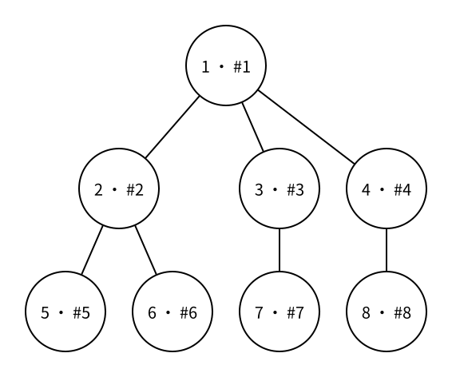

# 树的遍历：广度优先搜索（BFS）

> 状态：定稿

[图的遍历：广度优先搜索（BFS）](graph-breadth-first-search.md) 用队列按照最少边数逐层扩展。在有根树上，这些层正好就是节点的深度；树又没有环，因此可以用父节点代替一般图中的访问标记。

## 按层访问

下面把节点 $1$ 选作根。每个圆中的 `u · #k` 表示节点编号为 $u$，并且它是 BFS 第 $k$ 个访问到的节点。



如果同一层按图中从左到右的顺序访问，BFS 顺序是：

```text
1 2 3 4 5 6 7 8
```

节点 $1$ 的深度是 $0$；节点 $2,3,4$ 的深度是 $1$；节点 $5,6,7,8$ 的深度是 $2$。BFS 会先访问完深度 $1$ 的所有节点，再进入深度 $2$，不会像 DFS 那样先从节点 $2$ 深入到节点 $5$。

同一层中的先后顺序取决于邻接表的顺序，但深度较小的节点一定先于深度较大的节点访问。

## 等待访问的队列

BFS 需要记住已经发现、但还没有展开相邻节点的所有节点。最早发现的节点应当最先处理，所以使用先进先出的队列 `queue<int>`。

先把根节点放入队列：

```cpp
queue<int> q;
q.push(1);
```

只要队列不为空，就取出队首节点：

```cpp
while (!q.empty()) {
    int u = q.front();
    q.pop();

    printf("%d ", u);
}
```

现在还要查看 `g[u]`，把节点 $u$ 的子节点依次放到队尾。队列中原本等待的同层节点仍在前面，所以会先处理完当前层；新发现的下一层节点排在它们后面。

## 父节点与深度

无向边会在邻接表中存储两个方向。为了不沿原边返回，令 `parent[u]` 表示 BFS 从哪个节点第一次发现 `u`：

```cpp
int parent[MAXN];
int depth[MAXN];
```

根节点没有父节点，深度为 $0$：

```cpp
parent[1] = 0;
depth[1] = 0;
q.push(1);
```

从 `u` 发现相邻节点 `v` 时，如果 `v` 是 `u` 的父节点，就跳过；否则 `u` 就是 `v` 的父节点，而 `v` 比 `u` 深一层：

```cpp
for (int v : g[u]) {
    if (v == parent[u]) {
        continue;
    }

    parent[v] = u;
    depth[v] = depth[u] + 1;
    q.push(v);
}
```

父节点和深度必须在 `v` 入队时立刻确定。这样后续处理 `v` 时，信息已经准备好；“发现一个节点”和“安排它等待处理”也保持为同一个步骤。

因为输入保证是一棵树，除父节点以外的相邻节点一定属于尚未访问的子树，所以只检查父节点就足够。一般图 BFS 会改用 `visited` 或距离数组，防止同一个点从不同边反复入队。

## 完整代码

下面的程序读取一棵树，从节点 $1$ 开始 BFS，输出访问顺序，再输出每个节点的深度。

```cpp
#include <bits/stdc++.h>
using namespace std;

const int MAXN = 2e5 + 5;
vector<int> g[MAXN];

int parent[MAXN];
int depth[MAXN];

int main() {
    int n;
    scanf("%d", &n);

    for (int i = 1; i < n; i++) {
        int u, v;
        scanf("%d%d", &u, &v);
        g[u].push_back(v);
        g[v].push_back(u);
    }

    queue<int> q;
    parent[1] = 0;
    depth[1] = 0;
    q.push(1);

    while (!q.empty()) {
        int u = q.front();
        q.pop();

        printf("%d ", u);

        for (int v : g[u]) {
            if (v == parent[u]) {
                continue;
            }

            parent[v] = u;
            depth[v] = depth[u] + 1;
            q.push(v);
        }
    }
    printf("\n");

    for (int u = 1; u <= n; u++) {
        printf("depth[%d] = %d\n", u, depth[u]);
    }

    return 0;
}
```

示例输入：

```text
8
1 2
1 3
1 4
2 5
2 6
3 7
4 8
```

程序输出为：

```text
1 2 3 4 5 6 7 8
depth[1] = 0
depth[2] = 1
depth[3] = 1
depth[4] = 1
depth[5] = 2
depth[6] = 2
depth[7] = 2
depth[8] = 2
```

## 复杂度

每个节点恰好入队、出队一次，每条无向边在邻接表中查看两次，所以时间复杂度是 $O(n)$。邻接表、队列、父节点数组和深度数组总共占用 $O(n)$ 空间。

## 基础练习

1. 在深度之后继续输出每个非根节点的父节点，检查它是否总比当前节点浅一层。
2. 从节点 $1$ 以外的节点作为根重新执行 BFS，观察父节点、深度和同层访问顺序怎样变化。
3. 给定节点 `u`，沿 `parent[u]` 不断向上直到根，恢复根到 `u` 的唯一路径。

## 需要记住什么

- BFS 与 DFS 的访问方向有什么不同？
- 为什么 BFS 使用先进先出的队列？
- 为什么队列能保证先处理深度较小的节点？
- `parent[v]` 和 `depth[v]` 应该在节点入队时还是出队时确定？
- 为什么树的 BFS 只跳过父节点就足够？
- 树的 BFS 为什么是 $O(n)$？

## 下一篇

下一篇 [动态规划：状态与转移](../dynamic-programming/dp-state-transition.md) 会把能够产生相同剩余问题的选择过程合并成状态，避免重复搜索。
