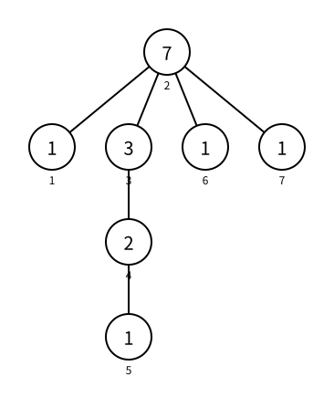

# 树的重心

> 最近修订：2026-08-14 02:21 +10:00（未审阅）

[树的直径与中心](tree-diameter-center.md) 选择一个节点，使它到最远节点的距离尽量小。现在换一种“平衡”要求：若删除一个节点以及与它相连的边，原树会分成若干连通分量；我们希望其中最大的连通分量尽量小。

满足这个目标的节点称为树的重心（centroid）。它关心的是剩余部分的节点数量，不是距离。树的中心与重心有时相同，有时不同，不能根据名称把它们混为一谈。

## 删除一个节点以后

考虑下面这棵有 `7` 个节点的树。图中圆外是节点编号；圆内数字是以节点 `2` 为根时的子树大小。



删除节点 `2` 后会得到四个连通分量：

```text
{1}          大小 1
{3, 4, 5}    大小 3
{6}          大小 1
{7}          大小 1
```

最大连通分量大小为 `3`。树共有 `7` 个节点，而 `3` 不超过一半，所以节点 `2` 是这棵树的重心。

同一棵树的直径可以是 `6 - 2 - 3 - 4 - 5`，中点是节点 `3`，因此它的中心是 `3`，重心却是 `2`。这个例子直接说明两种概念衡量的目标不同。

## 重心的定义

对于每个候选节点 `u`，删除它以后，令 `balance[u]` 表示剩余各个连通分量大小的最大值。

树的重心就是令 `balance[u]` 最小的节点。等价地，节点 `u` 是重心，当且仅当删除它以后每个连通分量都不超过整棵树的一半：

```text
largest_component * 2 <= n
```

使用乘以 `2` 的整数比较，不需要处理奇数节点的一半是多少，也不需要浮点数。

每棵树至少有一个重心，至多有两个重心；若有两个，它们一定由一条边直接相连。

## 朴素做法

可以依次尝试删除每个节点，再用 BFS 或 DFS 统计剩余连通分量：

```text
n 个候选节点 × 每次 O(n) = O(n²)
```

问题在于每次删点都重复计算了大量相同部分。任选节点 `1` 为根以后，一次 DFS 就能求出每个节点的子树大小；这些大小足以计算删除任意节点后的全部连通分量。

## 子树大小

令 `subtree_size[u]` 表示以节点 `1` 为根时，节点 `u` 及其全部后代的数量。

一个节点的子树由它自己和每个子节点的子树组成：

```cpp
subtree_size[u] = 1;
for (int v : g[u]) {
    if (v == p) {
        continue;
    }
    dfs(v, u);
    subtree_size[u] += subtree_size[v];
}
```

必须先递归算完 `v`，才能把 `subtree_size[v]` 加到 `u`，所以这是一项 DFS 返回时进行的后序计算。

## 删除 `u` 后的子树连通分量

对于 `u` 的每个子节点 `v`，删除 `u` 会切断边 `u - v`。以 `v` 为根的整棵子树成为一个独立连通分量，大小恰好是：

```cpp
subtree_size[v]
```

遍历子节点时，可以同时取这些大小的最大值：

```cpp
int largest_component = 0;

for (int v : g[u]) {
    if (v == p) {
        continue;
    }
    dfs(v, u);
    subtree_size[u] += subtree_size[v];
    largest_component = max(largest_component, subtree_size[v]);
}
```

这里不能只看最大的一个子树再停止，因为 `subtree_size[u]` 仍然需要累加全部子树。

## 父节点方向的连通分量

删除 `u` 后，除了每棵子树以外，还有原来位于 `u` 上方的部分。整棵树有 `n` 个节点，`u` 的子树包含 `subtree_size[u]` 个，因此上方部分大小为：

```cpp
n - subtree_size[u]
```

它可能比所有子树都大，必须一起参与最大值：

```cpp
largest_component = max(largest_component, n - subtree_size[u]);
```

若 `u` 恰好是 DFS 根节点 `1`，`subtree_size[u] == n`，上方部分大小为 `0`，公式仍然成立，无需特殊判断。

到这里，`largest_component` 就是定义中的 `balance[u]`。

## 比较所有候选节点

维护目前见过的最小最大连通分量 `best_balance`，以及达到它的全部节点 `centroids`。

发现更小值时，旧候选全部失效：

```cpp
if (largest_component < best_balance) {
    best_balance = largest_component;
    centroids = {u};
}
```

发现相同值时，当前节点也是重心：

```cpp
else if (largest_component == best_balance) {
    centroids.push_back(u);
}
```

DFS 顺序取决于邻接表。为了让输出稳定，最后按节点编号排序：

```cpp
sort(centroids.begin(), centroids.end());
```

## 为什么一定能走到重心

若删除当前节点 `u` 后存在一个大小超过 `n / 2` 的连通分量，那么其他所有连通分量加上 `u` 自己的总大小都小于它。沿着连接这个大连通分量的边移动一步，会把原来的其余部分变成较小的一侧，因此不会错过更平衡的位置。

不断向唯一可能超过一半的连通分量移动，不可能在树中绕环，最终会停在一个没有任何剩余连通分量超过一半的节点；它就是重心。这也说明重心一定存在。

若恰好有两个重心，删除连接它们的边会把树分成大小都为 `n / 2` 的两部分，所以它们必然相邻，且只会在 `n` 为偶数时出现。

## 状态封装

节点数、邻接表、子树大小和当前候选共同属于同一次求解。使用 `CentroidFinder` 把它们放在一起，避免为一次 DFS 建立多组全局变量：

```cpp
struct CentroidFinder {
    int n;
    const vector<vector<int>>& g;
    vector<int> subtree_size;
    int best_balance;
    vector<int> centroids;

    CentroidFinder(int node_count, const vector<vector<int>>& graph)
        : n(node_count), g(graph), subtree_size(node_count + 5),
          best_balance(node_count) {}
};
```

`g` 是只读引用：求重心不会修改输入树，也不需要复制整份邻接表。

完整 DFS 为：

```cpp
void dfs(int u, int p) {
    subtree_size[u] = 1;
    int largest_component = 0;

    for (int v : g[u]) {
        if (v == p) {
            continue;
        }
        dfs(v, u);
        subtree_size[u] += subtree_size[v];
        largest_component = max(largest_component, subtree_size[v]);
    }

    largest_component = max(largest_component, n - subtree_size[u]);
    if (largest_component < best_balance) {
        best_balance = largest_component;
        centroids = {u};
    } else if (largest_component == best_balance) {
        centroids.push_back(u);
    }
}
```

这里严格遵循树遍历命名：`u` 是当前节点，`v` 是当前邻居，`p` 是父节点，因此判断写成“若当前邻居就是父节点”：

```cpp
if (v == p)
```

## 完整程序

下面读入一棵树，第一行输出删除重心后最大连通分量大小的最小值，第二行输出全部重心：

```cpp
#include <bits/stdc++.h>

using namespace std;

struct CentroidFinder {
    int n;
    const vector<vector<int>>& g;
    vector<int> subtree_size;
    int best_balance;
    vector<int> centroids;

    CentroidFinder(int node_count, const vector<vector<int>>& graph)
        : n(node_count), g(graph), subtree_size(node_count + 5),
          best_balance(node_count) {}

    void dfs(int u, int p) {
        subtree_size[u] = 1;
        int largest_component = 0;

        for (int v : g[u]) {
            if (v == p) {
                continue;
            }
            dfs(v, u);
            subtree_size[u] += subtree_size[v];
            largest_component = max(largest_component, subtree_size[v]);
        }

        largest_component = max(largest_component, n - subtree_size[u]);
        if (largest_component < best_balance) {
            best_balance = largest_component;
            centroids = {u};
        } else if (largest_component == best_balance) {
            centroids.push_back(u);
        }
    }

    pair<int, vector<int>> solve() {
        dfs(1, 0);
        sort(centroids.begin(), centroids.end());
        return {best_balance, centroids};
    }
};

int main() {
    int n;
    scanf("%d", &n);

    vector<vector<int>> g(n + 5);
    for (int i = 1; i < n; i++) {
        int u, v;
        scanf("%d%d", &u, &v);
        g[u].push_back(v);
        g[v].push_back(u);
    }

    CentroidFinder finder(n, g);
    auto [balance, centroids] = finder.solve();
    printf("%d\n", balance);
    for (int i = 0; i < (int)centroids.size(); i++) {
        printf("%d%c", centroids[i], " \n"[i + 1 == (int)centroids.size()]);
    }
    return 0;
}
```

## 示例

输入：

```text
7
1 2
2 3
3 4
4 5
2 6
2 7
```

输出：

```text
3
2
```

删除节点 `2` 后最大连通分量含 `3` 个节点，并且没有其他节点能取得更小值。

## 正确性

DFS 返回时，`subtree_size[v]` 已经准确表示每个子节点方向的连通分量大小。删除 `u` 后，这些子树分别成为连通分量；剩下不在 `u` 子树中的节点全部连通，大小为 `n - subtree_size[u]`。算法取这些值的最大值，因此准确得到 `balance[u]`。

DFS 会访问全部节点，并把每个 `balance[u]` 与当前最优值比较。最终 `best_balance` 是全树最小值，`centroids` 恰好包含所有达到最小值的节点，因此返回的正是树的全部重心。

## 复杂度

DFS 访问每个节点一次、查看每条无向边两次，排序的元素至多只有两个，因此总时间复杂度为 $O(n)$，邻接表、子树大小和递归栈的空间复杂度为 $O(n)$。

## 常见错误

### 忘记父节点方向的连通分量

只比较 `subtree_size[v]` 会遗漏 `n - subtree_size[u]`。对于靠近叶节点的候选，这个上方部分通常才是最大的连通分量。

### 在进入子节点前使用子树大小

`subtree_size[v]` 必须等 `dfs(v, u)` 返回后才能确定。它是后序信息，不是进入节点时就已经知道的深度。

### 只保留一个重心

偶数个节点的树可能有两个重心。若题目要求全部重心，相等时必须追加，而不是忽略。

### 把中心当成重心

中心最小化最远距离，重心最小化最大剩余连通分量大小。两者的算法、答案和应用都可能不同。

### 用叶节点特判替代统一公式

叶节点的子树方向为空，但 `largest_component` 从 `0` 开始，父节点方向仍由 `n - subtree_size[u]` 统一处理，不需要特殊分支。

### 忽略递归深度

链状树会产生 $O(n)$ 层递归。若题目的栈空间严格、`n` 很大，应把 DFS 改成显式栈，并按遍历顺序的逆序计算子树大小；这不会改变本篇的状态定义。

## 基础练习

1. 手算一条长度分别为奇数、偶数的链的全部重心。
2. 计算星形树的重心，并比较中心是否相同。
3. 对示例中的每个节点分别计算 `balance[u]`，验证节点 `2` 最优。
4. 修改模板，输出每个节点的 `subtree_size[u]` 和 `balance[u]`。
5. 从任意一个重心作为根重新计算子树大小，验证每棵子树都不超过 `n / 2`。
6. 随机生成小树，逐个删除节点并用 BFS 统计连通分量，与线性算法对拍。

## 需要记住什么

1. 删除一个节点以后，`balance[u]` 表示什么？
2. 树的中心和重心分别最小化什么量？
3. `subtree_size[u]` 怎样从子节点计算？
4. 删除 `u` 后，每个子节点方向的连通分量有多大？
5. 父节点方向的连通分量为什么是 `n - subtree_size[u]`？
6. 为什么 DFS 根节点也能使用同一个公式？
7. 怎样同时保留全部最优重心？
8. 重心为什么一定存在？为什么至多有两个且相邻？
9. 算法为什么是 $O(n)$？
10. 深链导致递归栈不足时，应保留哪些状态改成迭代计算？

## 扩展阅读

- [点分治（正文待写）](../catalog.md#04-图论) 会反复选择当前连通分量的重心作为分治点，使子问题规模至多减半。
