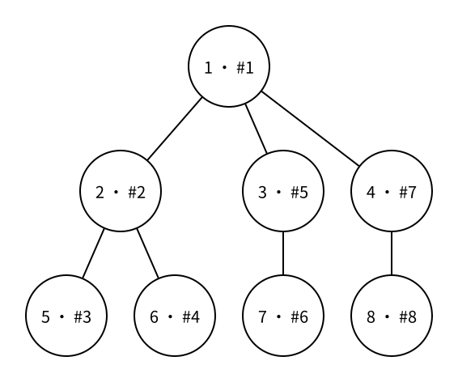

# 树的深度优先搜索

> 状态：草稿
> 直接前置：[0132 函数：递归（正文待写）](../CATALOG.md#01-c-基础)、[0433 树与有根树](trees-and-rooted-trees.md)、[0439 图的存储：邻接表（vector 实现）](vector-adjacency-list.md)

一棵树通常只以无向边给出。为了处理每个节点，我们需要从一个节点出发，沿边访问整棵树。深度优先搜索（depth-first search，DFS）的选择是：走到一个节点后，先把它的一棵子树完整处理完，再回头处理下一棵子树。

## 搜索顺序

下面仍把节点 $1$ 选作根。每个圆中的 `u · #k` 表示节点编号为 $u$，并且它是 DFS 第 $k$ 个访问到的节点。



如果每个节点都按照图中从左到右的顺序访问子节点，DFS 顺序是：

```text
1 2 5 6 3 7 4 8
```

从节点 $1$ 进入节点 $2$ 后，搜索不会立刻返回根去看节点 $3$，而是继续进入节点 $5$。节点 $5$ 没有未处理的子节点，搜索才返回节点 $2$，再进入节点 $6$。节点 $2$ 的整棵子树处理完成后，搜索才回到节点 $1$。

DFS 顺序不是树本身唯一确定的。交换邻接表中两个相邻点的存储顺序，可能改变访问顺序，但每个节点仍会恰好访问一次。

## 递归函数

递归函数首先需要知道当前节点 `u`：

```cpp
void dfs(int u) {
    printf("%d ", u);
}
```

接着要依次查看 `g[u]` 中从 `u` 出发的边记录：

```cpp
void dfs(int u) {
    printf("%d ", u);

    for (int v : g[u]) {
        dfs(v);
    }
}
```

这段代码还不能运行。无向边 $(u,v)$ 在邻接表中存了两个方向：从 `u` 进入 `v` 后，`g[v]` 又会看见 `u`，于是递归会立刻沿原边返回，再次进入 `v`，永远重复下去。

## 跳过父节点

进入当前节点时，同时记录我们是从哪个父节点 `parent` 过来的。枚举相邻节点时，如果又看见 `parent`，就跳过这条原路返回的边：

```cpp
void dfs(int u, int parent) {
    printf("%d ", u);

    for (int v : g[u]) {
        if (v == parent) {
            continue;
        }
        dfs(v, u);
    }
}
```

第一次从根节点开始时，根没有父节点。因为节点编号从 $1$ 开始，可以使用不存在的编号 `0`：

```cpp
dfs(1, 0);
```

树中任意两个节点之间只有一条路径。除了刚刚经过的父节点，当前节点的其他相邻节点一定通向尚未访问的子树。因此，遍历树时只跳过父节点就足够了，不需要额外的 `visited` 数组。

一般图可能有环，也可能从另一条边再次到达已经访问的点，届时只记录父节点不再足够。一般图 DFS 会为此引入 `visited`。

## 进入与返回

写在递归调用之前的操作，会在第一次进入节点时执行：

```cpp
printf("enter %d\n", u);
dfs(v, u);
```

写在递归调用之后的操作，要等节点 `v` 的整棵子树处理完、递归返回后才执行：

```cpp
dfs(v, u);
printf("leave %d\n", v);
```

这种“进入节点—递归处理每棵子树—离开节点”的结构，是后续计算子树大小、树形 DP 和二叉树遍历的基础。现在只需要先看懂调用发生在什么时候、返回又表示什么。

## 完整代码

下面的程序读取一棵以无向边给出的树，从节点 $1$ 开始 DFS，并按照第一次进入节点的顺序输出编号。

```cpp
#include <bits/stdc++.h>
using namespace std;

const int MAXN = 2e5 + 5;
vector<int> g[MAXN];

void dfs(int u, int parent) {
    printf("%d ", u);

    for (int v : g[u]) {
        if (v == parent) {
            continue;
        }
        dfs(v, u);
    }
}

int main() {
    int n;
    scanf("%d", &n);

    for (int i = 1; i < n; i++) {
        int u, v;
        scanf("%d%d", &u, &v);
        g[u].push_back(v);
        g[v].push_back(u);
    }

    dfs(1, 0);
    printf("\n");

    return 0;
}
```

示例输入：

```text
8
1 2
1 3
1 4
2 5
2 6
3 7
4 8
```

示例输出：

```text
1 2 5 6 3 7 4 8
```

## 复杂度

一棵有 $n$ 个节点的树有 $n-1$ 条边。邻接表把每条无向边保存两次，DFS 会查看总共 $2(n-1)$ 个邻接项，所以时间复杂度是 $O(n)$，邻接表和递归调用占用的额外空间也是 $O(n)$。

> 当树退化成一条很长的链时，递归深度可能达到 $n$，受到评测环境调用栈大小的限制。基础阶段先掌握递归结构；遇到确实会爆栈的规模时，可以改用显式栈实现同样的搜索过程。

## 需要记住什么

- DFS 为什么会先完整处理一棵子树，再处理下一棵子树？
- 为什么无向树的 DFS 不能不加判断地递归到所有相邻节点？
- 参数 `parent` 表示什么？为什么根节点可以把它设为 `0`？
- 为什么树中跳过父节点就足够，而一般图还需要 `visited`？
- 写在递归调用之前和之后的操作分别在什么时候执行？
- 树的 DFS 为什么是 $O(n)$？

## 下一篇

下一篇将介绍 [树的广度优先搜索](tree-breadth-first-search.md)。
