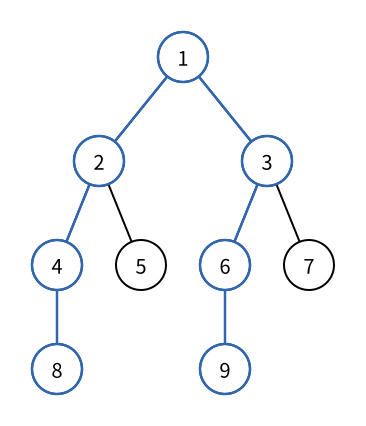

# 树的直径与中心

> 最近修订：2026-08-14 02:15 +10:00（未审阅）

[无根树](unrooted-trees.md) 中任意两个节点之间恰好只有一条路径。若要在一棵树上铺设一条覆盖范围尽量大的主干线路，自然会寻找树中最长的路径；若要设置一个服务点，让最远节点也尽量靠近，则需要寻找树的中心。

直接枚举全部 $O(n^2)$ 对端点，再分别计算路径长度，无法处理较大的树。本篇只考虑每条边长度都为 `1` 的无权树，从树的路径结构出发，用两次 BFS 找到直径，再从直径的中间位置得到中心。

## 距离、离心率与直径

无权树上两个节点 `u`、`v` 的距离，是它们之间唯一路径所含的边数。

用 $d(u,v)$ 表示节点 `u`、`v` 之间的距离。一个节点 `u` 到整棵树中最远节点的距离称为 `u` 的离心率（eccentricity）：

$$
e(u)=\max_v d(u,v)
$$

树中任意两节点之间的最大距离称为树的直径长度；达到这个长度的路径称为树的一条直径。直径的端点不一定唯一，直径路径也可能有多条，但直径长度唯一。



图中的蓝色路径为：

```text
8 - 4 - 2 - 1 - 3 - 6 - 9
```

它含有 `6` 条边，所以直径长度为 `6`。节点 `1` 位于路径正中间。

只有一个节点的树没有边，直径长度为 `0`，唯一节点本身就是长度为 `0` 的直径路径。

## 朴素做法

从每个节点分别进行一次 BFS，可以得到所有点对距离，再取最大值：

```text
n 个起点 × 每次 O(n) = O(n²)
```

这也能顺便计算每个节点的离心率，适合小规模验证，却没有利用“树中路径唯一”这一条件。

我们真正需要的不是全部距离，而是一个直径端点。一旦知道直径的一端，从它出发最远的节点必然可以作为另一端。

## 第一次 BFS：走到直径的一端

先任选一个节点，例如节点 `1`，进行 BFS，找到距离它最远的节点 `s`。

树上的路径不能绕环回来。随着距离增加，BFS 不断远离起点；一个最远节点必然位于某个分支的末端。树的一个基本性质是：

> 从任意节点出发，任取一个最远节点，它一定可以作为某条直径的端点。

可以用反证法理解。若从起点到这个最远节点的分支仍不能成为任何最长路径的一端，那么把一条真正的最长路径与这条分支在树中的唯一连接位置比较，总能用更长的一侧替换原分支，得到一个离起点更远的节点，与“已经最远”矛盾。

第一次 BFS 的起点不重要，它只负责把我们带到外围的一个直径端点。

## 第二次 BFS：找到另一端

再从 `s` 进行 BFS，找到离它最远的节点 `t`。因为 `s` 已经是直径端点，`s` 到 `t` 的路径就是一条直径：

```text
任意起点 --BFS--> s --BFS--> t
```

第二次 BFS 令 `parent[v]` 记录第一次发现 `v` 时来自哪个节点。完成以后，从 `t` 沿父节点回到 `s`，就能恢复整条直径路径。

## 一次 BFS 需要返回什么

定义一次 BFS 的结果：

```cpp
struct bfs_result {
    int farthest;
    vector<int> dist;
    vector<int> parent;
};
```

- `farthest` 是距离起点最远的一个节点；
- `dist[u]` 是起点到 `u` 的距离，`-1` 表示尚未访问；
- `parent[u]` 是 BFS 树中 `u` 的父节点，用于恢复路径。

起点距离为 `0`，没有父节点：

```cpp
int farthest = start;
dist[start] = 0;
q.push(start);
```

每次取出节点 `u` 时，用已经算出的距离更新最远节点：

```cpp
if (dist[u] > dist[farthest]) {
    farthest = u;
}
```

若有多个节点距离相同，保留其中任意一个都可以。

访问尚未到达的邻居时，同时确定距离和父节点：

```cpp
for (int v : g[u]) {
    if (dist[v] != -1) {
        continue;
    }
    dist[v] = dist[u] + 1;
    parent[v] = u;
    q.push(v);
}
```

完整辅助函数为：

```cpp
bfs_result bfs(int n, int start, const vector<vector<int>>& g) {
    vector<int> dist(n + 5, -1);
    vector<int> parent(n + 5, 0);
    queue<int> q;

    int farthest = start;
    dist[start] = 0;
    q.push(start);

    while (!q.empty()) {
        int u = q.front();
        q.pop();

        if (dist[u] > dist[farthest]) {
            farthest = u;
        }

        for (int v : g[u]) {
            if (dist[v] != -1) {
                continue;
            }
            dist[v] = dist[u] + 1;
            parent[v] = u;
            q.push(v);
        }
    }

    return {farthest, dist, parent};
}
```

这里使用 `dist` 兼作访问标记，因此即使把辅助函数用于一般无权图，也不会重复入队；本篇输入保证是一棵树。

## 恢复直径路径

第一次 BFS 只需要端点 `s`：

```cpp
int s = bfs(n, 1, g).farthest;
```

第二次 BFS 保留完整结果：

```cpp
bfs_result result = bfs(n, s, g);
int t = result.farthest;
```

此时直径长度就是 `result.dist[t]`。从 `t` 沿父节点不断向上，直到 `s`：

```cpp
vector<int> path;
for (int u = t; u != 0; u = result.parent[u]) {
    path.push_back(u);
    if (u == s) {
        break;
    }
}
```

得到的 `path` 从 `t` 指向 `s`。直径没有规定方向，所以不必反转；若题目要求从 `s` 输出到 `t`，再调用 `reverse` 即可。

若直径长度为 `D`，路径恰好含有 `D + 1` 个节点，代码中应满足：

```cpp
(int)path.size() == result.dist[t] + 1
```

## 树的中心

树的中心（center）是离心率最小的节点，也就是选择它作为服务点时，到最远节点的距离尽量小。

考虑一条长度为 `D` 的直径。若一个节点位于直径上，距离两端分别为 `x` 和 `D - x`，那么它到最远端点的距离至少是：

$$
\max(x,D-x)
$$

这个值只有在直径中点处最小：

- `D` 为偶数时，中点恰好是一个节点，树有一个中心；
- `D` 为奇数时，中点落在一条边内部，这条边的两个端点都是中心。

为什么直径之外不会藏着更远的节点？设 `c` 是直径中间的节点之一。若存在节点 `x` 到 `c` 的距离超过 $\lceil D/2\rceil$，将 `x` 到 `c` 的分支接到直径上距离 `c` 更远的端点，就会得到一条长度超过 `D` 的路径，与直径已经最长矛盾。因此中心的离心率为 $\lceil D/2\rceil$。

另一方面，任意节点到直径两个端点的距离中，至少一个不小于 $\lceil D/2\rceil$，所以不存在离心率更小的节点。直径中点确实就是整棵树的中心。

## 从路径取出中心

`path` 有 `D + 1` 个节点，使用 STL 下标 `0..D`。中间位置可以直接计算：

```cpp
int length = result.dist[t];
vector<int> centers = {path[length / 2]};
if (length % 2 == 1) {
    centers.push_back(path[length / 2 + 1]);
}
```

这里是本书下标约定中的例外：`path` 是 `vector` 的顺序接口，因此使用原生 `0-based` 下标。

例如：

```text
直径长度 6：7 个节点，下标 0..6，中心下标为 3
直径长度 5：6 个节点，下标 0..5，中心下标为 2、3
```

虽然不同的直径端点可能得到不同的直径路径，但所有直径的中间节点相同，因此树的中心不会随平局选择改变。

## 完整算法

用一个结果结构同时返回直径长度、路径和中心：

```cpp
struct diameter_result {
    int length;
    vector<int> path;
    vector<int> centers;
};

diameter_result find_diameter_and_center(int n, const vector<vector<int>>& g) {
    int s = bfs(n, 1, g).farthest;
    bfs_result result = bfs(n, s, g);
    int t = result.farthest;

    vector<int> path;
    for (int u = t; u != 0; u = result.parent[u]) {
        path.push_back(u);
        if (u == s) {
            break;
        }
    }

    int length = result.dist[t];
    vector<int> centers = {path[length / 2]};
    if (length % 2 == 1) {
        centers.push_back(path[length / 2 + 1]);
    }
    return {length, path, centers};
}
```

## 完整程序

下面读入一棵无权树，依次输出直径长度、一条直径路径和中心节点：

```cpp
#include <bits/stdc++.h>

using namespace std;

struct bfs_result {
    int farthest;
    vector<int> dist;
    vector<int> parent;
};

bfs_result bfs(int n, int start, const vector<vector<int>>& g) {
    vector<int> dist(n + 5, -1);
    vector<int> parent(n + 5, 0);
    queue<int> q;

    int farthest = start;
    dist[start] = 0;
    q.push(start);

    while (!q.empty()) {
        int u = q.front();
        q.pop();

        if (dist[u] > dist[farthest]) {
            farthest = u;
        }

        for (int v : g[u]) {
            if (dist[v] != -1) {
                continue;
            }
            dist[v] = dist[u] + 1;
            parent[v] = u;
            q.push(v);
        }
    }

    return {farthest, dist, parent};
}

struct diameter_result {
    int length;
    vector<int> path;
    vector<int> centers;
};

diameter_result find_diameter_and_center(int n, const vector<vector<int>>& g) {
    int s = bfs(n, 1, g).farthest;
    bfs_result result = bfs(n, s, g);
    int t = result.farthest;

    vector<int> path;
    for (int u = t; u != 0; u = result.parent[u]) {
        path.push_back(u);
        if (u == s) {
            break;
        }
    }

    int length = result.dist[t];
    vector<int> centers = {path[length / 2]};
    if (length % 2 == 1) {
        centers.push_back(path[length / 2 + 1]);
    }
    return {length, path, centers};
}

int main() {
    int n;
    scanf("%d", &n);

    vector<vector<int>> g(n + 5);
    for (int i = 1; i < n; i++) {
        int u, v;
        scanf("%d%d", &u, &v);
        g[u].push_back(v);
        g[v].push_back(u);
    }

    diameter_result answer = find_diameter_and_center(n, g);
    printf("%d\n", answer.length);
    for (int i = 0; i < (int)answer.path.size(); i++) {
        printf("%d%c", answer.path[i], " \n"[i + 1 == (int)answer.path.size()]);
    }
    for (int i = 0; i < (int)answer.centers.size(); i++) {
        printf("%d%c", answer.centers[i],
               " \n"[i + 1 == (int)answer.centers.size()]);
    }
    return 0;
}
```

## 示例

输入：

```text
9
1 2
1 3
2 4
2 5
3 6
3 7
4 8
6 9
```

输出：

```text
6
9 6 3 1 2 4 8
1
```

第一行是直径长度，第二行是一条直径路径，第三行是所有中心节点。

## 正确性

第一次 BFS 从任意节点找到最远节点 `s`。根据树的最远点性质，`s` 是某条直径的端点。第二次 BFS 从 `s` 找到最远节点 `t`，因此 `s` 到 `t` 的唯一路径达到树中最大距离，是一条直径；`parent` 恢复的正是这条路径。

直径中点到两个端点的最大距离是 $\lceil D/2\rceil$。若它到其他节点更远，就能把该节点与直径一端连接成更长路径；而任何候选中心到直径两端之一的距离都至少为 $\lceil D/2\rceil$。所以取出的一个或两个中间节点恰好是树的全部中心。

## 复杂度

两次 BFS 都只访问每个节点一次、查看每条无向边两次，恢复路径再访问至多 `n` 个节点，因此总时间复杂度为 $O(n)$，空间复杂度为 $O(n)$。

## 边权扩展

若树边具有正权值，可以用 DFS 沿唯一路径累加距离；因为树中不存在其他候选路径，不需要 Dijkstra。两次“从任意点走到最远点”的方法仍能求加权直径，但距离和答案应使用 `ll`。

加权树的几何中心可能落在一条边内部，而不是某个节点。若题目只允许从节点中选择中心，需要比较直径中点两侧的节点；具体以题目对“中心”的定义为准。

若允许负边权，“不断走向最远端”的性质不再能直接照搬，本篇算法不适用。

## 常见错误

### 只进行一次 BFS

任意起点通常不是直径端点。第一次 BFS 只负责找到端点 `s`，第二次才从 `s` 测量直径。

### 用节点数表示路径长度

无权图距离等于边数。直径路径含 `D + 1` 个节点，直径长度仍然是 `D`。

### 没有保存第二次 BFS 的父节点

只保存距离能够得到直径长度，却不能恢复路径，也就无法直接取出中心。

### 默认树只有一个中心

直径长度为奇数时，中点落在边内，存在两个相邻的中心节点。

### 在 `path` 上强行使用 1-based 下标

节点编号仍为 `1..n`，但 `vector` 的元素位置是 STL 原生 `0-based`。两种“下标”描述的对象不同。

### 对一般图使用两次 BFS

两次 BFS 求直径依赖树中路径唯一。一般无权图从任意点找最远点再重复一次，不保证得到图的直径。

## 基础练习

1. 分别计算只有一个节点、一条链和一颗星形树的直径与中心。
2. 给出一棵直径不唯一但中心唯一的树，再给出一棵有两个中心的树。
3. 修改模板，只输出直径长度；再恢复并输出端点 `s`、`t`。
4. 对每个节点计算离心率，用 $O(n^2)$ 朴素方法验证中心结果。
5. 给树边加入正权值，改用 DFS 和 `ll` 求加权直径。
6. 随机生成小树，用全源 BFS 枚举全部点对距离，与双次 BFS 对拍。

## 需要记住什么

1. 树的直径长度和直径路径分别指什么？直径是否一定唯一？
2. 为什么任意起点不能只进行一次 BFS 就得到直径？
3. 两次 BFS 的起点与最远点怎样依次变化？
4. 第二次 BFS 为什么需要保存 `parent`？
5. 直径长度 `D` 与路径节点数有什么关系？
6. 树的中心按照什么量定义？
7. `D` 为偶数或奇数时分别有几个中心？
8. 为什么中心一定在直径中间？
9. 为什么本篇算法不能直接用于一般图？
10. 正边权树需要怎样修改距离计算？

## 下一篇

删除一个节点并观察剩余连通分量的大小，会得到另一种平衡标准；详见
[树的重心](tree-centroid.md)。
