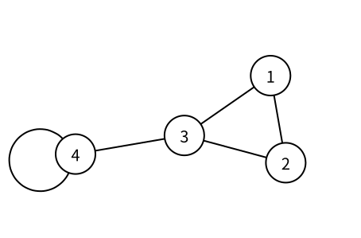
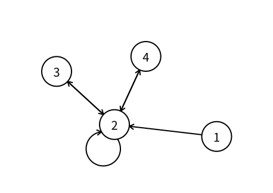

# 图：度数

> 状态：草稿
> 直接前置：[0401 图：点与边](vertices-and-edges.md)

只知道一张图有哪些点和边之后，我们经常还要描述某个点连接了多少条边。这个数量称为点的度数（degree）。

## 无向图的度数

在无向图中，与点 $u$ 相连的边数称为点 $u$ 的度数，记作 $\deg(u)$。

上图中：

- 点 $1$ 与两条边相连，所以 $\deg(1)=2$；
- 点 $2$ 与两条边相连，所以 $\deg(2)=2$；
- 点 $3$ 与三条边相连，所以 $\deg(3)=3$；
- 点 $4$ 除了连接点 $3$，还有一个自环。自环的两端都落在点 $4$ 上，因此对度数贡献 $2$，所以 $\deg(4)=3$。

每条普通无向边分别让两个端点的度数增加 $1$，自环则让同一个点的度数增加两次。因此，把所有点的度数相加，每条边都会被计算两次：

$$
\sum_{u\in V}\deg(u)=2|E|
$$

所以，无向图中奇数度数的点一定有偶数个。

## 有向图的入度与出度

有向边区分起点和终点，因此有向图的度数也要分成两种：

- 以点 $u$ 为终点的边数称为入度（in-degree），记作 $\deg^-(u)$；
- 以点 $u$ 为起点的边数称为出度（out-degree），记作 $\deg^+(u)$。

观察点 $2$：点 $1$、点 $3$ 和点 $4$ 各有一条边指向它，它还有一个自环，所以 $\deg^-(2)=4$；它有边指向点 $3$ 和点 $4$，自环也从它出发，所以 $\deg^+(2)=3$。

一条自环的起点和终点是同一个点，因此它会让该点的入度和出度各增加 $1$。

每条有向边恰好给一个点贡献一次出度，同时给一个点贡献一次入度，所以：

$$
\sum_{u\in V}\deg^-(u)=\sum_{u\in V}\deg^+(u)=|E|
$$

有时会把入度与出度之和称为有向图中一个点的总度数，但实际解题时通常直接区分入度和出度。

## 需要记住什么

- 无向图中一个点的度数如何计算？
- 为什么无向图中的自环对度数贡献 $2$？
- 有向图的入度和出度分别计算哪些边？
- 为什么一条有向自环会让入度和出度各增加 $1$？
- 所有点的度数之和与边数有什么关系？

## 下一篇

下一篇将介绍 [图的存储](graph-representation.md)。
