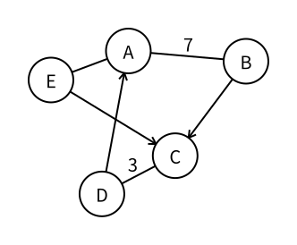

# 点与边

> 最近修订：2026-08-16 12:41 +10:00（未审阅）

道路连接城市，航班从一座城市飞向另一座城市，人与人之间存在好友关系。它们的对象和含义各不相同，但都可以抽象成同一种结构：保留有哪些对象，以及哪些对象之间存在关系。

这种结构称为图（graph）。

## 点

图中的对象称为顶点（vertex），可以简称为点。

例如，用图表示城市之间的道路时，每座城市就是一个点。点通常使用整数 `1, 2, ..., n` 编号，但编号只是为了在程序中区分它们，不是图的一部分。

首次给出定义后，本书在图论正文中统一使用竞赛里更常见的“点”。“节点（node）”留给链表节点、二叉树节点等数据结构语境。

所有点组成的集合称为点集，通常记作 $V$。点的数量写作 $|V|$，竞赛代码中通常使用变量 `n` 保存。

## 边

两个点之间的关系称为边（edge）。一条边连接的点称为这条边的端点（endpoint）。

所有边组成的集合称为边集，通常记作 $E$。边的数量写作 $|E|$，竞赛代码中通常使用变量 `m` 保存。因此，一张图常写成：

$$
G=(V,E)
$$

图形中点摆放在哪里、边画成直线还是曲线都不影响这张图。真正重要的只有点和边之间的关系。

## 无向边

如果关系没有方向，它就是无向边（undirected edge）。例如“双向道路”和“互为好友”都可以用无向边表示。

连接点 $u$ 和 $v$ 的无向边可以记作 $\{u,v\}$。从 $u$ 到 $v$ 和从 $v$ 到 $u$ 表示同一条边。

每条边都是无向边的图称为无向图（undirected graph）。

## 有向边

如果一条边的两个端点有顺序，它就是有向边（directed edge），通常用箭头表示。箭头出发的一端称为起点，箭头指向的一端称为终点。例如“关注”和“单向航班”都有明确方向。

从起点 $u$ 指向终点 $v$ 的有向边记作 $u\to v$。此时 $u\to v$ 和 $v\to u$ 的起点与终点正好相反，因此是两条不同的边。

每条边都是有向边的图称为有向图（directed graph）。同一张图中也可以同时出现有向边和无向边，这样的图称为混合图（mixed graph）。

上图没有箭头的线是无向边，带箭头的线是有向边，所以它是一张混合图。圆内的数字是点权，点旁的数字是点编号，边旁的数字是边权；没有数字的边没有给出边权。

## 点权与边权

点本身也可以附带数值。例如城市有常住人口，地点有收益，棋盘格有进入代价。附在点上的数值称为顶点权（vertex weight），通常简称点权。

点权的意义由具体问题决定。在解释存储方式时，本书使用 `vertex_weight[u]` 表示点 $u$ 的点权；进入具体算法后，可以根据题意改用更简短的名称。

有些关系还带有一个数值。例如道路有长度，航班有价格，网络连接有容量。附在边上的数值称为边权（edge weight），带边权的图称为带权图（weighted graph）。

边权的意义由具体问题决定。边上的 `7` 既可能表示长度为 $7$，也可能表示费用为 $7$，不能离开题意自行解释。

一张图可以只有点权、只有边权、两者都有，也可以都没有。没有给出边权时，通常只关心两个点是否相连。需要把所有边视为相同长度时，也可以把每条边的边权理解为 $1$。

## 特殊情况

没有连接任何边的点称为孤立点。它仍然属于点集，不能因为图上没有线连向它就将它忽略。

两个点之间可能存在多条不同的边，这些边称为重边（parallel edges）。例如两座城市之间的两班不同航班可以具有相同端点，但仍然是两条边。

一条边的两个端点也可能是同一个点，这种特殊的边称为自环（self-loop，也常简称 loop）。从环的角度看，自环同时也是只含一个点和一条边的特殊环；[路径与环](paths-and-cycles.md)会继续解释这里的“环”。

## 基础练习

1. 分别用图描述“好友关系”“关注关系”和“城市间单向航班”，判断每种关系应使用无向边还是有向边。
2. 画一张含四个点、三条普通边、一个孤立点和一个自环的图，写出点集与边集。
3. 为一张道路图分别设计点权和边权的含义，并说明同一个数字为什么不能脱离题意解释。
4. 给出两条端点相同但含义不同的边，说明它们为什么是重边而不是一条边。

## 需要记住什么

- 一张图由哪两个集合组成？“顶点”通常简称为什么？
- `vertex`、`edge` 和 `endpoint` 分别是什么意思？
- 无向边和有向边的根本区别是什么？
- 有向边的起点和终点分别位于箭头的哪一端？
- 图形中点的位置改变后，图本身改变了吗？
- 点权和边权分别附在哪种对象上？它们的含义由什么决定？

[路径与环](paths-and-cycles.md) 会研究怎样沿着首尾相接的边在图中移动。
