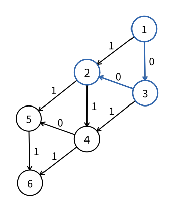

# 最短路：0-1 BFS

> 最近修订：2026-08-17 10:53 +10:00（未审阅）

普通 BFS 能在无权图中求最少边数，因为每经过一条边，路径长度都恰好增加 `1`。现在考虑一张带权图，每条边的权值只能是 `0` 或 `1`：权值 `0` 可以表示免费操作，权值 `1` 可以表示需要付出一次代价的操作。

目标不再是经过尽量少的边，而是让路径上的边权和最小。例如：

```text
1 -> 2       一条边，费用 1
1 -> 3 -> 2  两条边，费用 0 + 0 = 0
```

普通 BFS 会先通过一条边发现点 `2`，却错过边数更多、总费用更低的第二条路径。对 `0`、`1` 边权直接使用普通队列和“第一次发现以后永不修改”已经不再正确。

0-1 BFS 专门处理边权只含 `0` 和 `1` 的最短路。它通过 [`deque`](../cpp/deque.md) 同时操作队列两端，让当前距离较小的状态始终先处理，时间复杂度仍然是 $O(n+m)$。

## 最短距离

令：

```cpp
dist[u]
```

表示从起点 `s` 到点 `u` 的最小边权和。尚未找到路径时使用一个足够大的 `INF`：

```cpp
const int INF = 1e9;
vector<int> dist(n + 5, INF);
dist[s] = 0;
```

所有边权都非负，因此一条最短路不需要重复经过环；删除环不会增加总费用。简单路径最多经过 $n-1$ 条边，每条边权至多为 `1`，所以可达点的最短距离至多为 $n-1$。竞赛常见点数下，`int` 和 `INF = 1e9` 已经足够。

不可达点最后仍等于 `INF`，输出时可以转换成 `-1`。

## 松弛

假设已经有一条费用为 `dist[u]` 的路径到达点 `u`，再经过边：

$$
u\xrightarrow{w}v
$$

就得到一条到点 `v`、费用为：

```cpp
int candidate = dist[u] + w;
```

的新路径。只有它比当前记录更小时，才更新：

```cpp
if (candidate < dist[v]) {
    dist[v] = candidate;
}
```

这种“尝试用一条边改善终点答案”的操作称为松弛（relaxation）。与普通 BFS 的首次发现不同，一个点已经具有有限距离后仍可能被更优路径再次松弛。

例如点 `2` 先通过边 `1 -> 2` 得到距离 `1`，随后又通过 `1 -> 3 -> 2` 改进成 `0`。因此不能把 `dist[v] != INF` 直接当作“以后永远跳过”。

## 两种新距离

假设当前正在处理距离为 $d$ 的点 `u`。边权只有两种，因此松弛得到的候选距离也只有两种：

- 经过权值 `0` 的边，新距离仍为 $d$；
- 经过权值 `1` 的边，新距离为 $d+1$。

为了保证更小距离先处理：

- 新距离仍为 $d$ 时，把状态加入 `deque` 前端；
- 新距离变成 $d+1$ 时，把状态加入 `deque` 后端。

代码正好对应边权：

```cpp
if (w == 0) {
    q.push_front({candidate, v});
} else {
    q.push_back({candidate, v});
}
```

这可以理解成只有两个相邻优先级的优先队列。当前最小距离是 $d$ 时，尚待处理的有效状态只会位于距离 $d$ 和 $d+1$ 两层；权值 `0` 的新状态属于当前层，要插到前面，权值 `1` 的新状态属于下一层，放到后面等待。

若所有边权都是 `1`，程序只会从后端加入，行为就退化成普通 BFS。权值 `0` 的边正是需要开放前端的原因。

## 队列状态

一个点的距离可能在出队以前被改善。为了区分新旧队列项，每项同时保存“入队时的距离”和点编号：

```cpp
deque<pair<int, int>> q;
q.push_front({0, s});
```

取出时命名两个部分：

```cpp
auto [current_dist, u] = q.front();
q.pop_front();
```

若点 `u` 后来已经得到更小距离，旧项中的 `current_dist` 就不再等于 `dist[u]`：

```cpp
if (current_dist != dist[u]) {
    continue;
}
```

这个旧项称为过期状态。它只需要弹出并丢弃，不能再次展开 `g[u]`。有效状态则使用自己的 `current_dist` 计算候选值：

```cpp
int candidate = current_dist + w;
```

保存距离快照让“哪个队列项已经过期”成为代码中的显式判断，不需要依赖看不见的队列位置变化。

## 示例图

下面的有向图从点 `1` 出发。蓝色路径 `1 -> 3 -> 2` 经过两条权值为 `0` 的边，总费用为 `0`，优于直接边 `1 -> 2` 的费用 `1`。



各点最短距离为：

| 点 | 1 | 2 | 3 | 4 | 5 | 6 |
| ---: | ---: | ---: | ---: | ---: | ---: | ---: |
| `dist` | 0 | 0 | 0 | 1 | 1 | 2 |

用 `(距离, 点)` 表示队列项，完整变化如下：

| 步骤 | 弹出的状态 | 成功松弛 | 处理后的 `deque` |
| ---: | --- | --- | --- |
| 初始 | 无 | `dist[1] = 0` | `[(0,1)]` |
| 1 | `(0,1)` | `dist[2] = 1`，`dist[3] = 0` | `[(0,3),(1,2)]` |
| 2 | `(0,3)` | `dist[2] = 0`，`dist[4] = 1` | `[(0,2),(1,2),(1,4)]` |
| 3 | `(0,2)` | `dist[5] = 1` | `[(1,2),(1,4),(1,5)]` |
| 4 | `(1,2)` | 过期，跳过 | `[(1,4),(1,5)]` |
| 5 | `(1,4)` | `dist[6] = 2` | `[(1,5),(2,6)]` |
| 6 | `(1,5)` | 无 | `[(2,6)]` |
| 7 | `(2,6)` | 无 | `[]` |

第一步先按输入顺序处理边 `1 -> 2`，把 `(1,2)` 放到后端；接着权值为 `0` 的边 `1 -> 3` 产生 `(0,3)`，它从前端加入并优先处理。

点 `3` 又把点 `2` 的距离从 `1` 改进到 `0`，新项 `(0,2)` 加入前端。旧项 `(1,2)` 仍留在 `deque` 中，但弹出时发现 `1 != dist[2]`，因此不会重复扫描点 `2` 的出边。

## 完整循环

把松弛、两端入队和过期判断组合起来：

```cpp
while (!q.empty()) {
    auto [current_dist, u] = q.front();
    q.pop_front();

    if (current_dist != dist[u]) {
        continue;
    }

    for (auto& [v, w] : g[u]) {
        int candidate = current_dist + w;
        if (candidate >= dist[v]) {
            continue;
        }

        dist[v] = candidate;
        if (w == 0) {
            q.push_front({candidate, v});
        } else {
            q.push_back({candidate, v});
        }
    }
}
```

只有严格改善时才加入新状态。相等距离不需要重复入队；权值为 `0` 的环也不会让程序无限循环。

## 正确性

忽略过期项以后，`deque` 中的有效状态按距离从小到大排列，并且只会出现当前最小距离 $d$ 与下一层 $d+1$。

初始只有距离为 `0` 的起点，性质成立。弹出距离为 $d$ 的有效状态时：

- 权值 `0` 的成功松弛产生距离 $d$，放到前端，不会排到任何更大距离以后；
- 权值 `1` 的成功松弛产生距离 $d+1$，放到后端，不会越过仍待处理的距离 $d$ 状态。

因此性质始终保持。一个有效状态从前端弹出时，不可能还有一条未处理路径产生更小距离：任何更短路径的倒数第二个点都具有不大于该距离的最短距离，本应更早弹出并完成松弛。于是本次展开的 `dist[u]` 已经是最终最短距离。

每次展开都检查 `u` 的全部出边，并在能改善时更新终点。所有可达点最终都会沿某条最短路从起点依次得到松弛，所以算法不会遗漏最短距离；不可达点则始终保持 `INF`。

## 复杂度

有效队列中的距离只有相邻两层。一个点第一次得到的候选距离只可能是当前层 $d$ 或下一层 $d+1$；若它在出队前再次改善，只可能从 $d+1$ 降到 $d$。因此每个点至多产生两个队列项，其中旧项会作为过期状态直接跳过。

每个点的邻接表只在最终有效状态下展开一次，每条边只进行一次有效松弛检查。队列操作都是 $O(1)$，所以总时间复杂度为：

$$
O(n+m).
$$

邻接表占用 $O(n+m)$ 空间，距离数组和 `deque` 占用 $O(n)$ 空间，总空间复杂度为 $O(n+m)$。

这项线性保证依赖边权只能是 `0` 或 `1`。若存在权值 `2`，简单地放到后端不能继续保证队列只有相邻两层。

## 完整代码

程序读取一张边权为 `0` 或 `1` 的有向图和起点，输出起点到每个点的最小边权和；不可达点输出 `-1`。

带权邻接项继续使用本书约定的 `(v, w)`，即终点在前、边权在后。有向边 `u -> v` 只加入 `g[u]` 一次。

```cpp
#include <bits/stdc++.h>
using namespace std;

const int INF = 1e9;

int n;
int m;
vector<vector<pair<int, int>>> g;
vector<int> dist;

void zero_one_bfs(int s) {
    dist.assign(n + 5, INF);
    deque<pair<int, int>> q;

    dist[s] = 0;
    q.push_front({0, s});

    while (!q.empty()) {
        auto [current_dist, u] = q.front();
        q.pop_front();

        if (current_dist != dist[u]) {
            continue;
        }

        for (auto& [v, w] : g[u]) {
            int candidate = current_dist + w;
            if (candidate >= dist[v]) {
                continue;
            }

            dist[v] = candidate;
            if (w == 0) {
                q.push_front({candidate, v});
            } else {
                q.push_back({candidate, v});
            }
        }
    }
}

void solve() {
    int s;
    scanf("%d%d%d", &n, &m, &s);

    g.assign(n + 5, {});
    for (int i = 1; i <= m; i++) {
        int u, v, w;
        scanf("%d%d%d", &u, &v, &w);
        g[u].push_back({v, w});
    }

    zero_one_bfs(s);
    for (int u = 1; u <= n; u++) {
        int answer = dist[u] == INF ? -1 : dist[u];
        printf("%d%c", answer, " \n"[u == n]);
    }
}

int main() {
    solve();
    return 0;
}
```

输入：

```text
6 9 1
1 2 1
1 3 0
3 2 0
3 4 1
2 4 1
2 5 1
4 5 0
4 6 1
5 6 1
```

输出：

```text
0 0 0 1 1 2
```

若图中还存在一个从起点不可达的点 `7`，它会输出 `-1`。

## 无向图与多源起点

无向边 $(u,v)$ 要向邻接表加入 `(v,w)` 和 `(u,w)` 两个方向，0-1 BFS 的其余部分不变。

若有多个给定起点，可以复用 [图的遍历：多源 BFS](multi-source-bfs.md) 的初始化方式：把所有不同起点的距离设为 `0`，并把 `{0, source}` 加入 `deque` 前端。后续松弛仍按边权选择前端或后端，就能求每个点到起点集合的最小费用。

## 路径恢复

需要恢复一条最短路径时，在成功松弛点 `v` 的同一位置记录：

```cpp
par[v] = u;
```

距离后来再次改善时，`par[v]` 也会被新的前驱覆盖。算法结束后，从终点沿 `par`
回到起点并反转，就得到一条最小费用路径。

若存在多条费用相同的路径，严格松弛不会为相等费用替换父亲，最终保留哪一条取决于边和队列的处理顺序。

## 适用边界

| 边权 | 合适的基础算法 | 状态容器 |
| --- | --- | --- |
| 所有边等价 | 普通 BFS | `queue` |
| 只有 `0`、`1` | 0-1 BFS | `deque` |
| 任意非负边权 | Dijkstra | 小根 `priority_queue` |

0-1 BFS 不是所有带权图的通用 BFS。边权包含负数时，最短距离可能通过继续绕行而下降；边权大于 `1` 时，双端队列不再完整表达所有优先级。这些情况要选择符合边权条件的其他最短路算法。

## 常见错误

### 继续使用第一次发现规则

点第一次得到有限距离以后仍可能被更小费用改进。判断条件必须是 `candidate < dist[v]`，不能写成只允许 `dist[v] == INF` 时更新。

### 两种边权都 push_back

这样会退化成按经过边数扩展的普通队列，权值 `0` 的更优状态可能排在权值 `1` 的状态以后。权值 `0` 使用 `push_front`，权值 `1` 使用 `push_back`。

### 把两个端点都加入有向图

边 `u -> v` 只加入 `g[u]`。只有题目给出无向边时才补上反向邻接项。

### 处理过期状态

点的距离被改善后，旧项仍可能留在 `deque` 中。必须比较队列项距离与 `dist[u]`，不相等时直接跳过，避免重复展开邻接表。

### 相等距离也重复入队

只有严格改善才需要新状态。使用 `candidate <= dist[v]` 会让相等路径反复入队，权值 `0` 的环尤其容易产生无限重复。

### 对其他边权强行分类

不能把权值 `2` 也简单视为“非零所以放到后端”，更不能处理负权。算法的正确性和线性复杂度都以 `w` 只可能是 `0` 或 `1` 为前提。

### 把队列项解释成路径

`deque` 只保存待处理状态，不直接保存完整路径。需要输出路径时另设 `par`，并在成功
松弛时同步修改。

## 基础练习

1. 手算示例中点 `2` 从距离 `1` 改进到 `0` 的过程，并指出旧队列项何时被跳过。
2. 把示例中的边 `3 -> 2` 权值改成 `1`，重新计算全部最短距离和队列顺序。
3. 给定一种免费移动和一种收费移动，建立 `0`、`1` 边并求最少收费次数。
4. 增加 `par` 数组，恢复从起点到指定终点的一条最小费用路径。
5. 把模板改成无向图，并加入自环、重边和不可达点测试。
6. 随机生成小规模 `0`、`1` 带权图，用 Bellman–Ford 反复松弛全部边，与 0-1 BFS 对拍。

## 需要记住什么

1. 普通 BFS 为什么不能直接求 `0`、`1` 边权的最小费用？
2. `dist[u]` 保存什么？松弛一条边时怎样计算 `candidate`？
3. 为什么点第一次得到有限距离以后仍可能被改善？
4. 经过权值 `0` 和权值 `1` 的边分别产生什么新距离？
5. 为什么权值 `0` 的新状态加入前端，权值 `1` 的加入后端？
6. 队列项为什么同时保存入队时距离和点编号？怎样识别过期状态？
7. 为什么只有严格改善时才重新入队？
8. `deque` 中有效状态的距离具有什么顺序性质？
9. 0-1 BFS 为什么能达到 $O(n+m)$？
10. 普通 BFS、0-1 BFS 和 Dijkstra 分别适用于什么边权？
