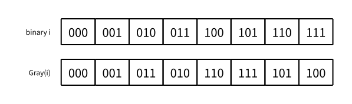

# 格雷码

> 最近修订：2026-08-14 02:33 +10:00（未审阅）

普通二进制整数相邻的两个值可能同时改变很多位。例如从 `3` 增加到 `4`：

```text
011 -> 100
```

三个位都发生了变化。若这些位来自机械位置传感器或其他不能严格同时切换的信号，过渡瞬间可能暂时读到与真实位置相差很远的组合。

格雷码（Gray code）重新排列固定宽度的二进制编码，使序列中相邻两项恰好只有一个二进制位不同。它不是压缩编码；所有码字仍然等长。它解决的是相邻状态切换时改变位数过多的问题。

## 相邻一位不同

两个等长二进制串中不同位置的数量称为汉明距离（Hamming distance）。格雷码序列要求相邻码字的汉明距离为 `1`。

一种三位格雷码为：

```text
000
001
011
010
110
111
101
100
```

从上到下逐对比较，每次只改变一个位置。最后一项 `100` 与第一项 `000` 也只相差一个位置，因此这套标准序列还能首尾相接形成循环。

格雷码并不唯一。本篇使用最常见的二进制反射格雷码（binary-reflected Gray code）。

## 从一位开始反射

一位时只有两个码字：

```text
0
1
```

假设已经有 `n - 1` 位格雷码，可以这样构造 `n` 位版本：

1. 按原顺序复制一份，在每项前面加 `0`；
2. 按逆序复制一份，在每项前面加 `1`；
3. 把两部分连接起来。

从两位序列构造三位序列：

```text
两位原序列       前缀 0       反向后前缀 1
00               000          110
01               001          111
11               011          101
10               010          100
```

连接中间两列就得到：

```text
000 001 011 010 | 110 111 101 100
```

“反射”正是把原序列倒过来再接到后面。

## 为什么反射构造成立

前半段都以 `0` 开头，后半段都以 `1` 开头，所以两部分不会重复；各部分内部的剩余位又完整包含原来的全部码字，因此总共得到全部 $2^n$ 个不同的 `n` 位串。

前半段内部保持原顺序，后半段内部只是把原顺序反过来，相邻项仍然只差一位。

前半段最后一项与后半段第一项使用同一个原码字，只是新增前缀分别为 `0`、`1`，所以连接处只差新增的一位。首项和末项也来自原序列的同一个首项，同样只差前缀。

因此若 `n - 1` 位序列具有相邻一位变化和首尾相邻性质，反射后得到的 `n` 位序列仍然具有这两项性质。

## 不必真的递归构造

反射过程适合理解，但若只想求整数 `value` 对应的格雷码，可以直接计算：

```cpp
unsigned long long gray_code(unsigned long long value) {
    return value ^ (value >> 1);
}
```

其中 `^` 是按位异或，`value >> 1` 把每一位左侧相邻的高位移动到当前位置。

若二进制整数从高到低的位为：

```text
b[k] b[k-1] ... b[1] b[0]
```

对应格雷码满足：

```text
最高位 g[k] = b[k]
其余位 g[i] = b[i + 1] ^ b[i]
```

这恰好就是 `value ^ (value >> 1)` 的逐位结果。

## 公式为什么保证相邻一位变化

二进制整数增加 `1` 时，最低的一段连续 `1` 会变成 `0`，它前面的第一个 `0` 会变成 `1`。例如：

```text
... 0 111 -> ... 1 000
```

设这一段连续 `1` 有 `k` 位：

- 更低的相邻位原来都是 `1 ^ 1`，后来都是 `0 ^ 0`，格雷位不变；
- 变化边界处原来是 `0 ^ 1`，后来是 `1 ^ 0`，结果仍然是 `1`；
- 边界再高一位与刚从 `0` 变成 `1` 的二进制位异或，因此只有这一格雷位改变。

所以 `gray_code(value)` 与 `gray_code(value + 1)` 恰好只差一位。最高值到 `0` 的首尾关系也由反射构造保证。

这里的 `value` 是被编码的非负整数，不是数组下标。它的取值自然从 `0` 到 $2^n-1$；这不改变本书在自定义数组和图节点中优先使用 1-based 编号的约定。

## 三位对应表

下图上行按普通二进制整数递增，下行是在同一 `value` 上计算出的格雷码：



| `value` | 二进制 | 格雷码 |
| ---: | --- | --- |
| 0 | `000` | `000` |
| 1 | `001` | `001` |
| 2 | `010` | `011` |
| 3 | `011` | `010` |
| 4 | `100` | `110` |
| 5 | `101` | `111` |
| 6 | `110` | `101` |
| 7 | `111` | `100` |

注意格雷码本身不是按普通二进制数值递增。它只保证序列位置相邻时码字改变一位。

## 从格雷码还原二进制

已知最高位 `g[k] = b[k]`。再由：

```text
g[i] = b[i + 1] ^ b[i]
```

得到：

```text
b[i] = b[i + 1] ^ g[i]
```

所以可以从最高位开始，逐位用前一个二进制位恢复下一个。把这个过程写成整型位运算，就是不断把格雷码右移并异或到答案：

```cpp
unsigned long long gray_to_binary(unsigned long long gray) {
    unsigned long long value = 0;
    while (gray > 0) {
        value ^= gray;
        gray >>= 1;
    }
    return value;
}
```

例如 `gray = 110`：

```text
value = 000 ^ 110 = 110
value = 110 ^ 011 = 101
value = 101 ^ 001 = 100
```

还原得到普通二进制 `100`，也就是整数 `4`。

不要直接把格雷码比特串当作普通二进制数进行加减。若需要原始数值，先还原成普通二进制整数。

## 输出固定宽度

整数本身不会保存“前导零”。为了把三位格雷码 `1` 输出成 `001`，需要显式按宽度生成字符串：

```cpp
string binary_string(unsigned long long value, int width) {
    string bits(width, '0');
    for (int i = width - 1; i >= 0; i--) {
        bits[i] = char('0' + (value & 1));
        value >>= 1;
    }
    return bits;
}
```

字符串是 STL 原生顺序容器，所以位置使用 `0..width - 1`。循环从最后一个字符开始填最低位，逐步向左填入更高位。

## 生成完整序列

依次枚举普通整数 `0..2^n-1`，对每个值套用公式，就会按反射格雷码顺序得到全部码字：

```cpp
unsigned long long total = 1ULL << n;
for (unsigned long long value = 0; value < total; value++) {
    string code = binary_string(gray_code(value), n);
    printf("%s\n", code.c_str());
}
```

使用 `1ULL << n`，是为了先在无符号 64 位整数中进行左移。本模板要求 `1 <= n < 64`；而输出本身有 $2^n$ 行，实际可运行的 `n` 会远小于上限。

## 完整程序

下面读入位数 `n`，输出全部 `n` 位二进制反射格雷码：

```cpp
#include <bits/stdc++.h>

using namespace std;

unsigned long long gray_code(unsigned long long value) {
    return value ^ (value >> 1);
}

unsigned long long gray_to_binary(unsigned long long gray) {
    unsigned long long value = 0;
    while (gray > 0) {
        value ^= gray;
        gray >>= 1;
    }
    return value;
}

string binary_string(unsigned long long value, int width) {
    string bits(width, '0');
    for (int i = width - 1; i >= 0; i--) {
        bits[i] = char('0' + (value & 1));
        value >>= 1;
    }
    return bits;
}

int main() {
    int n;
    scanf("%d", &n);

    unsigned long long total = 1ULL << n;
    for (unsigned long long value = 0; value < total; value++) {
        string code = binary_string(gray_code(value), n);
        printf("%s\n", code.c_str());
    }
    return 0;
}
```

`gray_to_binary` 没有在主程序中调用，但与正向公式一起构成可复制的双向转换模板。

## 示例

输入：

```text
3
```

输出：

```text
000
001
011
010
110
111
101
100
```

## 正确性

反射构造从一位合法序列开始。每次扩展时，两半内部继承相邻一位变化；连接处和首尾只改变新增前缀位；两种前缀又保证全部码字互不重复。因此它生成全部 $2^n$ 个 `n` 位串，并且相邻项及首尾项都恰好相差一位。

公式 `value ^ (value >> 1)` 逐位计算相邻二进制位的异或，产生的顺序与反射构造相同。`gray_to_binary` 从最高位开始累积这些异或关系，因此恢复原整数。

## 复杂度

单个整数的正向转换只包含一次右移和一次异或，时间、额外空间都是 $O(1)$。逆转换最多进行 `64` 次右移，针对固定 64 位整数同样是 $O(1)$。

输出完整 `n` 位序列共有 $2^n$ 个码字，每个码字需要写出 `n` 个字符，因此时间复杂度为 $O(n2^n)$。程序逐项生成并输出，不保存整个序列；除单个长度为 `n` 的字符串外，额外空间为 $O(n)$。

## 常见错误

### 直接按普通二进制递增输出

普通二进制在进位时可能改变多位。格雷码需要对每个 `value` 计算 `value ^ (value >> 1)`。

### 反射时没有倒序

第二份序列必须逆序后再加前缀 `1`。若仍按原顺序，两个半段的连接处可能改变多位。

### 丢失前导零

把整数直接输出不会显示固定宽度。必须使用 `bitset` 或自行构造长度为 `n` 的字符串。

### 把格雷码当成普通二进制值

格雷码序列不按其比特串的数值递增。做算术前先调用逆转换。

### 使用有符号左移接近最高位

写成 `1 << n` 时，左操作数通常是 32 位 `int`。使用 `1ULL << n`，并保证 `n < 64`。

### 忘记首尾关系

二进制反射格雷码不仅相邻项差一位，最后一项和第一项也差一位。涉及循环状态时应检查这对边界。

## 基础练习

1. 从两位格雷码手工反射构造三位和四位序列。
2. 对三位序列逐对异或，验证每个结果都只有一个 `1`。
3. 手算整数 `0..7` 的 `value ^ (value >> 1)`，与表格比较。
4. 分别把格雷码 `010`、`101`、`111` 还原成普通二进制整数。
5. 给定 `n` 和序列位置 `value`，只输出对应格雷码，不生成前面的项目。
6. 穷举较小 `n`，检查码字不重复、相邻和首尾汉明距离为 `1`、逆转换恢复原值。

## 需要记住什么

1. 普通二进制相邻整数为什么可能同时改变很多位？
2. 格雷码对相邻码字的汉明距离有什么要求？
3. 二进制反射格雷码怎样从 `n - 1` 位构造 `n` 位？
4. 为什么第二份序列必须倒序？
5. 为什么构造后的连接处和首尾都只差一位？
6. `value ^ (value >> 1)` 中右移和异或分别产生什么逐位关系？
7. 怎样从最高位开始把格雷码还原成普通二进制？
8. 为什么格雷码不能直接当作普通二进制整数做算术？
9. 怎样保留输出中的前导零？
10. 生成完整序列为什么必然需要指数级输出时间？

## 下一步

至此，[学习路线](../learning-path.md) 阶段 1–4 中列出的核心文章都已经具有正文。接下来可以按路线逐篇审阅、修订，也可以继续进入阶段 5 的高中基础内容。
