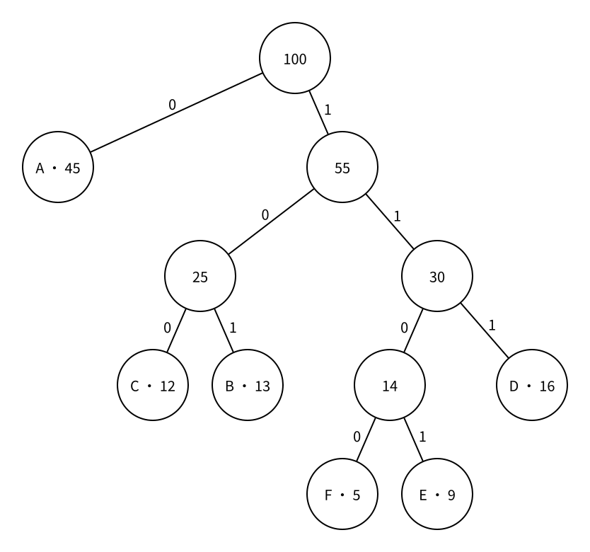

# 哈夫曼编码

> 最近修订：2026-08-14 02:27 +10:00（未审阅）

假设一段数据只包含若干种符号，但它们出现频率差异很大。若每个符号都使用相同数量的二进制位，出现一次和出现一万次的符号仍然占用同样长度。我们希望让高频符号使用较短编码、低频符号使用较长编码，从而缩短整段数据。

随意使用不同长度会导致无法分割。哈夫曼编码（Huffman coding）先把可唯一解码的编码表示成二叉树，再反复合并频率最小的两棵树，得到带权路径长度最小的前缀编码。

本篇需要已经了解 [容器适配器：priority_queue](../cpp/priority-queue.md) 和 [二叉树的结构与存储](../data-structures/binary-tree-structure-and-storage.md)。

## 等长编码

若共有 `k` 种符号，等长二进制编码至少需要：

$$
L=\lceil \log_2 k\rceil
$$

位表示一个符号。例如六种符号至少需要 `3` 位：

```text
A 000
B 001
C 010
D 011
E 100
F 101
```

每段 `3` 位都能独立解释，边界非常明确。若六种符号总共出现 `100` 次，无论频率怎样分布，都需要 `300` 位。

ASCII 的传统编码对每个字符使用固定的 `7` 位；固定宽度的格雷码也为同一位数范围内的每个值提供等长表示。等长编码不一定为了压缩设计，它的优点是定位和解码简单。

## 直接缩短会产生歧义

若为了让 `A` 更短而随意规定：

```text
A 0
B 01
C 10
```

读到比特串 `010` 时，可以解释成：

```text
A C   -> 0 | 10
B A   -> 01 | 0
```

两种原文得到相同比特串，解码者无法判断边界。

## 前缀编码

如果任何一个完整码字都不是另一个码字的前缀，这套编码称为前缀编码（prefix code）。

例如：

```text
A 0
B 10
C 110
D 111
```

读到 `0` 时可以立即确定 `A` 已经结束，因为没有其他码字以 `0` 开头；读到 `1` 时继续读取，直到形成某个完整码字。解码不需要额外分隔符。

“前缀编码”不是把运算符写在前面的前缀表达式；这里的前缀指一个比特串的开头部分。

## 前缀编码树

把二叉树的左边标记为 `0`，右边标记为 `1`，每种符号只放在叶节点。从根到叶经过的边标签依次组成该符号的编码。



图中 `A` 的路径只有一条左边，因此编码为 `0`；`F` 的路径是右、右、左、左，因此编码为 `1100`。

任何叶节点都不可能是另一个叶节点的祖先，所以一个叶的编码不会成为另一个叶编码的前缀。反过来，一套二进制前缀编码也可以按比特逐层插入，形成这样一棵二叉树。

解码时从根开始读取比特：`0` 走左边，`1` 走右边；到达叶节点就输出符号并返回根，继续处理剩余比特。

## 带权路径长度

令符号 `i` 的出现频率为 $f_i$，它在编码树中的叶节点深度为 $d_i$，也就是编码长度。整段数据需要的比特数是：

$$
W=\sum_i f_i d_i
$$

这个和称为编码树的带权路径长度（weighted path length，WPL）。我们的目标不是让树高最小，也不是让每个码字都短，而是在所有前缀编码树中令 `W` 最小。

高频符号的 $f_i$ 较大，把它放浅一层会节省更多比特；低频符号可以承担较深的位置。

## 从最小频率开始合并

考虑一棵最优的二进制前缀编码树。没有必要保留只有一个子节点的内部节点，因为删掉它能让其下全部叶节点变浅一层。因此可以只考虑每个内部节点都有两个子节点的满二叉结构。

在最深层一定能找到一对互为兄弟的叶节点。若这两个位置没有放置频率最小的两个符号，可以把更小频率的符号与它们交换；小权值移到更深处、大权值移到更浅处不会增大 `W`。所以至少存在一棵最优树，让当前最小的两个权值 `x`、`y` 成为最深处的兄弟。

把这两个叶节点暂时合成一个权值为 `x + y` 的新符号。它们在最终树中会比新父节点各深一层，因此这次展开固定增加：

$$
x+y
$$

合并以后，剩下的问题仍然是“为一组权值构造最小带权路径长度的前缀树”，只是 `x`、`y` 被 `x + y` 取代。于是可以不断重复：

1. 取出当前最小的两个权值；
2. 建立一个父节点，权值为二者之和；
3. 把新父节点放回候选集合；
4. 直到只剩一棵树。

这就是哈夫曼算法。

## 为什么使用小根堆

每一步都要取出当前最小的两个权值，并插入一个新权值。若每次线性扫描，最多进行 `n - 1` 次合并，总时间会达到 $O(n^2)$。

小根堆恰好支持反复取最小值和插入。C++ 的 `priority_queue` 默认是大根堆，因此写成：

```cpp
priority_queue<pair<ll, int>, vector<pair<ll, int>>, greater<pair<ll, int>>> q;
```

队列项是 `(weight, node_id)`：先按权值选择，权值相同时按节点编号选择。第二项不仅找到对应树节点，也让本模板在同权值时得到确定结果。

## 建立叶节点

输入中的第 `1..n` 个符号直接对应节点 `1..n`。每个节点保存权值和左右孩子：

```cpp
struct HuffmanNode {
    ll weight;
    int left;
    int right;
};
```

叶节点没有孩子，左右编号都为 `0`：

```cpp
for (int i = 1; i <= n; i++) {
    nodes[i] = {frequency[i], 0, 0};
    q.push({frequency[i], i});
}
```

频率及其累加值可能超过 32 位整数范围，因此使用 `ll`。本篇假设每个输入频率都是正数；从未出现的符号不需要加入编码表。

## 反复合并

每次取出最小的两棵树 `x`、`y`：

```cpp
auto [weight_x, x] = q.top();
q.pop();
auto [weight_y, y] = q.top();
q.pop();
```

新建父节点，把先取出的 `x` 放左边、`y` 放右边：

```cpp
node_count++;
ll weight_sum = weight_x + weight_y;
nodes[node_count] = {weight_sum, x, y};
q.push({weight_sum, node_count});
```

交换左右孩子只会把所有 `0`、`1` 对调到另一套合法编码，不会改变码长与 `W`。

每次合并的 `weight_sum` 正是这两个子树中的所有叶节点又增加一层所产生的额外代价。因此不必等编码全部生成，再逐项计算长度；把所有合并权值相加就得到最终带权路径长度：

```cpp
encoded_bits += weight_sum;
```

## 生成每个码字

合并结束时，小根堆中唯一节点就是根。从根进行 DFS，向左加入字符 `'0'`，返回时撤销，再向右加入 `'1'`：

```cpp
void build_codes(int u, int symbol_count, const vector<HuffmanNode>& nodes,
                 string& code, vector<string>& codes) {
    if (u <= symbol_count) {
        codes[u] = code;
        return;
    }

    code.push_back('0');
    build_codes(nodes[u].left, symbol_count, nodes, code, codes);
    code.pop_back();

    code.push_back('1');
    build_codes(nodes[u].right, symbol_count, nodes, code, codes);
    code.pop_back();
}
```

`code` 描述当前根到 `u` 的路径。递归返回后必须 `pop_back()`，否则右子树会保留左子树路径中的多余字符。这与搜索中的“选择—递归—撤销”完全相同。

## 同权值与多种树形

若候选中有多个相同权值，选择其中哪两个先合并可能得到不同树形；同一个父节点的左右孩子也可以交换。因此一组频率可能对应多套不同的哈夫曼编码。

这些编码的具体比特串不同，但只要每一步都取当前最小的两个权值，最终带权路径长度相同且最优。实际传输时，编码方与解码方必须共享同一棵树或同一张码表，不能各自任意打破平局。

本模板用 `(weight, node_id)` 固定平局顺序，所以相同输入顺序会生成相同码表。它不是哈夫曼编码唯一性的数学要求，只是工程上的确定性规则。

## 示例合并过程

使用图中的频率：

```text
A 45   B 13   C 12   D 16   E 9   F 5
```

合并过程为：

```text
5 + 9   = 14
12 + 13 = 25
14 + 16 = 30
25 + 30 = 55
45 + 55 = 100
```

所有合并权值之和为：

```text
14 + 25 + 30 + 55 + 100 = 224
```

最终码表为：

| 符号 | 频率 | 编码 | 长度 | 贡献 |
| --- | ---: | --- | ---: | ---: |
| A | 45 | `0` | 1 | 45 |
| B | 13 | `101` | 3 | 39 |
| C | 12 | `100` | 3 | 36 |
| D | 16 | `111` | 3 | 48 |
| E | 9 | `1101` | 4 | 36 |
| F | 5 | `1100` | 4 | 20 |

贡献相加同样得到 `224` 位，比 `3` 位等长编码的 `300` 位少 `76` 位。

## 只有一种符号

数学上的前缀树可以只含一个根叶节点，它的深度和带权路径长度都是 `0`，码字是空串。如果消息长度由其他信息给出，确实无需比特区分符号种类。

实际程序通常不希望输出空码字，因此本模板约定唯一符号使用编码 `0`，实际编码长度就是它的频率。这个约定是接口选择，不改变两个及以上符号时的哈夫曼算法。

## 完整程序

下面读入符号名称和正频率，输出编码后的总位数及一套确定的哈夫曼码表：

```cpp
#include <bits/stdc++.h>

using namespace std;

typedef long long ll;

struct HuffmanNode {
    ll weight;
    int left;
    int right;
};

struct HuffmanResult {
    ll encoded_bits;
    vector<string> codes;
};

void build_codes(int u, int symbol_count, const vector<HuffmanNode>& nodes,
                 string& code, vector<string>& codes) {
    if (u <= symbol_count) {
        codes[u] = code;
        return;
    }

    code.push_back('0');
    build_codes(nodes[u].left, symbol_count, nodes, code, codes);
    code.pop_back();

    code.push_back('1');
    build_codes(nodes[u].right, symbol_count, nodes, code, codes);
    code.pop_back();
}

HuffmanResult huffman_coding(int n, const vector<ll>& frequency) {
    vector<HuffmanNode> nodes(2 * n + 5);
    priority_queue<pair<ll, int>, vector<pair<ll, int>>, greater<pair<ll, int>>>
        q;

    for (int i = 1; i <= n; i++) {
        nodes[i] = {frequency[i], 0, 0};
        q.push({frequency[i], i});
    }

    vector<string> codes(n + 5);
    if (n == 1) {
        codes[1] = "0";
        return {frequency[1], codes};
    }

    int node_count = n;
    ll encoded_bits = 0;
    while (q.size() > 1) {
        auto [weight_x, x] = q.top();
        q.pop();
        auto [weight_y, y] = q.top();
        q.pop();

        node_count++;
        ll weight_sum = weight_x + weight_y;
        nodes[node_count] = {weight_sum, x, y};
        encoded_bits += weight_sum;
        q.push({weight_sum, node_count});
    }

    int root = q.top().second;
    string code;
    build_codes(root, n, nodes, code, codes);
    return {encoded_bits, codes};
}

int main() {
    int n;
    scanf("%d", &n);

    vector<string> symbols(n + 5);
    vector<ll> frequency(n + 5);
    for (int i = 1; i <= n; i++) {
        char buffer[105];
        scanf("%100s%lld", buffer, &frequency[i]);
        symbols[i] = buffer;
    }

    HuffmanResult result = huffman_coding(n, frequency);
    printf("%lld\n", result.encoded_bits);
    for (int i = 1; i <= n; i++) {
        printf("%s %s\n", symbols[i].c_str(), result.codes[i].c_str());
    }
    return 0;
}
```

## 示例

输入：

```text
6
A 45
B 13
C 12
D 16
E 9
F 5
```

输出：

```text
224
A 0
B 101
C 100
D 111
E 1101
F 1100
```

## 正确性

在某棵最优前缀编码树中，可以把最小的两个权值交换到最深的一对兄弟叶节点而不增大带权路径长度。合并这两个叶以后，它们共同表现为权值之和的一个叶；若合并后的子问题不是最优，把它替换成更优子树就能改进原树，产生矛盾。

因此第一次合并最小的两个权值属于某个最优解，合并后仍是同类最优子问题。重复这一论证直到只剩根，哈夫曼算法构造的树具有最小带权路径长度。所有符号都位于叶节点，所以根到叶路径形成前缀编码；`build_codes` 按每条路径准确写出对应比特串。

## 复杂度

哈夫曼树共有 `n` 个叶节点和 `n - 1` 个内部节点。进行 `n - 1` 次堆合并，每次包含常数次 $O(\log n)$ 操作，因此构树时间为 $O(n\log n)$，节点和堆空间为 $O(n)$。

生成码表还需要写出每个码字，时间和空间至少与全部码字的总长度相同。一般记作 $O(n+L)$，其中 `L` 是所有码字长度之和；极端不平衡的树中 `L` 可以达到 $O(n^2)$。

若只需要最小带权路径长度，不建立树节点和码字，只在小根堆中保存权值并累加每次合并结果即可，复杂度仍为 $O(n\log n)$，代码会更短。

## 常见错误

### 使用默认大根堆

哈夫曼算法每次取最小的两个权值。默认 `priority_queue` 会先取最大值，必须使用 `greater` 或其他小根堆写法。

### 只把新权值加入答案，不放回堆

合并后的子树还要继续与其他树合并。它既贡献当前一层代价，也必须以 `weight_sum` 重新成为候选。

### 把符号放在内部节点

前缀编码树中的完整符号必须位于叶节点。若内部节点也是符号，它的路径会成为后代符号码字的前缀。

### 认为具体编码唯一

同权值选择顺序和左右孩子交换都会改变比特串，但不改变最优带权路径长度。若题目要求指定码表，必须遵循它给出的平局规则。

### 忘记撤销当前路径

DFS 从左子树返回后要删除刚加入的 `'0'`，再进入右子树；否则码字会混入其他分支的路径。

### 把频率当作概率时忘记统一尺度

频率、出现次数和概率都可以作为权值。把全部权值乘以同一个正常数不会改变合并顺序；但不要把不同单位混在同一组输入中。

## 基础练习

1. 手算频率 `1, 1, 2, 3` 的每次合并、最终码表与带权路径长度。
2. 为四个完全相同的频率画出两种不同左右方向的哈夫曼树，比较码字和 `W`。
3. 使用图中的码表解码 `01001111100`，每到一个叶节点就重新回到根。
4. 只保留小根堆中的权值，写出只计算最小带权路径长度的短程序。
5. 生成随机小频率集合，枚举所有二叉树划分，与哈夫曼算法的代价对拍。
6. 处理只有一个符号的输入，并说明空码字和模板约定 `0` 的区别。

## 需要记住什么

1. 等长编码为什么容易分割？它可能浪费在哪里？
2. 什么是前缀编码？为什么叶节点路径天然满足前缀条件？
3. 带权路径长度 `W` 怎样计算？
4. 哈夫曼算法每一步选择哪两个权值？
5. 为什么最小的两个权值可以成为最深处的兄弟？
6. 合并后的新权值为什么是二者之和？
7. 为什么所有合并权值之和等于最终 `W`？
8. `priority_queue` 为什么必须是小根堆？队列项为什么还保存节点编号？
9. 同权值为什么可能产生不同码表？哪些量仍然相同？
10. 只有一个符号时，数学空码字与程序约定有什么区别？

## 下一篇

下一篇 [格雷码](gray-code.md) 会构造相邻两个编码恰好只有一个二进制位不同的等长编码序列。
